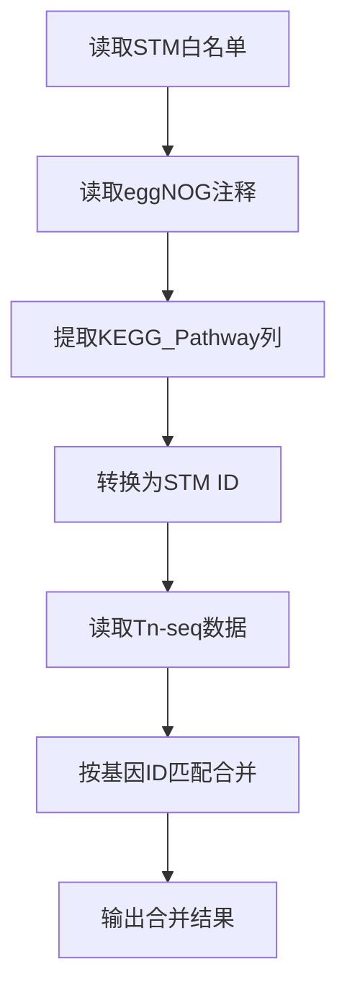

# 合并脚本ID转换详细分析报告

**日期**：2026年5月29日  
**分析脚本**：`hebing-stm-tag-ko-KO-tnseqfc.py`  
**位置**：`H:\hermesp-agent\10-chaos-rast\KEGG-R-pathway-Ovary\`

---

## 一、脚本整体流程



---

## 二、关键步骤详细分析

### 步骤1：读取STM白名单

| 项目       | 内容                                                       |
| -------- | -------------------------------------------------------- |
| **代码位置** | 第22-33行                                                  |
| **输入**   | Sheet2（STM白名单）                                           |
| **输入格式** | 两列：path_id, description                                  |
| **输入示例** | stm01100, Metabolic pathways                             |
| **输出**   | `stm_dict` 字典                                            |
| **输出格式** | `{stm01100: "Metabolic pathways", ...}`                  |
| **代码**   | `df_stm = pd.read_excel(FILE_PATH, sheet_name='Sheet2')` |

**关键代码**：

```python
# 第28-30行
stm_dict = dict(zip(df_stm.iloc[:, 0].astype(str).str.strip(), 
                    df_stm.iloc[:, 1].astype(str).str.strip()))
valid_stm_ids = set(stm_dict.keys())
```

---

### 步骤2：读取eggNOG注释

| 项目       | 内容                                                        |
| -------- | --------------------------------------------------------- |
| **代码位置** | 第35-93行                                                   |
| **输入**   | Sheet1（eggNOG注释）                                          |
| **输入格式** | 多列：query, GOs, COG, KEGG_Pathway, KEGG_ko 等               |
| **输入示例** | JI728_00005, GO:0005515, ..., ko:K00001                   |
| **输出**   | `gene_full_info` 字典                                       |
| **输出格式** | `{JI728_00005: {所有列数据}, ...}`                             |
| **代码**   | `df_anno = pd.read_excel(FILE_PATH, sheet_name='Sheet1')` |

**关键代码**：

```python
# 第42行
id_col_name = df_anno.columns[0]  # 自动获取第一列列名(query)
```

---

### 步骤3：提取KEGG_Pathway列并转换为STM ID

| 项目       | 内容                                          |
| -------- | ------------------------------------------- |
| **代码位置** | 第51-67行                                     |
| **输入**   | `KEGG_Pathway` 列                            |
| **输入格式** | `ko:01100, ko:01200` 或 `map01100, map01200` |
| **输入示例** | `ko:01100, ko:01200`                        |
| **输出**   | `Matched_STM_IDs` 列                         |
| **输出格式** | `stm01100, stm01200`                        |
| **输出示例** | `stm01100, stm01200`                        |

**关键代码**：

```python
# 第53-67行
raw_path = str(row.get('KEGG_Pathway', ''))
final_stm_ids = []
final_stm_descs = []

if pd.notna(raw_path) and raw_path != '-':
    paths = [p.strip() for p in raw_path.split(',')]
    for p in paths:
        # 提取数字并转为 stm
        num_match = re.search(r'\d{5}', p)
        if num_match:
            stm_id = f"stm{num_match.group(0)}"
            # 只有在表2里的才算数
            if stm_id in valid_stm_ids:
                final_stm_ids.append(stm_id)
                final_stm_descs.append(stm_dict.get(stm_id, ""))
```

**ID转换逻辑**：
| 输入格式 | 提取数字 | 转换结果 | 验证 |
|----------|----------|----------|------|
| `ko:01100` | `01100` | `stm01100` | ✅ 在白名单中 |
| `map01100` | `01100` | `stm01100` | ✅ 在白名单中 |
| `01100` | `01100` | `stm01100` | ✅ 在白名单中 |
| `ko:99999` | `99999` | `stm99999` | ❌ 不在白名单中 |

---

### 步骤4：清洗KEGG_ko列

| 项目       | 内容                     |
| -------- | ---------------------- |
| **代码位置** | 第84-86行                |
| **输入**   | `KEGG_ko` 列            |
| **输入格式** | `ko:K00001, ko:K00002` |
| **输入示例** | `ko:K00001`            |
| **输出**   | 清洗后的 `KEGG_ko` 列       |
| **输出格式** | `K00001, K00002`       |
| **输出示例** | `K00001`               |

**关键代码**：

```python
# 第84-86行
if 'KEGG_ko' in row_data:
    k_val = str(row_data['KEGG_ko'])
    row_data['KEGG_ko'] = k_val.replace('ko:', '') if pd.notna(k_val) else ""
```

**清洗逻辑**：
| 输入 | 输出 | 说明 |
|------|------|------|
| `ko:K00001` | `K00001` | 去掉 `ko:` 前缀 |
| `ko:K00001, ko:K00002` | `K00001, K00002` | 批量去掉前缀 |
| `nan` | `` | 空值处理 |

---

### 步骤5：读取Tn-seq数据并合并

| 项目       | 内容                   |
| -------- | -------------------- |
| **代码位置** | 第95-151行             |
| **输入**   | Sheet3（Tn-seq数据）     |
| **输入格式** | 包含基因ID列（A列）          |
| **输入示例** | JI728_00005          |
| **输出**   | 合并后的完整数据             |
| **输出格式** | 原有列 + 新增注释列          |
| **输出文件** | `*_Full_Merged.xlsx` |

**关键代码**：

```python
# 第126-143行
for row in ws.iter_rows(min_row=2, min_col=DATA_ID_COL_INDEX, max_col=DATA_ID_COL_INDEX):
    cell = row[0]
    gene_id = cell.value

    if gene_id in gene_full_info:
        info_dict = gene_full_info[gene_id]
        match_count += 1

        # 逐列写入
        for i, header in enumerate(sorted_headers):
            val = info_dict.get(header, "")
            if pd.isna(val): val = ""
            ws.cell(row=cell.row, column=start_col + i, value=str(val))
```

**合并逻辑**：
| 步骤 | 操作 | 说明 |
|------|------|------|
| 1 | 遍历Sheet3每一行 | 获取基因ID |
| 2 | 在gene_full_info中查找 | 匹配基因ID |
| 3 | 获取注释信息 | 提取所有列数据 |
| 4 | 写入新列 | 添加到Sheet3末尾 |

---

## 三、ID转换完整流程

### 3.1 基因ID转换

| 阶段         | ID格式    | 示例                   | 说明       |
| ---------- | ------- | -------------------- | -------- |
| **原始**     | NCBI格式  | JI728_00005          | 从NCBI下载  |
| **RAST**   | fig格式   | fig\|1002261.3.peg.1 | RAST注释   |
| **eggNOG** | query格式 | JI728_00005          | eggNOG注释 |
| **合并后**    | 统一格式    | JI728_00005          | 最终使用     |

**关键**：使用NCBI的JI728_xxxxx作为统一ID

### 3.2 KEGG通路ID转换

| 阶段         | ID格式     | 示例       | 说明      |
| ---------- | -------- | -------- | ------- |
| **KEGG原始** | ko:xxxxx | ko:01100 | KEGG数据库 |
| **提取数字**   | 纯数字      | 01100    | 正则提取    |
| **转换为STM** | stmxxxxx | stm01100 | 添加stm前缀 |
| **验证白名单**  | stmxxxxx | stm01100 | 确认在白名单中 |

### 3.3 KO编号转换

| 阶段         | ID格式      | 示例        | 说明        |
| ---------- | --------- | --------- | --------- |
| **KEGG原始** | ko:Kxxxxx | ko:K00001 | KEGG数据库   |
| **清洗后**    | Kxxxxx    | K00001    | 去掉ko:前缀   |
| **进一步清洗**  | 纯数字       | 00001     | 去掉K前缀（可选） |

---

## 四、输入输出文件汇总

### 4.1 输入文件

| 文件           | 位置     | 格式    | 内容         |
| ------------ | ------ | ----- | ---------- |
| **STM白名单**   | Sheet2 | Excel | STM通路ID和描述 |
| **eggNOG注释** | Sheet1 | Excel | 基因功能注释     |
| **Tn-seq数据** | Sheet3 | Excel | 必需基因分析结果   |

### 4.2 输出文件

| 文件              | 位置  | 格式    | 内容     |
| --------------- | --- | ----- | ------ |
| **合并结果**        | 同目录 | Excel | 完整合并数据 |
| **Full_Merged** | 同目录 | Excel | 完整合并版本 |
| **Matched**     | 同目录 | Excel | 匹配版本   |

### 4.3 新增列

| 列名                           | 来源             | 格式                            | 说明       |
| ---------------------------- | -------------- | ----------------------------- | -------- |
| **Matched_STM_IDs**          | KEGG_Pathway转换 | `stm01100, stm01200`          | 匹配的STM通路 |
| **Matched_STM_Descriptions** | STM白名单         | `Metabolic pathways \|\| ...` | 通路描述     |
| **KEGG_ko**                  | 清洗后            | `K00001, K00002`              | KO编号     |

---

## 五、关键代码位置索引

| 功能             | 代码行      | 说明        |
| -------------- | -------- | --------- |
| 读取STM白名单       | 22-33行   | 建立STM字典   |
| 读取eggNOG注释     | 35-93行   | 提取基因信息    |
| 提取KEGG_Pathway | 51-67行   | 转换为STM ID |
| 清洗KEGG_ko      | 84-86行   | 去掉ko:前缀   |
| 读取Tn-seq数据     | 95-151行  | 合并到Sheet3 |
| 写入新列           | 117-143行 | 添加注释信息    |

---

## 六、总结

### 6.1 ID转换关键点

1. **基因ID**：使用NCBI的JI728_xxxxx作为统一ID
2. **KEGG通路ID**：从ko:xxxxx转换为stmxxxxx
3. **KO编号**：从ko:Kxxxxx转换为Kxxxxx

### 6.2 合并逻辑

1. **按基因ID匹配**：Sheet3的基因ID与Sheet1的query匹配
2. **添加注释列**：将Sheet1的所有列添加到Sheet3末尾
3. **特殊处理**：KEGG_Pathway转换为STM ID，KEGG_ko去掉前缀

### 6.3 输出结果

1. **完整合并**：保留所有原始数据 + 新增注释
2. **STM通路映射**：每个基因对应多个STM通路
3. **KO编号**：清洗后的KO编号

---

**报告生成时间**：2026年5月29日  
**分析脚本**：`hebing-stm-tag-ko-KO-tnseqfc.py`  
**保存位置**：`H:\hermesp-agent\10-chaos-rast\`