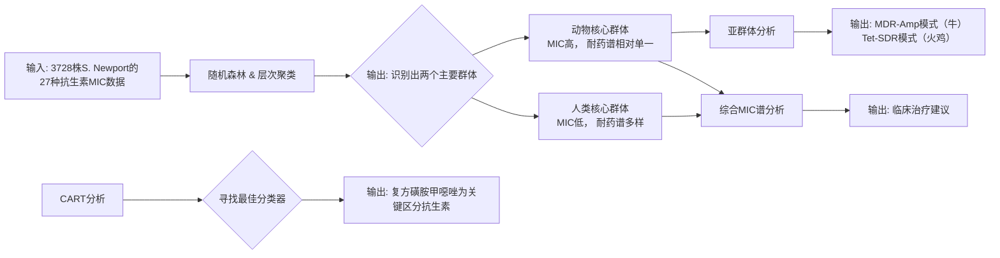

# Multiple Food-Animal-Borne Route in Transmission of Antibiotic-Resistant Salmonella Newport to Humans

## 📎 快捷链接

| 类型 | 链接 |
|------|------|
| Zotero 条目 | [打开条目](zotero://select/items/0/7SSMPKP2) |
| Zotero PDF | [打开PDF](zotero://open-pdf/library/items/T932VI7H) |
| MinerU 解析 | [查看解析](file:///G:/zotero/llm-for-zotero-mineru/2748/full.md) |
| DOI | [在线查看](https://doi.org/10.3389/fmicb.2018.00023) |

## 一、核心概念与研究背景
- **一句话总结**：本研究通过分析美国20年间3728株沙门氏菌纽波特（S. Newport）分离株的抗生素敏感性数据，揭示了人类感染的多重食物动物来源，并发现动物来源菌株普遍具有更高的耐药性。
- **关键概念解析**：
    - **S. Newport**：沙门氏菌的一种血清型，在美国是引起人类感染的前三大血清型之一，通常认为其主要宿主是牛，但已证实其可在多种环境（如粪肥、植物组织）和宿主（家禽、猪、野生动物、贝类等）中持久存在。
    - **MIC (最小抑菌浓度)**：衡量抗生素对细菌抑制效果的量化指标，数值越低表示细菌越敏感，数值越高则表示耐药性越强。本文使用了针对27种抗生素的MIC数据。
    - **MDR-Amp (多重耐药-氨苄西林耐药模式)**：一种典型的抗生素耐药模式，在本文特指对氨苄西林、氯霉素、链霉素、磺胺类和四环素耐药，并携带AmpC型β-内酰胺酶基因。
    - **食物动物传播途径**：指通过食用被污染的牛肉、猪肉、禽肉、牛奶等动物源性食品而感染病原体的途径。

## 二、遭遇的瓶颈与中间问题
- **现有挑战**：在研究前，尽管已知S. Newport可感染多种宿主并导致人类疾病，但不同食物动物来源（如牛、猪、禽类）对人类感染的具体贡献比例和传播路径并不清楚。这阻碍了针对性地制定从农场到餐桌的干预措施。
- **具体难点**：
    1.  **多系性与复杂性**：S. Newport本身是一个多系性（polyphyletic）的血清型，包含多个遗传谱系，不同谱系可能对应不同的宿主和耐药谱，增加了溯源分析的复杂性。
    2.  **环境因素的干扰**：S. Newport能在环境（如农场、水体）中长期存活，环境来源的菌株可能混淆对食物动物传播链的判断。
    3.  **现有分型方法的局限性**：传统的分子分型方法（如PFGE）在区分具有相似耐药谱但来源不同的菌株时可能分辨率不足。需要一种能整合大规模表型数据（MIC）的方法来洞察传播动态。

## 三、揭秘过程与解决方案
- **破局思路**：作者的切入点是，不依赖传统的基因型分型，而是利用美国国家抗菌素耐药性监测系统（NARMS）积累的大规模MIC数据集（3728株菌，27种抗生素），通过机器学习和数据挖掘方法，直接从**表型（耐药性）** 层面划分细菌群体，并识别出区分动物和人类群体的关键抗生素。
- **一步步揭秘**：
    1.  **数据收集与整理**：从NARMS数据库获取1996-2015年间，来自人类（2763株）、动物（901株，主要为牛726株、火鸡139株）和零售肉类（64株）的S. Newport分离株及其MIC数据。
    2.  **群体划分（发现异常）**：应用**随机森林**和**层次聚类**两种无监督学习方法。两种方法均揭示，基于MIC谱，菌株主要分为两个大群体：一个**动物核心群体**（G1/G3），包含几乎所有动物来源菌株和部分（~9.7%）人类菌株；另一个**人类核心群体**（G2/G4），几乎完全由人类菌株构成，且其MIC值普遍更低（更敏感），但耐药谱更多样。
    3.  **锁定关键分类器（修正假设）**：为找到客观、最佳的区分标准，使用**分类与回归树**分析。CART分析确定，**复方磺胺甲噁唑（Trimethoprim-sulfamethoxazole, COT）** 是区分动物与人类群体的最佳单一分类器。这表明对这种一线治疗药物的耐药性是动物来源菌株的一个显著特征。
    4.  **识别特异性传播链**：进一步分析动物核心群体内部，发现了两种主导的耐药模式：**MDR-Amp模式**（主要流行于牛群）和**Tet-SDR模式**（主要流行于火鸡群）。这证明了不同食物动物宿主对人类感染的贡献是特异的。
    5.  **临床指导意义**：基于人群分离株的整体耐药谱，分析指出**氟喹诺酮类（如环丙沙星）** 而非三代头孢（如头孢曲松）是更合理的经验性治疗选择。

## 四、核心技术路线
- **整体架构**：研究采用“大数据MIC表型分析 + 多层机器学习挖掘”的框架。
- **关键创新点**：
    1.  **表型驱动**：直接利用大规模、标准化的MIC数据，而非基因组序列，进行群体结构分析，能直接反映临床相关的耐药表型。
    2.  **机器学习整合**：结合**随机森林**（发现群体模式）、**层次聚类**（展示多样性和亲缘）和**CART**（确定关键预测变量和阈值）三种算法，从不同角度验证结论的稳健性。
- **流程图**：

## 五、结果呈现与证据链
- **核心结论**：
    1.  人类感染的S. Newport呈现**多重来源**，仅有约**9.7%** 的人类分离株可能直接来源于食物动物（主要为牛和火鸡）。
    2.  动物来源菌株的耐药性**显著高于**人类社区菌株，且其**耐药谱多样性更低**，表明它们代表了特定的、传播中的耐药克隆。
    3.  复方磺胺甲噁唑是区分动物和人类群体感染的**最佳生物标志物**。
    4.  存在明确的**食物动物特异性传播路径**（牛→MDR-Amp， 火鸡→Tet-SDR）。
- **证据展示**：
    - **图1**：随机森林投影图（图1A）和层次聚类树（图1B）均清晰显示动物源菌株（绿色）聚集，而人类菌株分布广泛。图1C显示动物核心群体（G3）的MIC值普遍更高（蓝色表示耐药）。
    - **CART分析**：明确给出决策树，第一层分裂变量就是COT，其MIC≥4/76为区分动物（≥）和人类（<）的最优阈值。
    - **耐药模式分析**：在动物核心群体中，牛群分离株75%以上表现为MDR-Amp模式，而火鸡分离株则以Tet-SDR模式为主。
- **如何回应中间问题**：结果直接回答了“不同食物动物对人类感染贡献比例”的问题（~9.7%来源于动物），并揭示了贡献的异质性（不同动物有不同耐药克隆）。MIC数据作为特征，成功区分了不同来源的群体，克服了传统分型在表型关联上的不足。

## 六、局限性与待解决问题
1.  **地域与时间局限性**：数据仅来自美国NARMS系统，结论是否适用于其他国家/地区有待验证。
2.  **MIC作为代理指标的局限性**：MIC表型虽与临床治疗相关，但无法等同于基因型。完全相同的MIC谱可能由不同的基因机制（如不同耐药基因或调控突变）导致，无法精确追踪克隆传播。
3.  **缺乏基因组数据**：未能结合全基因组测序（WGS）来验证基于MIC的群体划分是否与遗传谱系一致，也无法深入解析耐药基因的传播载体（如质粒）和水平转移情况。
4.  **动物来源比例的计算方法**：约9.7%的比例是基于将MIC谱与动物核心群体最相似的人类菌株划归为动物来源。该估算基于模型假设，实际比例可能被低估或高估，需基因组流行病学研究进一步确认。
5.  **非食物动物和环境来源**：研究聚焦于主要食物动物（牛、猪、禽），对环境、野生动物、水产等其他潜在来源的贡献评估不足。

## 七、与沙门氏菌/细菌基因组学研究的关联
- **可直接借鉴的方法/思路**：
    1.  **表型大数据挖掘**：可将此研究范式应用于其他重要的沙门氏菌血清型（如Enteritidis, Typhimurium），利用全球或国家监测网络的MIC数据，系统评估不同宿主来源的流行病学重要性。
    2.  **机器学习工具箱**：随机森林、CART等方法非常适合用于分析高维、非线性的微生物学数据（如毒力基因谱、代谢表型谱），以发现潜在的分组和关键驱动因素。
    3.  **耐药模式作为流行病学标记**：识别宿主特异性的耐药模式（如本研究的MDR-Amp vs Tet-SDR）可作为追踪传播链的实用标记，在资源有限的情况下辅助溯源。
- **应避免的陷阱**：
    1.  **过度依赖单一数据类型**：仅用MIC或仅用MLST可能无法全面反映菌株特性。应提倡**表型（MIC）与基因型（WGS）数据整合分析**，以建立更精确的“基因型-表型-流行病学”关联。
    2.  **忽略宿主特异性毒力因子**：传播不仅依赖于耐药性，还与适应不同宿主的**毒力基因岛（SPIs）或宿主特异性基因**密切相关。在后续研究中，应结合耐药与毒力基因组进行分析。
    3.  **环境因素的简化**：在构建传播模型时，应更系统地纳入环境样本数据，以评估环境作为混合池或独立传播源的作用。

Tags: #论文笔记 #流行病学 #沙门氏菌 #抗生素耐药性 #机器学习 #食物传播 #NARMS #MIC