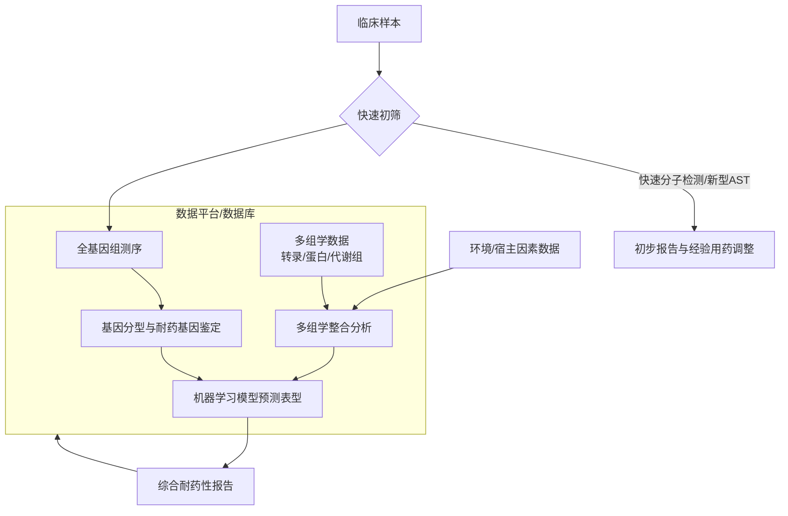

# Paving the way for precise diagnostics of antimicrobial resistant bacteria

## 📎 快捷链接

| 类型 | 链接 |
|------|------|
| Zotero 条目 | [打开条目](zotero://select/items/0/ZA2LPUWP) |
| Zotero PDF | [打开PDF](zotero://open-pdf/library/items/L3KP6D4S) |
| MinerU 解析 | [查看解析](file:///G:/zotero/llm-for-zotero-mineru/2767/full.md) |
| DOI | [在线查看](https://doi.org/10.3389/fmolb.2022.976705) |

## 一、核心概念与研究背景
- **一句话总结**：针对传统抗菌药耐药性（AMR）诊断方法慢、不准确且与临床脱节的问题，本文综述并倡导整合新兴的快速表型检测、全基因组测序（WGS）、机器学习和多组学分析，构建一个更快速、精准且可预测的AMR综合监测平台。
- **关键概念解析**：
    - **AMR（Antimicrobial Resistance）**：细菌等病原体对原本有效的抗菌药物产生抵抗的能力，是全球公共卫生的重大威胁。
    - **AST（Antimicrobial Susceptibility Test）**：传统的表型药敏试验，通过测量最低抑菌浓度（MIC）判断细菌对药物的敏感性，是临床“金标准”，但耗时长达48小时以上。
    - **WGS（Whole-Genome Sequencing）**：全基因组测序，能提供细菌的完整遗传信息，用于鉴定耐药基因、毒力因子和进行分子分型，为快速诊断提供基因型依据。
    - **机器学习**：一种人工智能方法，通过算法学习大量基因型（如SNP、耐药基因）与表型（如MIC值）数据之间的关系，构建预测模型。
    - **基因型-表型差异（Genotype-Phenotype Discrepancy）**：细菌携带的耐药基因型与实际表现出的耐药表型不完全对应的现象，这是当前基因型预测方法的主要挑战和瓶颈。

## 二、遭遇的瓶颈与中间问题
- **现有挑战**：
    1.  **时效性差**：传统AST依赖细菌培养，流程耗时长达48小时以上，导致临床常先凭经验用药，可能造成药物滥用（如英国2013-2015年约20%的抗生素处方不当）。
    2.  **体外与体内脱节**：体外AST无法模拟宿主组织内复杂的微生物-宿主相互作用，可能误导用药选择。
    3.  **COVID-19的放大效应**：疫情期间大量不当抗生素使用，加剧了AMR传播，特别是耐碳青霉烯类肠杆菌（CPE）等“最后防线”药物耐药菌的暴发。
- **具体难点（作者遇到的“拦路虎”）**：
    1.  **基因型预测表型的局限性**：仅依赖WGS检测耐药基因或SNP来预测耐药表型，准确性受“基因型-表型差异”限制，可能导致不当处方。
    2.  **耐药性的复杂性**：AMR是细菌在环境压力（包括抗菌药物和非抗菌化合物）下进化的结果，具有高度可塑性（如铜绿假单胞菌），单一维度的检测难以全面捕捉。
    3.  **数据整合难题**：如何将基因组、转录组、蛋白组等多组学数据与临床表型数据有效整合，构建可靠的预测模型是一大挑战。

## 三、揭秘过程与解决方案
- **破局思路**：从“单一、滞后”的诊断转向“多维、快速、预测性”的综合监测。核心切入点是认识到AMR是复杂进化过程的产物，必须结合**基因型、表型、环境因素**进行多维度分析。
- **一步步揭秘（综述梳理的领域发展逻辑）**：
    1.  **承认现状**：传统AST虽可靠但慢，无法应对当前AMR危机，尤其在疫情等紧急情况下。
    2.  **探索快速替代方案**：评估多种新型快速表型检测技术（见Table 1），如流式细胞术、微流控芯片、前向激光散射等，它们能缩短检测时间。
    3.  **引入基因型视角**：采用WGS作为强大的补充工具，能绕过培养步骤快速鉴定病原体和预测耐药基因，但认识到其预测的准确性存在瓶颈。
    4.  **引入智能分析工具**：应用机器学习，利用不断增长的WGS和表型数据，优化从基因型到表型的预测模型，以提高诊断的准确性。
    5.  **构想最终解决方案**：提出建立一个**整合的、数据驱动的监测平台**。该平台以可靠的耐药菌株数据库为基础，融合快速分子检测、WGS和多组学分析，并由机器学习算法进行挖掘和预测。

## 四、核心技术路线
- **整体架构**：本文提出的技术方案是一个**多层次、多技术融合的智能监测生态系统**。
- **关键创新点**：相比传统单一方法，其核心创新在于**整合**与**预测**。
    1.  **整合快速表型与基因型**：用快速初筛（如分子检测、新型AST）结合WGS深度分析。
    2.  **整合多组学数据**：引入转录组、蛋白组等数据，以更全面地理解耐药机制。
    3.  **引入机器学习预测**：不仅用于分析，更用于构建能够预测未测试菌株耐药性的模型。
    4.  **构建中央数据库/平台**：实现数据的标准化存储、共享与持续学习，提升监测的预见性和系统性。
- **流程图**：

## 五、结果呈现与证据链
- **核心结论**：
    1.  现有传统AST方法已不足以应对当前的AMR危机，亟需革新。
    2.  快速表型检测、WGS和机器学习等新技术各有优势，但单独使用均存在局限。
    3.  **唯有将多种技术与数据整合到一个协同的平台中，才能实现真正快速、精准且具有预测性的AMR诊断和监测**。
- **证据展示**：
    - **关键图表**：**Table 1** 是本文的核心证据之一。它系统列举并对比了多种新型表型检测技术（如荧光素酶法、流式细胞术、数字延时显微镜、微流控系统等）的原理、优缺点。这直接回应了“寻找传统AST替代方案”的中间问题。
    - **数据与对比**：论文引用了多项研究数据，如英国抗生素不当处方率（20%）、COVID-19期间CPE暴发等，用以说明问题的严峻性和紧迫性。
- **如何回应中间问题**：
    - Table 1 证明了存在比传统AST更快的表型检测技术选项。
    - 关于基因型-表型差异的讨论，直接回应了WGS预测的瓶颈问题。
    - 最终提出的整合平台方案，是对“如何应对AMR复杂性”这一根本挑战给出的综合性答案。

## 六、局限性与待解决问题
- **数据质量与标准化**：构建可靠的预测模型依赖于高质量、标准化的基因型与表型配对数据。目前数据的标准化和共享程度不足。
- **成本与可及性**：WGS和多组学技术成本虽在下降，但仍未达到在所有地区（尤其是资源有限地区）常规应用的水平。
- **模型的泛化性与验证**：机器学习模型容易对训练数据过拟合，需要在不同地域、不同菌株的大规模独立数据集上进行严格验证，以确保其普适性和可靠性。
- **复杂机制的解析**：对于那些由未知机制或复杂环境调控导致的耐药表型，当前技术整合平台的预测能力可能仍然有限。
- **临床实施的障碍**：将这样一个复杂的综合系统整合到常规临床工作流程中，面临流程改造、专业人员培训、成本核算和监管审批等多重实际障碍。

## 七、与沙门氏菌/细菌基因组学研究的关联
- **可直接借鉴的方法/思路**：
    1.  **WGS分型与耐药基因检测**：建立沙门氏菌本地或区域性的WGS参考数据库，用于快速识别血清型、耐药基因谱和暴发克隆群。
    2.  **基因型-表型关联分析**：利用公开的沙门氏菌WGS数据和对应的MIC表型数据，训练机器学习模型，预测本地菌株的耐药表型。
    3.  **整合监测思路**：在沙门氏菌监测中，可尝试将基于PCR的快速检测、WGS、常规AST以及可能的环境采样数据进行关联分析，构建更立体的传播和耐药性监测网络。
- **应避免的陷阱**：
    1.  **唯基因型论**：不能仅凭检测到某个耐药基因（如`blaCTX-M`）就断定菌株对相应药物耐药，需结合表型验证或更可靠的预测模型。基因型与表型不匹配在沙门氏菌中同样存在。
    2.  **忽视环境因素**：在分析沙门氏菌耐药性时，应考虑养殖场抗菌药物使用史、饲料成分、动物迁移等环境选择压力，这些是驱动其进化的重要因素。
    3.  **数据孤岛**：应避免数据封闭，积极参与全球或区域性的细菌基因组数据共享计划（如Enterogen、Pathogenwatch），以增强模型的预测能力。

Tags: #论文笔记 #抗菌药耐药性 #诊断技术 #机器学习 #多组学 #综述 #Frontiers in Molecular Biosciences