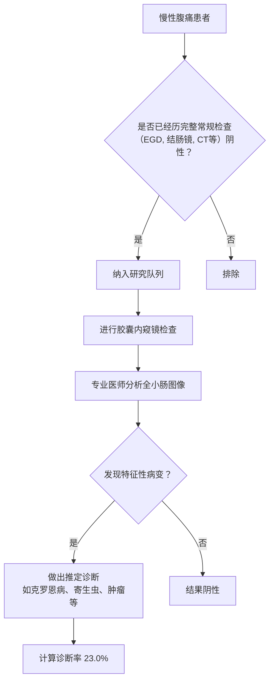

# 胶囊内窥镜在慢性腹痛患者中诊断率的提高

## 📎 快捷链接

| 类型 | 链接 |
|------|------|
| Zotero 条目 | [打开条目](zotero://select/items/0/8TJQP6VS) |
| Zotero PDF | [打开PDF](zotero://open-pdf/library/items/QYTAP3NH) |
| MinerU 解析 | [查看解析](file:///G:/zotero/llm-for-zotero-mineru/2849/full.md) |
| DOI | [在线查看](https://doi.org/10.1371/journal.pone.0087396) |

## 一、核心概念与研究背景
- **一句话总结**：本研究评估了对于经常规检查（如胃镜、肠镜、CT等）后仍无法明确病因的慢性腹痛患者，使用胶囊内窥镜（CE）检查能否有效发现潜在的小肠病变，从而提高诊断率。
- **关键概念解析**：
    - **慢性腹痛 (Chronic Abdominal Pain, CAP)**：指持续或间断超过三个月的腹痛，是临床常见主诉。病因复杂，包括功能性（如肠易激综合征）和结构性（如炎症、肿瘤）疾病，常规检查后仍有大量患者病因不明，是临床诊断的难点。
    - **胶囊内窥镜 (Capsule Endoscopy, CE)**：一种无线、无痛的内窥镜技术。患者吞服一个药丸大小的胶囊，其内部摄像头在消化道内（尤其是传统内镜难以抵达的**全段小肠**）连续拍摄并传输图像。CE被誉为观察小肠这一“黑暗大陆”的革命性工具，已广泛应用于不明原因消化道出血、克罗恩病等的诊断。

## 二、遭遇的瓶颈与中间问题
- **现有挑战**：
    1.  **小肠是诊断“盲区”**：传统上，小肠被称为“黑暗大陆”（Dark Continent）。胃镜（EGD）和结肠镜只能观察消化道两端，中间约5-6米长的小肠是检查盲区。
    2.  **传统小肠检查手段有限且效果不佳**：推进式肠镜（Push enteroscopy）侵入性强、观察范围有限；小肠钡餐（Barium follow-through）和CT对黏膜病变的敏感性低；血管造影等有创检查风险高。
    3.  **慢性腹痛诊断率低**：大量患者经过血检、尿检、粪便检查、超声、CT、EGD和肠镜等一系列全面检查后，仍无法找到腹痛病因，诊断陷入僵局。
- **具体难点**：既往少数研究评估CE在慢性腹痛中的价值时，得出的**诊断率较低**（论文中引用为“CE was not informative in these patients”），这挑战了将CE用于此类患者的临床合理性。

## 三、揭秘过程与解决方案
- **破局思路**：作者团队的切入点是**系统性地评估一个大规模、严格筛选的慢性腹痛患者队列**。他们假设，尽管既往研究结果不理想，但随着CE技术的普及和阅片经验的积累，在经过更全面的前期筛查后，CE可能会发现更多被遗漏的小肠器质性病变。
- **一步步揭秘**：
    1.  **定义研究人群**：纳入2006-2012年间主诉**持续或间歇性腹痛≥3个月**的患者。
    2.  **严格的排除与前期筛查**：所有患者均已经过**全面的常规检查阴性**（血/尿/粪检、超声/CT、胃镜、结肠镜），排除了已知的胃部、结直肠、肝胆胰等常见病因。这确保了患者群体是真正的“不明原因慢性腹痛”。
    3.  **应用新技术进行探查**：对这243例患者统一进行CE检查，使用OMOM和PillCam SB两种系统。
    4.  **系统分析与诊断**：由专业消化科医生分析CE图像，根据特征性表现（如溃疡、狭窄、隆起、寄生虫等）做出“推定诊断”。
    5.  **发现“真相”**：结果出乎意料地好，**诊断率高达23.0%**，远高于既往研究。发现了包括克罗恩病、肠炎、寄生虫感染、肿瘤等在内的多种病变，直接证明了CE在这一人群中的高诊断价值。

## 四、核心技术路线
- **整体架构**：一项**回顾性、单中心队列研究**。
- **关键创新点**：
    1.  **研究人群筛选严格**：专注于经“金标准”检查（胃镜+结肠镜）阴性的慢性腹痛患者，排除了上消化道和结直肠疾病干扰。
    2.  **样本量较大**：243例患者，是当时同类研究中规模较大的之一。
    3.  **使用国产与进口双系统**：同时评估了国产OMOM胶囊和进口PillCam SB胶囊，结果具有较好的可比性（诊断率分别为22.2% vs 24.2%）。
- **流程图**：

## 五、结果呈现与证据链
- **核心结论**：对于常规检查阴性的慢性腹痛患者，胶囊内窥镜（CE）的**诊断率显著提高（23.0%）**，是一种有效的诊断工具。
- **证据展示**：
    1.  **总体诊断率**：243例患者中，**56例（23.0%）** 经CE发现明确的小肠病变。
    2.  **疾病谱构成**（Table 2 & Figures 1-6）：
        - **克罗恩病**：19例 (7.8%)，表现为溃疡、狭窄。
        - **肠炎**：15例 (6.2%)，表现为红斑、水肿。
        - **特发性肠道淋巴管扩张症**：11例 (4.5%)。
        - **钩虫病**：5例 (2.1%)，粪便检查阴性但被CE直接发现。
        - **小肠肿瘤**：3例 (1.2%)，包括腺癌和胃肠道间质瘤。
        - **其他**：蛔虫病、过敏性紫癜等。
    3.  **安全性数据**：胶囊滞留发生率为**0.82% (2/243)**。
- **回应中间问题**：这一结果**直接反驳了既往认为CE对慢性腹痛患者诊断价值有限的观点**。高诊断率（23.0%）表明，在一个经过精心筛选（常规检查阴性）的患者群体中，CE能有效揭示隐藏在小肠中的结构性病因。

## 六、局限性与待解决问题
1.  **研究设计局限性**：本研究为**回顾性研究**，存在选择偏倚。例如，纳入的患者可能因症状更严重或医生更倾向于怀疑小肠病变而被推荐进行CE检查，这可能高估了在真实世界慢性腹痛人群中的诊断率。
2.  **缺乏“金标准”对照**：CE的诊断是“推定诊断”，部分诊断（如克罗恩病）虽然参考了指南，但未全部通过后续的病理活检或手术（如本例中的克罗恩病由手术和病理确认）进行验证。对于肠炎等诊断，可能缺乏特异性。
3.  **功能性腹痛的区分**：23.0%的诊断率意味着仍有**77.0%的患者CE检查结果为阴性**。研究未进一步评估这些阴性结果患者中，有多大比例属于功能性腹痛（如肠易激综合征），也未对阴性患者进行长期随访以评估预后。
4.  **技术固有缺陷**：
    - **无法进行活检或治疗**：CE仅能提供影像，发现病变后仍需通过其他手段（如双气囊小肠镜、手术）获取组织病理学确诊。
    - **肠道准备与蠕动影响**：肠道清洁度、转运时间异常（如本研究5例）可能影响图像质量和诊断。
    - **滞留风险**：虽然本研究中发生率低（0.82%），但对于疑似狭窄的克罗恩病或肿瘤患者，风险更高。

## 七、与沙门氏菌/细菌基因组学研究的关联
- **可直接借鉴的方法/思路**：
    1.  **诊断工具的评估范式**：本研究展示了一个清晰的临床研究范式——针对一类病因不明的常见症状（慢性腹痛），评估一种新型诊断技术（CE）在特定筛选人群（常规检查阴性）中的**增量诊断价值**。这种思路可应用于评估新型分子诊断技术（如宏基因组测序mNGS）在不明原因感染性腹泻或腹痛中的价值。
    2.  **发现隐匿感染灶**：CE发现了粪便检查阴性的钩虫和蛔虫感染。这提示，对于**传统病原学检测阴性但临床高度怀疑感染的病例**，CE可能作为一种补充手段，直接可视化肠道寄生虫或严重的感染性黏膜病变（如某些细菌性肠炎导致的溃疡），为后续靶向取样（如通过小肠镜在病变处取组织或灌洗液）进行**培养或基因组学分析（如16S rRNA测序、宏基因组）** 提供关键定位信息。
- **应避免的陷阱**：
    1.  **技术适用性局限**：CE的核心优势在于观察**小肠黏膜结构**。它**不能**用于诊断没有明显黏膜病变的感染（如某些全身性感染早期、非侵袭性细菌定植），也不能像培养或测序那样提供病原体的**特异性基因型或抗生素耐药信息**。
    2.  **成本与可及性**：CE费用昂贵，且存在滞留风险。在感染诊断中，应优先考虑无创、廉价、高特异性的传统方法（如血清学、粪便PCR、培养）和新兴的分子诊断技术，将CE作为评估并发症（如慢性寄生虫感染导致的淋巴管扩张、缺血）或排除其他结构性病因的二线工具。
    3.  **结果解读的挑战**：CE发现的黏膜水肿、红斑等非特异性表现，需谨慎解读，不能直接等同于特定病原体感染，必须结合临床和实验室检查综合判断。

Tags: #论文笔记 #消化内科学 #胶囊内窥镜 #慢性腹痛 #诊断学 #克罗恩病 #小肠疾病 #PLoS ONE