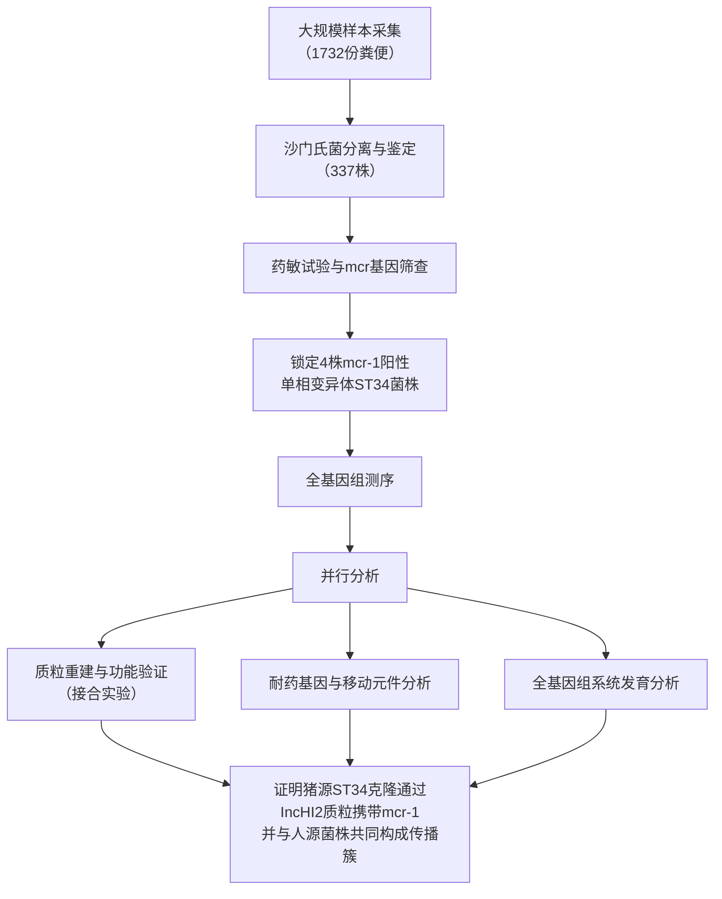

# Genomic Characterization of mcr-1-carrying Salmonella enterica Serovar 4,[5],12:i:- ST 34 Clone Isolated From Pigs in China

## 📎 快捷链接

| 类型 | 链接 |
|------|------|
| Zotero 条目 | [打开条目](zotero://select/items/0/UBQFUE46) |
| Zotero PDF | [打开PDF](zotero://open-pdf/library/items/69RJUYU2) |
| MinerU 解析 | [查看解析](file:///G:/zotero/llm-for-zotero-mineru/471/full.md) |
| DOI | [在线查看](https://doi.org/10.3389/fbioe.2020.00663) |

## 一、核心概念与研究背景
- **一句话总结**：本研究在中国猪群中发现了一种携带粘菌素耐药基因mcr-1的单相变异体沙门氏菌ST34克隆，并提供了其通过猪肉传播给人类的基因组学证据。
- **关键概念解析**：
    - **Salmonella enterica serovar 4,[5],12:i:- (单相变异体)**：一种缺少鞭毛抗原H1的沙门氏菌肠炎血清型变体，被认为是鼠伤寒沙门氏菌的全球大流行克隆，在人和动物中分离率很高，常表现为多重耐药。
    - **mcr-1 (Mobilized Colistin Resistance)**：首个被发现的可水平转移的粘菌素耐药基因，编码一种磷酸乙醇胺转移酶，能修饰细菌脂多糖，导致对“最后一道防线”抗生素粘菌素产生耐药性，其移动性是全球公共卫生的重大威胁。
    - **ST34 (Sequence Type 34)**：通过多位点序列分型确定的沙门氏菌克隆型。ST34是全球单相变异体沙门氏菌流行的主要克隆之一，与多重耐药性密切相关。
    - **IncHI2 质粒**：一种广泛存在于肠杆菌科中的不相容性IncHI2型质粒，是mcr-1等耐药基因的主要载体之一，具有高效接合转移能力。

## 二、遭遇的瓶颈与中间问题
- **现有挑战**：尽管已知携带mcr-1的沙门氏菌在动物和人类中流行，但**从农场到餐桌（尤其是通过猪肉）传播mcr-1的直接证据仍然缺乏**。特别是，无症状的肥育猪（作为食品链关键节点）的研究被忽视，其作为耐药菌储主和传播源的角色不明确。
- **具体难点**：
    1.  需要从大量样本中筛选出特定的耐药菌株。
    2.  需要证明mcr-1在沙门氏菌内的存在形式（染色体还是质粒）及其可移动性。
    3.  需要在基因组水平上建立从猪源分离株到人源感染菌株的进化传播链。

## 三、揭秘过程与解决方案
- **破局思路**：作者跳出常规研究有症状动物的思路，将焦点放在常被忽视但处于食品链关键位置的**无症状肥育猪**上，通过系统的流行病学采样和深度基因组学分析，试图“抓住”耐药基因传播的现行证据。
- **一步步揭秘**：
    1.  **大规模筛选**：从河南省45个猪场和2个屠宰场收集了1732份健康肥育猪的粪便样本，分离出337株沙门氏菌，建立了菌株库。
    2.  **锁定目标**：通过药敏试验和PCR筛查，在单相变异体沙门氏菌中发现了4株粘菌素耐药株（MIC=4 mg/L），且均携带mcr-1基因。所有菌株均属于ST34克隆。
    3.  **验证可转移性**：对这4株菌进行接合转移实验，发现其中3株（来自同一农场）的mcr-1可以高效转移到大肠杆菌受体菌中，证明了其位于可移动遗传元件上。
    4.  **基因组深度解析**：对4株菌进行全基因组测序。
        - 通过质粒重建，证实mcr-1位于**IncHI2型接合质粒**上。
        - 发现mcr-1的遗传环境相似，下游均存在ISApl1转座酶。
        - 在其中2株菌的质粒上，发现mcr-1与**I类整合子**（携带其他耐药基因）共定位，表明该质粒积累了多重耐药性。
    5.  **追溯传播链**：收集全球所有可获得的（66株）携带mcr-1的鼠伤寒/单相变异体沙门氏菌基因组数据（来源包括猪、猪肉、其他动物、人类和环境），进行系统发育分析。结果表明，所有8株中国猪源菌株（包括本研究的4株）和1株中国人群菌株形成了**独立的、紧密的进化簇**。

## 四、核心技术路线
- **整体架构**：基于全基因组测序(WGS)和比较基因组学的综合研究方案。
- **关键创新点**：
    1.  **样本来源创新**：专注于无症状的肥育猪，填补了食品链中特定环节的研究空白。
    2.  **分析深度创新**：不仅进行菌株鉴定，更通过质粒重建、接合实验和全基因组系统发育分析，构建了从基因定位到群体传播的完整证据链。
- **流程图**：

## 五、结果呈现与证据链
- **核心结论**：
    1.  中国健康猪群中存在携带mcr-1的单相变异体沙门氏菌ST34克隆，该克隆表现出多重耐药性。
    2.  mcr-1主要位于可接合转移的**IncHI2型质粒**上，且可能与携带其他耐药基因的I类整合子共存。
    3.  系统发育分析为**猪肉作为mcr-1克隆传播途径**提供了直接证据，中国猪源和人源的mcr-1阳性ST34菌株形成了独特的进化簇。
- **证据展示**：
    - **图1A**：展示了从农场和屠宰场分离的沙门氏菌血清型分布，单相变异体在屠宰场占比高于农场。
    - **表1**：详细列出了4株mcr-1阳性菌株的耐药表型（对16种抗生素的MIC值）和基因型（携带的耐药基因），显示其为广泛的多重耐药。
    - **图2**：展示了pSAL_13.3和pSAL_13.6质粒的圆形图谱，清晰地标明了mcr-1和I类整合子在IncHI2质粒上的共定位。
    - **图3**：展示了4株菌中mcr-1基因及其周围环境（如ISApl1）的遗传结构示意图。
    - **系统发育树**：基于全基因组SNP构建的进化树，将本研究的4株猪源菌株与全球其他来源菌株进行比较，显示了其与中国猪源、人源菌株的紧密聚集关系。
- **回应中间问题**：这些结果系统地回答了“mcr-1在哪里（IncHI2质粒）”、“怎么移动（可接合转移）”、“从哪里来（中国猪群）”、“到哪里去（可能传播至人）”这几个关键问题，构建了完整的传播证据链。

## 六、局限性与待解决问题
- **局限性**：
    1.  样本地理范围有限，仅来自河南省，可能无法代表全中国情况。
    2.  采样时间跨度较短（2017年），缺乏时间序列上的动态观察。
    3.  仅通过系统发育相关性推断传播，缺乏对人源感染病例的直接流行病学关联（如追踪到具体的猪肉产品）。
    4.  未深入研究该IncHI2质粒上其他耐药基因的共传播能力和选择压力。
- **待解决问题**：
    1.  ST34克隆在中国猪群中的具体起源和进化路径是什么？
    2.  不同农场间该克隆的传播网络是怎样的？
    3.  携带mcr-1的ST34克隆与不携带mcr-1的ST34克隆在适应性上有何差异？
    4.  如何有效干预该耐药克隆在食品链中的传播？

## 七、与沙门氏菌/细菌基因组学研究的关联
- **可直接借鉴的方法/思路**：
    1.  **研究视角**：关注**无症状动物宿主**，它们是耐药菌传播链中沉默但关键的一环。
    2.  **技术组合**：“表型筛查（药敏） + 基因型筛查（PCR） + 深度基因组解析（WGS，质粒重建，接合实验） + 群体系统发育分析”的组合拳，是研究耐药基因传播的标准化强大流程。
    3.  **分析重点**：对于质粒携带的耐药基因，**质粒分型（如IncHI2）和遗传环境分析（如转座子、整合子）** 至关重要，有助于理解其移动性和稳定性。
- **应避免的陷阱**：
    1.  **忽略背景信息**：仅报告耐药基因的有无，而不关联其宿主菌的克隆型（如ST34）和流行病学背景（来源、时间、地点），会丧失重要的传播线索。
    2.  **低估质粒的可塑性**：不能假设一个耐药基因只存在于一种质粒类型上。同一克隆的菌株可能通过获得不同质粒而拥有相同的耐药表型，需要通过质粒重建来确认。
    3.  **孤立分析人源或动物源菌株**：必须将人、动物、食品来源的菌株置于同一系统发育框架下分析，才能揭示传播方向和热点。

**Tags**: #论文笔记 #沙门氏菌 #耐药基因传播 #基因组学 #mcr-1 #FrontiersInBioengineeringAndBiotechnology