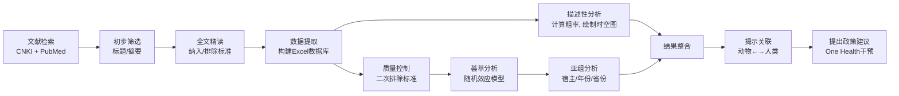

# ONE Health Approach to Address Zoonotic Brucellosis: A Spatiotemporal Associations Study Between Animals and Humans

## 📎 快捷链接

| 类型 | 链接 |
|------|------|
| Zotero 条目 | [打开条目](zotero://select/items/0/SUI4ZYB2) |
| Zotero PDF | [打开PDF](zotero://open-pdf/library/items/N76THEDQ) |
| MinerU 解析 | [查看解析](file:///G:/zotero/llm-for-zotero-mineru/475/full.md) |
| DOI | [在线查看](https://doi.org/10.3389/fvets.2020.00521) |

## 一、核心概念与研究背景
- **一句话总结**：本研究通过系统分析近60年的文献数据，揭示了中国动物与人类布鲁氏菌病在空间和时间上的关联，确定了主要的动物宿主和热点地区，为制定“一个健康”策略下的精准防控政策提供了关键证据。
- **关键概念解析**：
    - **布鲁氏菌病 (Brucellosis)**：由布鲁氏菌属细菌引起的人畜共患病，被世界卫生组织列为最被忽视的动物源性疾病之一。感染动物通过流产、睾丸炎等造成巨大经济损失，人类感染后表现为波浪热、关节痛、乏力等，严重影响公共卫生。
    - **一个健康 (One Health)**：一种跨学科的协作理念，认识到人类健康、动物健康和环境健康相互依存。本研究正是基于此理念，系统性地整合动物与人类疾病数据。
    - **时空关联 (Spatiotemporal Association)**：研究疾病在不同地理位置（空间）和不同时间段（时间）的分布模式及其相互关系。这是理解人畜共患病传播动态的关键。
    - **主要病原体**：在中国，主要的布鲁氏菌种包括：
        - `B. melitensis`：主要感染羊，对人毒力最强。
        - `B. abortus`：主要感染牛和牦牛。
        - `B. canis`：主要感染犬。
        - `B. suis`：主要感染猪。

## 二、遭遇的瓶颈与中间问题
- **现有挑战**：
    1.  **数据碎片化与黑箱**：尽管知道布鲁氏菌病在中国是再发/新发疾病，但缺乏对全国范围内**动物布鲁氏菌病**流行情况的系统性、标准化评估。动物感染常无症状，被严重低估。
    2.  **关联链不明**：人类病例的发生与哪些动物宿主、在哪些地区、通过何种传播链密切相关？这个问题缺乏基于大规模流行病学数据的回答。
- **具体难点**：
    1.  **数据整合难度大**：研究需要从长达60年、中英文两种语言、来源各异的1400多篇文献中提取标准化数据。
    2.  **方法学异质性**：不同研究使用的检测方法（如RBPT, SAT, PCR, ELISA）、样本类型、采样策略不一致，给数据的合并分析（荟萃分析）带来挑战。
    3.  **动物宿主多样性**：感染源包括羊、牛、猪、犬等多种动物，且在不同地区流行的优势菌种不同，增加了分析的复杂性。

## 三、揭秘过程与解决方案
- **破局思路**：采用 **“一个健康”** 框架作为核心指导思想，将**系统综述**与**荟萃分析**相结合，对历史文献数据进行挖掘和再分析，从而在宏观层面揭示规律。
- **一步步揭秘**：
    1.  **第一步：大规模数据狩猎** → 在CNKI和PubMed中检索关键词“布鲁氏菌/布鲁氏菌病”+“中国”，获得1464篇文献。
    2.  **第二步：严格筛选** → 依据纳入/排除标准（如：需包含原始数据、排除综述和重复数据），通过两轮筛选（标题/摘要筛选 → 全文精读），最终锁定357篇文献中的692个独立数据集。
    3.  **第三步：精细数据提取** → 设计统一表格，从文献中系统提取省份、宿主、采样年份、检测方法、样本量、阳性数等关键信息，构建数据库。
    4.  **第四步：分层揭秘** →
        - **描述性分析**：计算各省份、各宿主、各时间段的记录数量和阳性率，绘制初步的时空分布图，发现北方和羊/犬相关研究更多。
        - **荟萃分析**：对通过更严格质量控制的数据集，使用随机效应模型计算**总体和亚组流行率**，获得更精确的置信区间估计。
        - **关联分析**：将动物流行率的时空变化趋势与人类流行率进行比对，寻找同步或先后变化的模式，从而推断关联性。

## 四、核心技术路线
- **整体架构**：**系统性文献回顾 + 流行病学荟萃分析 + 时空关联分析**。
- **关键创新点**：
    1.  **视角创新**：首次在全国尺度上，以“一个健康”视角系统性地整合动物与人类布鲁氏菌病的流行病学数据。
    2.  **方法整合**：将传统的流行病学描述、统计学荟萃分析与时空可视化方法相结合。
    3.  **宿主特异性分析**：不仅计算总体流行率，还按不同动物宿主（羊、牛、犬等）进行亚组分析，精准定位风险源。
- **流程图**：

## 五、结果呈现与证据链
- **核心结论**：
    1.  动物布鲁氏菌病**总体流行率为1.70% (95% CI: 1.66–1.74)**。
    2.  **犬（8.35%）和牦牛**是中国主要的布鲁氏菌动物储主，而羊是导致人类感染的最重要传染源。
    3.  流行率在时间和空间上均呈非均衡分布：总体趋势为“下降（至90年代末）-上升（2000年后）”；**湖北、四川、内蒙古、福建、贵州**是动物流行率最高的五个省份。
    4.  动物和人类疾病的流行率变化在时间上存在同步性，证明了两者之间的传播关联。
- **证据展示**：
    1.  **森林图**：显示了不同宿主亚组的流行率及置信区间，犬的流行率远高于其他动物（Figure S1可能相关）。
    2.  **时空分布图**：
        - **时间趋势图 (Figure 3)**：清晰地展示了人类和动物流行率在1990年代前下降、2000年后上升的“V”型或“U”型趋势。
        - **空间分布图 (Figure 4)**：直观显示了高流行率省份的地理聚集性，以及南方/北方、沿海/内陆的差异。
    3.  **菌种分布图 (Figure 2)**：显示人类感染菌种多样，而羊、犬、猪、牦牛分别有各自的优势菌种，指向了物种特异性传播链。
- **这些结果如何回应“中间问题”**：
    - 通过全国性数据整合，**打破了数据黑箱**，量化了动物宿主的风险等级（犬>牦牛>羊/牛>猪）。
    - 通过时空关联分析，**揭示了传播链**：在流行率高的省份，动物（尤其是羊）的高流行率与随后或同步出现的人类高发病率高度相关。
    - 荟萃分析通过统一的方法**部分解决了数据异质性问题**，提供了比单一研究更可靠的流行率估计。

## 六、局限性与待解决问题
- **局限性**：
    1.  **研究设计局限性**：这是基于既往文献的二次分析，而非前瞻性队列研究。原始研究的质量、方法和报告标准不一，尽管有严格筛选，但仍可能存在选择偏倚和信息偏倚。
    2.  **数据质量局限性**：部分数据缺乏关键信息（如具体采样年份、动物年龄/性别），且血清学阳性结果不等于病原学确诊，可能高估流行率。
    3.  **分析方法局限性**：将羊与山羊数据合并分析，但它们在某些地区的流行情况可能不同。犬作为主要储主的结论可能受特定研究集中于犬的影响。
- **待解决问题**：
    1.  需要基于全基因组测序等分子流行病学方法，更精确地追踪从动物到人的传播事件，验证时空关联的因果关系。
    2.  需要评估环境因素（如气候变化、养殖方式变迁）在疾病再兴起中的作用。
    3.  需要评估疫苗接种（如在羊群中）和控制措施对切断传播链的实际效果。

## 七、与沙门氏菌/细菌基因组学研究的关联
- **可直接借鉴的方法/思路**：
    1.  **“一个健康”框架**：研究人畜共患病（如沙门氏菌病）时，应系统性地整合人类临床分离株、养殖场/食品动物分离株、环境分离株的数据。
    2.  **时空关联分析思路**：可以用于分析沙门氏菌在动物、食品和人类感染病例中出现的时空同步性，识别高风险区域和传播热点。
    3.  **系统综述与荟萃分析**：是评估特定血清型/型别在不同宿主中流行率的强大工具。
- **应避免的陷阱**：
    1.  **数据整合陷阱**：在整合不同来源的数据时，必须仔细评估其可比性（如检测方法、抽样策略）。在基因组学研究中，这意味着要考虑测序深度、覆盖度和分析流程的一致性。
    2.  **相关性≠因果性**：时空上的关联不能直接等同于传播链。需要更直接的证据，如**全基因组SNP分析或核心基因组MLST**，来证实人类分离株与特定动物/环境来源分离株的直接克隆关系。
    3.  **宿主泛化 vs. 特化**：本研究提示不同布鲁氏菌种有宿主特异性。类似地，沙门氏菌的不同血清型对动物和人的致病力也不同，分析时需区分对待。

Tags: #论文笔记 #流行病学 #人畜共患病 #布鲁氏菌病 #系统综述 #荟萃分析 #时空分析 #一个健康 #FrontiersinVeterinaryScience