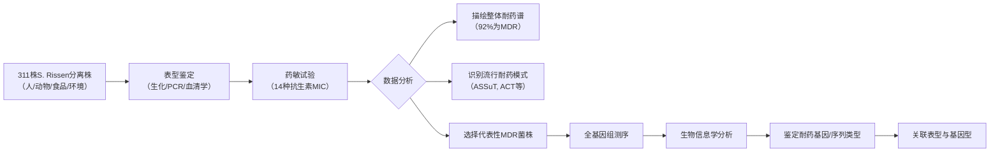

# Characterization of Multidrug Resistance Patterns of Emerging Salmonella enterica Serovar Rissen along the Food Chain in China

## 📎 快捷链接

| 类型 | 链接 |
|------|------|
| Zotero 条目 | [打开条目](zotero://select/items/0/K3ASYGVQ) |
| Zotero PDF | [打开PDF](zotero://open-pdf/library/items/KKNHQ3A5) |
| MinerU 解析 | [查看解析](file:///G:/zotero/llm-for-zotero-mineru/483/full.md) |
| DOI | [在线查看](https://doi.org/) |

## 一、核心概念与研究背景
- **一句话总结**：该研究首次系统性地分析了2016-2019年中国全食物链（人、动物、食品、环境）中新兴沙门氏菌Rissen血清型的多重耐药性模式，揭示了其严峻的耐药现状和特定的耐药谱流行趋势。
- **关键概念解析**：
    - **沙门氏菌Rissen血清型**：一种全球新兴的、主要与猪源产品相关的食源性沙门氏菌，是引起人类沙门氏菌病的常见病原体之一。
    - **多重耐药性**：指细菌同时对三种或以上不同类别的抗生素产生耐药性，是公共卫生的重大威胁。
    - **最低抑菌浓度**：衡量抗生素体外抑制细菌生长能力的指标，数值越低，抗菌活性越强。
    - **食物链传播**：强调耐药菌和耐药基因可沿“养殖-食品-人类-环境”这一链条进行扩散和循环。

## 二、遭遇的瓶颈与中间问题
- **现有挑战**：尽管Rissen血清型在全球食源性疾病中地位上升，但关于其在中国，特别是涵盖整个食物链的系统性耐药性数据和耐药决定因素信息非常有限。
- **具体难点**：
    1.  **数据空白**：缺乏来自中国不同地区、不同来源（人、动物、食品、环境）的Rissen血清型分离株的系统性耐药性调查。
    2.  **谱系不清**：不清楚在中国流行的Rissen血清型其主要耐药模式是什么，以及不同来源的菌株之间是否存在耐药性关联。
    3.  **机制不明**：表型耐药背后的遗传基础（耐药基因）尚未被揭示。

## 三、揭秘过程与解决方案
- **破局思路**：作者依托中国本地监测网络，获取了覆盖中国15个省市的、来自四个主要来源（人、动物、食品、环境）的311株S. Rissen分离株，通过“大规模表型筛查+代表性菌株基因组测序”的策略，系统描绘其耐药图谱。
- **一步步揭秘**：
    1.  **样本收集**：从2016-2019年的中国监测系统中，筛选出311株S. Rissen分离株，并获取其来源和临床信息。
    2.  **表型鉴定**：通过生化、PCR和血清凝集实验，确认所有菌株均为沙门氏菌Rissen血清型。
    3.  **耐药性普查**：使用微量肉汤稀释法，测定所有菌株对14种临床相关抗生素的MIC值，确定其耐药表型。
    4.  **模式分析**：统计不同来源、不同耐药模式的菌株比例，识别出流行的优势耐药模式（如ASSuT, ACT）。
    5.  **基因探秘**：选取8株具有代表性的广泛耐药菌株进行全基因组测序，通过生物信息学分析，将表型耐药与具体的耐药基因（如`blaTEM-1`, `tet(A)`, `sul2`, `dfrA14`等）进行关联。

## 四、核心技术路线
- **整体架构**：大规模流行病学调查 + 表型耐药检测 + 基因组学验证。
- **关键创新点**：首次对中国境内“全食物链”来源的S. Rissen进行了耐药性全景式分析，并尝试建立“耐药表型-基因型”的直接联系。
- **流程图**：

## 五、结果呈现与证据链
- **核心结论**：
    1.  **来源分布**：S. Rissen感染以人源为主（67%，208/311），其中大部分患者出现腹泻。
    2.  **高耐药性**：92%的菌株为多重耐药菌。
    3.  **耐药谱**：对四环素、复方新诺明、氯霉素、链霉素、磺胺异恶唑和氨苄西林的耐药率最高。对三代头孢（头孢曲松、头孢噻呋）、庆大霉素和喹诺酮类（环丙沙星）等仍高度敏感。
    4.  **流行模式**：ASSuT（27%）、ACT（25%）、ACSSuT（22%）等是主要的多重耐药模式。
    5.  **基因决定**：测序的8株菌株中，携带了与表型耐药匹配的基因，如`blaTEM-1`（氨苄西林耐药）、`tet(A)`（四环素耐药）、`sul2`和`dfrA14`（磺胺类耐药）等。
- **证据展示**：MIC值分布表、不同来源菌株耐药率对比图、多重耐药模式占比图。
- **回应“中间问题”**：研究结果全面填补了S. Rissen在中国食物链中的耐药性数据空白，明确了其以“对老一代抗生素耐药、对新型头孢和喹诺酮敏感”为主要特征，并通过基因组学揭示了部分遗传基础。

## 六、局限性与待解决问题
1.  **机制研究深度有限**：研究侧重于基因检测，未对耐药基因的水平转移机制、表达调控或其在菌株适应性中的作用进行深入功能研究。
2.  **样本代表性**：尽管覆盖了15个省市，但样本量在不同来源和地区间可能不均衡，可能影响结论的普适性。
3.  **缺乏进化与传播动力学分析**：未进行基于全基因组的系统发育分析，无法揭示耐药菌株间的克隆传播关系和进化路径。
4.  **抗生素使用数据关联缺失**：研究指出了养殖业滥用可能是主因，但未能将菌株的耐药表型与具体的抗生素使用数据直接关联。
5.  **未涵盖耐药基因的遗传背景**：未充分探讨耐药基因是位于染色体还是质粒上，这影响了对其传播风险的判断。

## 七、与沙门氏菌/细菌基因组学研究的关联
- **可直接借鉴的方法/思路**：
    1.  **系统采样策略**：从同一地理区域的“全食物链”环节系统收集菌株，对于研究食源性病原的传播和耐药性扩散至关重要。
    2.  **标准化药敏方案**：采用CLSI/NARMS标准的微量肉汤稀释法进行MIC测定，确保数据可比性。
    3.  **表型-基因型关联验证**：对代表性菌株进行WGS，使用如`ABRicate`等工具快速筛查耐药基因，是建立因果关系的有效手段。
- **应避免的陷阱**：
    1.  **避免仅依赖表型数据**：仅报告耐药率而不同步进行基因分型，会错失揭示耐药传播机制的机会。
    2.  **避免样本偏倚**：采样时需有意识地平衡不同宿主、地区和临床来源的样本量。
    3.  **谨慎解读流行模式**：像“ASSuT”这样的缩写模式是观察结果，其形成原因（共选择、基因连锁等）需要基因组和流行病学数据进一步验证。
    4.  **注意选择压力**：在分析耐药性时，应始终考虑养殖场、医院和社区环境中抗生素选择压力这一核心驱动因素。

Tags: #论文笔记 #微生物学 #沙门氏菌 #耐药性 #多重耐药 #最小抑菌浓度 #全基因组测序 #公共卫生 #Antibiotics