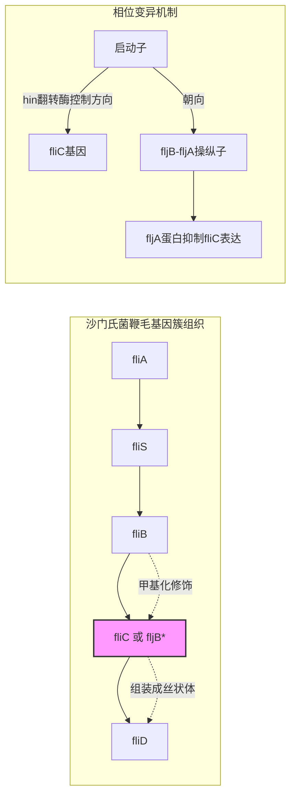

# Comprehensive Analysis Reveals Two Distinct Evolution Patterns of Salmonella Flagellin Gene Clusters

## 📀 快捷链接

| 类型 | 链接 |
|------|------|
| Zotero 条目 | [打开条目](zotero://select/items/0/MFE6Z3PE) |
| Zotero PDF | [打开PDF](zotero://open-pdf/library/items/B5JMGICB) |
| MinerU 解析 | [查看解析](file:///G:/zotero/llm-for-zotero-mineru/6866/full.md) |
| DOI | [在线查看](https://doi.org/10.3389/fmicb.2017.02604) |

## 一、核心概念与研究背景
- **一句话总结**：本研究通过大规模基因组比较，揭示了沙门氏菌决定血清型的两个关键鞭毛蛋白基因簇（fliC 和 fljB）存在两种截然不同的进化模式，这主要与细菌的单相或双相特性相关。
- **关键概念解析**：
    - **鞭毛蛋白基因 (fliC, fljB)**：编码沙门氏菌鞭毛丝状体蛋白，是细菌的运动结构，也是决定其血清型（H抗原）和毒力的关键表面抗原。fliC编码“相1”抗原，存在于几乎所有沙门氏菌中；fljB编码“相2”抗原，仅存在于部分肠亚种中。
    - **单相/双相血清型 (Monophasic/Biphasic serovars)**：沙门氏菌可通过“相位变异”机制切换表达两种鞭毛蛋白。能同时表达两种相抗原（fliC和fljB）的菌株称为“双相”；只能表达一种（通常为fliC）的称为“单相”；不表达任何鞭毛的为“非运动型”。
    - **鞭毛蛋白基因簇 (Flagellin gene clusters)**：不仅指fliC和fljB本身，还包括其上下游的一系列调控和结构基因，如`fliA`（特异性σ因子）、`fliB`（甲基化）、`fliD`（丝状体帽蛋白）、`fliS`（鞭毛蛋白输出）、`fljA`（fliC的负调控因子）、`hin`（控制相位变异的翻转酶）等。这些基因的共进化关系是本研究的核心。
    - **同源重组 (Homologous recombination)**：细菌遗传变异的重要来源，发生在fliC、fljB等基因之间，导致抗原多样性。

## 二、遭遇的瓶颈与中间问题
- **现有挑战**：
    1.  **进化模式不清**：尽管知道fliC和fljB序列可变且与血清型相关，但整个鞭毛蛋白基因簇（包含多个功能基因）的进化历史和模式缺乏系统性描述。
    2.  **数据局限**：此前结论基于有限样本，无法全面反映沙门氏菌（尤其是其肠亚种I）中2500多种血清型的多样性。
    3.  **关系不明**：fliC/fljB基因簇的进化是否与沙门氏菌的核心基因组进化同步？基因簇内部各基因之间是否存在协调进化？
- **具体难点**：
    1.  如何从庞大的基因组数据中准确鉴定并比较这些非单拷贝、且可能存在重组的鞭毛蛋白基因簇。
    2.  如何量化不同基因树之间以及与物种树（核心基因组）之间的进化一致性（congruence），以判断是垂直遗传还是频繁水平转移。
    3.  如何解析基因簇内不同基因之间的重组热点和进化压力。

## 三、揭秘过程与解决方案
- **破局思路**：作者摒弃了仅关注fliC/fljB序列的传统思路，转而采用**大规模泛基因组学和比较基因组学方法**，将分析对象扩展到完整的鞭毛蛋白基因簇，并结合严格的一致性统计分析和重组检测，从基因簇和基因两个层面解构其进化历史。
- **一步步揭秘**：
    1.  **构建数据基础**：收集了当时最全面的214个沙门氏菌基因组（覆盖5个亚种，87个血清型），为泛基因组分析提供了坚实基础。
    2.  **定义分析单元**：通过OrthoMCL进行泛基因组聚类，确定所有同源基因簇。这步是关键，它标准化了不同基因组中“相同”基因的定义，为后续比较提供了统一标准。
    3.  **重建物种进化树**：提取所有菌株共享的**127,544个单拷贝核心基因**，通过串联序列的SNP构建了代表沙门氏菌“真实”进化关系的核心基因组系统发育树。这作为后续分析的“标尺”。
    4.  **定位与鉴定鞭毛基因簇**：以标准菌株LT2为参考，利用BLAST在泛基因组中定位fliC、fljB及其周边基因（fliA, fliB, fliD, fliS, fljA, hin）的同源簇。结合基因物理位置（侧翼基因链接）确认其身份，区分了fliC位点和fljB位点。
    5.  **进行一致性分析**：使用PAUP软件，对每个鞭毛基因的基因树与核心基因组树进行统计比较（1-lnL检验）。**意外发现**：只有`fliA`和`fliS`的进化与核心基因组同步（一致），而`fliB`、`fliC/fljB`、`fliD`的基因树彼此一致，却与核心基因组树**不一致**。这强烈暗示`fliB`-`fliC/fljB`-`fliD`构成了一个“独立进化”的模块。
    6.  **揭示模块内模式**：进一步对`fliB`、`fliC/fljB`、`fliD`的联合基因树进行分析，发现它们清晰地分为两大分支，并且**这两大分支与单相、双相血清型的划分高度对应**。这就是两种进化模式的首次明确呈现。
    7.  **探究内在驱动力**：使用RDP4软件检测`fliB`、`fliC`、`fliD`基因内的重组事件。结果显示，重组事件主要发生在**同一进化模式组（如双相组内或单相组内）的菌株之间**，而跨组重组罕见。这解释了两种模式为何能保持稳定和分化。

## 四、核心技术路线
- **整体架构**：泛基因组构建 → 核心基因组系统发育树 → 鞭毛基因簇识别 → 基因树一致性分析 → 联合进化模式识别 → 组内重组分析。
- **关键创新点**：
    1.  **视角转换**：从单个基因（fliC/fljB）分析上升到整个**基因簇**（多个功能相关基因）的进化分析。
    2.  **一致性定量**：使用严格的统计学方法（1-lnL）评估多个基因树与物种树的进化一致性，而非仅凭主观观察。
    3.  **大规模数据集**：分析了当时尽可能多的、覆盖多样血清型的基因组，结果更具代表性。
- **流程图**：
    ```mermaid
    graph TD
        A[214个沙门氏菌基因组] --> B[泛基因组分析];
        B --> C{识别核心基因簇};
        B --> D[鉴定鞭毛蛋白基因簇<br>（fliA/B/C/D/S, fljA/B, hin）];
        C --> E[构建核心基因组进化树];
        D --> F[为每个鞭毛基因构建基因树];
        E --> G[一致性分析<br>（基因树 vs 物种树）];
        F --> G;
        G --> H{发现模式};
        H --> I[模式一：fliA, fliS<br>与核心基因组进化同步];
        H --> J[模式二：fliB, fliC/fljB, fliD<br>彼此同步，独立于核心基因组];
        J --> K[联合树分为两大组<br>对应单相/双相血清型];
        J --> L[重组分析];
        L --> M[发现重组主要发生在组内];
    ```

## 五、结果呈现与证据链
- **核心结论**：沙门氏菌鞭毛蛋白基因簇存在两种明确的进化模式：
    1.  **模式一（垂直遗传）**：`fliA`和`fliS`基因的进化与沙门氏菌核心基因组保持同步，表明它们主要随菌株垂直遗传，变异缓慢。
    2.  **模式二（协同进化与分化）**：`fliB`、`fliC`/`fljB`和`fliD`基因构成了一个协同进化的模块，其进化轨迹独立于核心基因组。该模块进一步分化为两个主要进化分支，**一个主要包含双相血清型菌株，另一个主要包含单相血清型菌株**。
- **证据展示**：
    - **一致性分析结果**：`fliA`和`fliS`基因树与核心基因组树的1-lnL值低于显著性阈值（第99百分位），表明进化一致。而`fliB`、`fliC`、`fliD`等基因树则不一致。
    - **联合基因树**：基于`fliB`、`fliC/fljB`、`fliD`构建的系统发育树（文中图2）清晰显示了与血清型单/双相特性对应的两大分支。
    - **重组热点**：RDP4分析（文中表2）检测到多个重组事件，且这些事件主要发生在同一分支（单相组或双相组）的菌株之间。
- **回应中间问题**：
    - **进化模式不清**：结果明确划分出两种模式。
    - **数据局限**：使用了205个高质量基因组（最终用于分析的数量），覆盖87个血清型，提供了强大统计力。
    - **关系不明**：一致性分析直接回答了进化同步性问题；重组分析揭示了模式二内部多样性的生成机制。

## 六、局限性与待解决问题
- **局限性**：
    1.  **数据偏差**：尽管样本量较大，但主要来源于数据库中已测序的基因组，可能偏向于临床重要或常见的血清型，未能完全代表自然界中的全部多样性。
    2.  **分析深度**：主要聚焦于进化模式的模式识别，对驱动这两种模式产生的**具体选择压力**（如环境适应、宿主相互作用）的深入机制探讨不足。
    3.  **机制未完全阐明**：虽然发现了重组发生在组内，但对于**为何双相和单相菌株的鞭毛基因簇进化路径会彻底分开**这一根本问题，论文未能给出分子层面的完整解释。
    4.  **方法依赖**：进化树和重组检测的结果依赖于所用算法和参数，可能存在一定的方法学误差。
- **待解决问题**：
    1.  这两种进化模式是否在沙门氏菌的其他表面抗原基因（如O抗原、Vi抗原）中也存在？
    2.  双相/单相表型的转换机制（hin介导的翻转）的起源和进化，与这两种基因簇进化模式有何关联？
    3.  模式二基因簇（fliB-fliC/fljB-fliD）是否形成了一个更易发生水平基因转移和重组的“基因组岛”？

## 七、与沙门氏菌/细菌基因组学研究的关联
- **可直接借鉴的方法/思路**：
    1.  **“基因簇”视角**：在研究功能相关的基因家族（如毒素、粘附素、抗生素抗性基因簇）时，不应孤立看待单个基因，而应分析其所在的**遗传背景和共进化模式**。
    2.  **一致性分析框架**：利用PAUP等软件进行基因树与物种树的一致性检验，是判断基因进化是“垂直”还是“水平”的金标准方法之一，可用于分析任何疑似经历水平转移的基因。
    3.  **组合分析**：将泛基因组、系统发育、重组检测和表型关联分析相结合，能更全面地揭示细菌重要性状的进化动态。
- **应避免的陷阱**：
    1.  **避免忽视遗传背景**：仅基于fliC/fljB序列进行血清分型或进化分析，可能会忽略其所在的基因簇背景，从而错过重要的进化和功能信息。
    2.  **注意样本代表性**：在进行进化分析时，需谨慎评估数据库样本的偏差，并尽可能纳入多样化的菌株（包括环境、动物分离株和不同亚种）。
    3.  **谨慎解读重组事件**：基因间的重组信号可能由多次事件或基因转换造成，需结合多种方法和生物合理性进行判断，避免过度解读。


*注：D位置在fliC位点时为fliC，在fljB位点时为fljB，两者互斥。*

Tags: #论文笔记 #进化微生物学 #沙门氏菌 #鞭毛蛋白 #基因簇进化 #系统发育 #重组 #FrontiersInMicrobiology