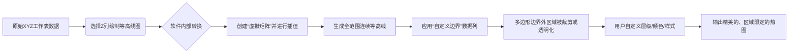

# Create Heatmap with Virtual Matrix and Colormap Bar Plot Contents

## 📎 快捷链接

| 类型 | 链接 |
|------|------|
| Zotero 条目 | [打开条目](zotero://select/items/0/JSTZ7KTR) |
| Zotero PDF | [打开PDF](zotero://open-pdf/library/items/9BHHPYLZ) |
| MinerU 解析 | [查看解析](file:///G:/zotero/llm-for-zotero-mineru/7003/full.md) |
| DOI | [在线查看](https://doi.org/) |

## 一、核心概念与研究背景
- **一句话总结**：这篇教程展示了如何使用 Origin 2020 软件，通过“虚拟矩阵”和“自定义边界”功能，将原始的XYZ数据（如地理坐标及测量值）转化为专业、清晰的热图（等高线图），并完成高级美化。
- **关键概念解析**：
    - **热图/等高线图**：一种用颜色梯度表示二维空间上数值大小（如温度、密度、基因表达量）的可视化方法。在生物医学中常用于展示培养皿上菌落生长密度、组织切片染色强度或空间转录组数据。
    - **虚拟矩阵**：Origin 软件中的一种数据结构。当你的数据是X、Y、Z三列（即一系列离散点），而非预先网格化的矩阵时，软件可以内部将其“虚拟化”为一个矩阵进行计算和插值，从而生成连续的等高线。这是处理非规则采样数据的核心。
    - **自定义边界**：用于限定等高线图的绘制范围，只绘制指定多边形区域内的部分。这对于可视化特定地理区域（如一个国家、一个培养皿）或不规则形状样本的数据至关重要，能避免无意义的空白区域。

## 二、遭遇的瓶颈与中间问题
- **现有挑战**：在数据可视化前，研究者常常面临数据格式（XYZ离散点 vs. 标准矩阵）与绘图需求不匹配的问题。直接绘制可能导致边界不准确、区域外出现多余的颜色填充，或无法聚焦到感兴趣区域。
- **具体难点**：
    1.  **数据映射**：如何将非均匀分布的XYZ点数据准确地映射到连续的等高线曲面。
    2.  **边界控制**：如何让等高线仅显示在指定的、不规则的地理或物理边界内，避免“越界”。
    3.  **视觉优化**：如何根据数据特征和审美需求，精细调节颜色映射、等高线层级和样式，使图表既科学准确又清晰易读。

## 三、揭秘过程与解决方案
- **破局思路**：作者的核心思路是利用 Origin 软件的**数据转换**和**图形对象独立控制**能力。关键在于不改变原始数据，而是通过软件内置的“虚拟矩阵”机制进行插值，并将“边界”作为一个独立的图形层或数据参数来精准控制绘图范围。
- **一步步揭秘**：
    1.  **准备数据**：在工作表中准备X、Y、Z三列数据（例如，地理经度、纬度、温度）。
    2.  **创建基础图**：选中Z列数据，通过菜单 `Plot > Contour : Contour - Color Fill` 创建初始等高线图。此时图形可能包含全部数据范围。
    3.  **设定数值范围**：使用 `Set Levels` 对话框，根据数据分布设定等高线的最小值(`From`)、最大值(`To`)以及主要/次要层级数，控制颜色梯度的分辨率。
    4.  **应用颜色板**：在迷你工具栏中为等高线图选择合适的颜色板（如 `Rainbow`），以直观反映数值高低。
    5.  **锁定坐标轴范围**：分别设置X轴和Y轴的显示范围（如 `-127` 到 `-65`， `23` 到 `50`），将视图聚焦到目标地理区域。
    6.  **核心步骤：应用自定义边界**：
        - 打开 `Plot Details` 对话框，在 `Contouring Info` 标签页选择 `Custom Boundary`。
        - 指定边界X数据列和Y数据列，这两列数据定义了用于裁剪等高线图的多边形顶点坐标。
        - 设置 `Smoothing Parameter`（平滑参数），使边界线更顺滑。
    7.  **精修图形元素**：
        - 在 `Colormap/Contours` 标签页，可以独立设置边界线和等高线的样式（如颜色、是否显示、是否跟随填充色）。
        - 对特定数值（如30℃）的等高线进行单独定制。
    8.  **调整版面与图例**：
        - 调整图层尺寸和纵横比。
        - 双击颜色标尺（Color Scale），精细控制其标题、刻度、标签等格式，使其与主图协调。
    9.  **添加标题**：添加描述性图表标题（如“30-Year Mean Temperature for the Month of January”）。

## 四、核心技术路线
- **整体架构**：技术路线围绕“数据 → 虚拟矩阵插值 → 带边界裁剪的等高线渲染 → 精细美饰”这一流程展开。
- **关键创新点**：
    - **虚拟矩阵**：自动处理离散XYZ数据，无需用户手动重采样或网格化。
    - **独立的边界控制**：将边界视为一个独立于等高线计算的数据对象，实现了精准、灵活的空间裁剪。
- **流程图**：

## 五、结果呈现与证据链
- **核心结论**：通过上述步骤，可以高效、精准地创建出仅显示美国本土区域、以彩虹色渐变表示1981-2010年1月平均温度的专业热图。
- **证据展示**：教程最终生成的图表清晰地展示了美国各州的温度梯度，并且等高线和颜色填充被严格限制在美国国界线内，边界外的区域（如加拿大、墨西哥、海洋）没有任何图形元素，验证了自定义边界功能的有效性。
- **回应中间问题**：
    - **数据映射**：通过“虚拟矩阵”插值解决了。
    - **边界控制**：通过指定边界X/Y数据列，并利用平滑参数优化，完美解决了。
    - **视觉优化**：通过独立设置等高线/边界线颜色、自定义颜色标尺、调整图层尺寸等多步精细操作解决了。

## 六、局限性与待解决问题
1.  **边界平滑度依赖参数**：`Smoothing Parameter` 的设置没有通用公式，需要用户反复尝试，对不规则或尖锐的边界可能产生意外形变。
2.  **版本依赖**：教程明确指出自2018版起，自定义边界的填充行为得到了改进。使用旧版本（<2018）的用户可能会遇到边界填充不完美的问题，需通过系统变量 `@TCSM` 恢复旧行为。
3.  **手动操作繁多**：从数据准备到最终出图，涉及大量手动对话框设置和属性调整，对于批量处理或需要程序化绘图的场景不够高效。
4.  **对非多边形边界支持有限**：教程中的边界是闭合多边形。对于更复杂的边界（如含孔洞的多边形、非连续区域），操作可能更加复杂。
5.  **数据要求**：要求XYZ数据在空间上分布合理，过于稀疏或不均匀的采样点可能导致插值后的等高线失真。

## 七、与沙门氏菌/细菌基因组学研究的关联
- **可直接借鉴的方法/思路**：
    - **可视化细菌空间分布**：将平板培养或生物被膜实验中，不同区域（X， Y坐标）的菌落计数或生物量（Z值）生成热图，清晰展示细菌生长的热点区域。
    - **展示基因表达模式**：在宏基因组或空间转录组数据中，将样本的空间坐标（如肠道不同区段、培养基不同位置）与特定基因的表达量结合，用热图呈现其空间表达梯度。
    - **数据分析流程标准化**：该教程提供的分步操作指南，可以转化为实验室内部的标准数据分析流程（SOP），用于处理同类空间分布数据。
- **应避免的陷阱**：
    - **过度插值**：对于离散且分布稀疏的细菌计数数据，插值可能生成不真实的“渐变”，错误暗示测量点之间存在连续变化。应谨慎使用，或搭配原始数据点标记。
    - **边界定义误差**：如果用于定义实验区域（如培养皿、感染组织切片）的边界数据不精确，会导致分析区域错误。需确保边界数据与物理实验区域严格对应。
    - **忽略数据分布**：在设置等高线层级时，需根据实际数据的分布（如是否对数分布）选择合适的映射方式（线性/对数），否则可能导致视觉误导。

Tags: #论文笔记 #数据可视化 #热图 #等高线图 #Origin #教程