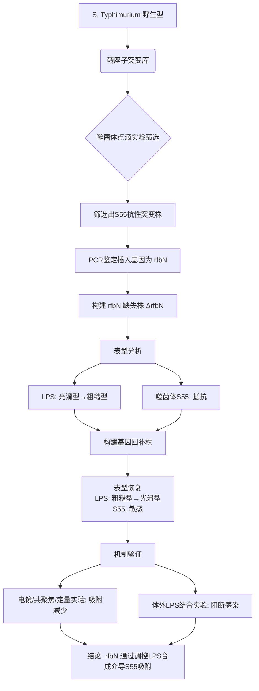

# The rfbN gene of Salmonella Typhimurium mediates phage adsorption by modulating biosynthesis of lipopolysaccharide

## 📎 快捷链接

| 类型 | 链接 |
|------|------|
| Zotero 条目 | [打开条目](zotero://select/items/0/CA57BVW5) |
| Zotero PDF | [打开PDF](zotero://open-pdf/library/items/YZHKJX4N) |
| MinerU 解析 | [查看解析](file:///G:/zotero/llm-for-zotero-mineru/7034/full.md) |
| DOI | [在线查看](https://doi.org/) |

## 一、核心概念与研究背景
- **一句话总结**：该研究揭示了鼠伤寒沙门氏菌中一个名为 `rfbN` 的基因，通过控制细菌表面脂多糖（LPS）的合成，决定了噬菌体S55能否吸附并感染细菌。
- **关键概念解析**：
    - **`rfbN` 基因**：在沙门氏菌中参与LPS O抗原合成的基因。本研究首次发现它与噬菌体吸附相关。
    - **脂多糖 (LPS)**：革兰氏阴性菌外膜的主要成分，结构复杂，由**核心多糖**和**O抗原**多糖链组成。根据O抗原的完整与否，分为**光滑型（Smooth, S-LPS）**和**粗糙型（Rough, R-LPS）**。LPS是许多噬菌体吸附的受体。
    - **噬菌体吸附 (Phage Adsorption)**：噬菌体感染的第一步，即其尾部纤维蛋白识别并结合细菌表面的特异性受体（此处为LPS）。这是决定感染特异性的关键步骤。
    - **噬菌体治疗**：利用噬菌体裂解病原菌来治疗细菌感染的方法，是应对多重耐药菌的潜在策略。理解噬菌体-宿主相互作用机制是其安全有效应用的基础。

## 二、遭遇的瓶颈与中间问题
- **现有挑战**：在噬菌体治疗领域，虽然噬菌体裂解细菌的现象已被认知，但特定细菌基因如何精确调控噬菌体吸附的分子机制尚不完全清楚，限制了噬菌体疗法的精准设计与应用。
- **具体难点**：
    1.  如何筛选并鉴定出影响特定噬菌体（S55）感染宿主（S. Typhimurium）的关键宿主基因？
    2.  如何证实该基因的功能是通过影响细菌表面结构（如LPS）来实现的？
    3.  如何精确解析该基因编码蛋白的功能结构域？

## 三、揭秘过程与解决方案
- **破局思路**：作者采用经典的“遗传筛选-表型验证-机制解析”研究范式。灵感来自于噬菌体感染宿主依赖表面受体，而LPS是已知重要受体，因此将研究焦点从全局筛选收敛到与LPS合成相关的基因上。
- **一步步揭秘**：
    1.  **大规模筛选**：通过转座子突变技术，随机插入破坏鼠伤寒沙门氏菌D6株的基因，获得约**5000个**突变体库。
    2.  **表型筛选**：利用“噬菌体点滴实验”筛选对噬菌体S55产生抗性的突变体。发现一个突变株不能被S55裂解。
    3.  **基因定位**：通过PCR和测序，确定转座子插入了 `rfbN` 基因。
    4.  **因果关系验证**：构建 `rfbN` 基因缺失株（ΔrfbN83-188）和基因回补株。发现：
        - 缺失株：对S55完全抵抗，**LPS从光滑型转变为粗糙型**。
        - 回补株：恢复对S55的敏感性，LPS恢复为光滑型。
        *这一步直接证明了 `rfbN` 通过调控LPS类型影响噬菌体感染。*
    5.  **吸附机制验证**：通过多种方法证实，噬菌体S55对缺失株的**吸附能力显著降低**（TEM、共聚焦显微镜、定量吸附实验）。
    6.  **受体直接证据**：将纯化的光滑型LPS与S55噬菌体体外孵育后，再加入野生型细菌，细菌不再被裂解。这证明**光滑型LPS可以直接与S55结合，阻断其感染**。
    7.  **蛋白功能域解析**：构建分别缺失三个不同氨基酸片段（90-120aa, 121-158aa, 159-194aa）的RfbN蛋白回补株，发现缺失任一片段都会导致LPS变为粗糙型且对S55抵抗，说明**这三个区域对蛋白功能都至关重要**。

## 四、核心技术路线
- **整体架构**：`遗传筛选 → 功能基因鉴定 → 基因敲除/回补构建 → 表型分析（生长、LPS类型、噬菌体裂解/吸附） → 机制验证（体外LPS结合实验）`。
- **关键创新点**：首次报道了 `rfbN` 基因在噬菌体吸附过程中的作用，并将其功能明确限定在LPS O抗原合成途径上。
- **流程图**：

## 五、结果呈现与证据链
- **核心结论**：`rfbN` 基因通过调控LPS的生物合成（特别是O抗原的完整性），决定鼠伤寒沙门氏菌外膜呈现光滑型LPS，从而作为噬菌体S55的吸附受体，介导其后续的感染过程。
- **证据展示**：
    1.  **表型证据**：`ΔrfbN` 缺失株对S55完全抵抗（点滴实验无裂解环）；LPS银染电泳显示其LPS条带迁移模式改变，证实为粗糙型。
    2.  **吸附证据**：
        - **透射电镜 (TEM)**：直观显示S55大量吸附在野生型菌体表面，而在`ΔrfbN`缺失株表面极少。
        - **共聚焦显微镜**：荧光标记的S55（绿色）与表达红色荧光蛋白的野生型菌体共定位，而在缺失株上信号很弱。
        - **定量吸附实验**：与野生型相比，S55在`ΔrfbN`缺失株上的**吸附率显著下降**。
    3.  **直接结合证据**：纯化的光滑型LPS能“中和”S55的感染能力，这是LPS作为直接受体的强有力证据。
- **如何回应“中间问题”**：上述证据系统性地回答了从筛选到机制的全链问题：筛选得到 `rfbN` → 证明其通过LPS发挥作用 → 证明LPS直接是受体。

## 六、局限性与待解决问题
1.  **噬菌体特异性**：研究仅针对噬菌体S55，`rfbN` 缺失是否影响其他以LPS为受体的沙门氏菌噬菌体？结论的普适性有待验证。
2.  **机制深度**：研究仅证明 `rfbN` 通过LPS合成起作用，但未深入探究其作为酶（可能是转移酶）的具体生化功能，以及它是如何与LPS合成通路中的其他蛋白相互作用的。
3.  **体内数据缺失**：所有实验均在体外进行，未在动物感染模型中验证 `rfbN` 突变或噬菌体治疗的效果。
4.  **LPS结合蛋白未鉴定**：研究证明了LPS是受体，但未鉴定S55噬菌体上直接结合LPS的具体尾部纤维蛋白是什么。
5.  **功能域机制不清**：发现RfbN蛋白的三个氨基酸片段（90-120, 121-158, 159-194）对其功能必需，但这些片段在蛋白结构中的具体作用（如构成活性中心、参与蛋白折叠或互作）未阐明。

## 七、与沙门氏菌/细菌基因组学研究的关联
- **可直接借鉴的方法/思路**：
    1.  **“转座子突变+表型筛选”策略**：这是鉴定与特定表型（如噬菌体抗性、毒力、耐药性）相关基因的经典且高效的方法。
    2.  **系统的基因敲除/回补验证**：为确认基因功能，必须构建非极性缺失株和互补株，并进行严格的表型比较，这是功能基因组学研究的“金标准”。
    3.  **多层次表型分析**：将基因功能与细菌表面结构（如LPS银染）、生理行为（如自聚集）和外界互作（如噬菌体吸附）相结合，进行多角度验证。
- **应避免的陷阱**：
    1.  **避免过度泛化结论**：一个基因对一种噬菌体的影响不能直接推论到所有噬菌体。需要测试不同血清型或不同受体的噬菌体。
    2.  **注意LPS修饰的连锁效应**：`rfbN` 影响O抗原合成，而LPS核心区域或脂质A的修饰也可能影响噬菌体吸附。在研究其他LPS相关基因时，需全面分析LPS结构变化。
    3.  **警惕表型假阴性/假阳性**：转座子插入可能导致极性效应或影响相邻基因，在解释结果时需谨慎，并通过精准敲除和回补来确证。
    4.  **体外结果需体内验证**：细菌在宿主体内的表面结构（如荚膜、其他糖修饰）可能覆盖或影响LPS，体外发现的吸附机制在感染过程中可能复杂化。

Tags: #论文笔记 #微生物学 #噬菌体 #沙门氏菌 #脂多糖 #基因功能 #吸附机制 #VetMicrobiol