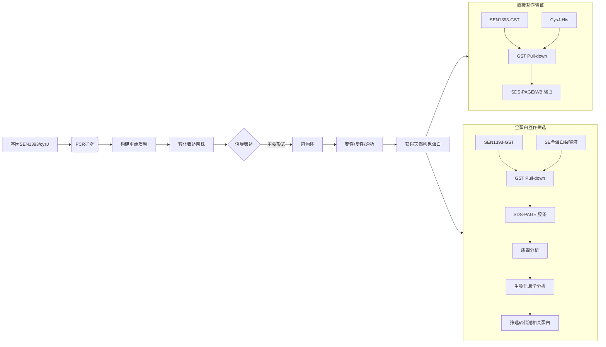

# 肠炎沙门氏菌硫代谢相关基因cysJ和基因SEN1393的原核表达与蛋白相互作用研究

## 📎 快捷链接

| 类型 | 链接 |
|------|------|
| Zotero 条目 | [打开条目](zotero://select/items/0/#) |
| Zotero PDF | [打开PDF](zotero://open-pdf/library/items/RBGWGBCF) |
| MinerU 解析 | [查看解析](file:///G:/zotero/llm-for-zotero-mineru/7147/full.md) |
| DOI | [在线查看](https://doi.org/#) |

## 一、核心概念与研究背景

- **一句话总结**：本研究旨在解决“肠炎沙门氏菌为何能在具有多重抗菌特性的蛋清中顽强生存”这一食品安全谜题，通过探索其硫代谢相关蛋白SEN1393与CysJ的相互作用，揭示其提高蛋清抗性的潜在分子机制。
- **关键概念解析**：
    - **肠炎沙门氏菌**：全球最主要的人畜共患食源性病原体之一，尤其与蛋及蛋制品污染强相关，是研究蛋清抗性的模式菌株。
    - **硫代谢**：细菌利用无机硫合成半胱氨酸、蛋氨酸等含硫氨基酸的过程。这些氨基酸是谷胱甘肽等抗氧化分子的前体，对抵抗宿主氧化应激至关重要。
    - **蛋清抗菌特性**：一个由**碱性pH、高粘度、营养限制**（如铁被卵转铁蛋白螯合）和**多种抗菌蛋白**（溶菌酶、卵转铁蛋白等）构成的多重胁迫环境。
    - **蛋白-蛋白相互作用**：生命活动的基本方式，通过酵母双杂交、GST pull-down等技术鉴定，是理解信号通路和代谢调控的关键。
    - **GST pull-down**：一种**体外**验证蛋白相互作用的技术。将一种蛋白（Bait，如SEN1393-GST）固定在谷胱甘肽琼脂糖珠上，与另一种蛋白（Prey，如CysJ-His或全蛋白裂解液）孵育，通过洗脱检测是否存在相互作用。

## 二、遭遇的瓶颈与中间问题

- **现有挑战**：肠炎沙门氏菌在蛋清中的特殊高存活能力是其引起食品安全问题的关键，但其背后的分子机制，特别是如何通过硫代谢途径增强抗氧化能力，尚不明确。
- **具体难点**：
    1.  **蛋白表达与活性问题**：目标蛋白SEN1393和CysJ在原核表达系统中主要以**无活性的包涵体**形式存在，难以获得用于相互作用研究的天然构象蛋白。
    2.  **基因调控的复杂性**：关键基因`cysJ`在常规营养丰富的培养条件下（如LB培养基）**受到抑制**，导致其表达量极低，这为在生理相关条件下筛选其相互作用蛋白带来了困难。
    3.  **相互作用的验证与扩展**：仅验证两个已知蛋白的相互作用不足以构建调控网络，需要从全蛋白水平无偏地筛选SEN1393的其他互作伙伴。

## 三、揭秘过程与解决方案

- **破局思路**：作者采取了“**从已知到未知，从验证到发现**”的策略。先聚焦于两个已知与硫代谢相关的基因（`cysJ`和`SEN1393`），通过经典的分子克隆和生化方法验证它们之间的直接相互作用，为SEN1393的功能提供直接证据。随后，利用这一已验证的“诱饵”蛋白，在更接近生理状态的全蛋白背景下进行无偏筛选，以发现新的互作网络。
- **一步步揭秘**：
    1.  **构建表达载体**：首先对`SEN1393`和`cysJ`基因进行生物信息学分析，设计引物，通过PCR扩增、酶切连接，分别构建了带GST标签的`SEN1393-pGEX-4T-1`和带His标签的`cysJ-pET-28a`原核表达载体。
    2.  **攻克包涵体难题**：通过优化诱导条件（SEN1393-GST：28°C，0.6mM IPTG；CysJ-His：16°C，0.6mM IPTG），虽然仍主要表达为包涵体，但提高了可溶性部分的比例。随后，通过**包涵体提取、尿素变性、透析复性**等步骤，成功将两种蛋白恢复为可用于实验的天然构象。
    3.  **验证直接相互作用**：进行GST pull-down实验。将复性的SEN1393-GST（作为Bait）与CysJ-His（作为Prey）孵育。通过SDS-PAGE和Western Blotting检测，清晰地在洗脱组分中检测到了CysJ-His蛋白，**直接证明了二者之间存在物理相互作用**。
    4.  **无偏筛选新伙伴**：以复性的SEN1393-GST为诱饵，与肠炎沙门氏菌的**全蛋白裂解液**进行GST pull-down实验。将洗脱下来的蛋白复合物进行SDS-PAGE胶条切取，送**质谱分析**，以期发现所有与SEN1393相互作用的蛋白。
    5.  **解析质谱数据**：对质谱数据进行GO、COG富集分析和亚细胞定位，从中筛选出与硫代谢相关的蛋白，包括半胱氨酸和蛋氨酸代谢途径中的关键酶。

## 四、核心技术路线

- **整体架构**：采用**原核表达、蛋白复性、体外互作验证（GST pull-down）与质谱组学分析**相结合的技术体系。
- **关键创新点**：
    1.  **包涵体蛋白的复性与应用**：成功将两个主要以包涵体形式表达的目标蛋白进行复性，并将其应用于GST pull-down实验，解决了蛋白活性获取的难题。
    2.  **从点到面的筛选策略**：在验证了一对已知互作的基础上，利用同一Bait蛋白进行全蛋白水平的无偏筛选，极大地扩展了发现新互作蛋白的可能性。
- **流程图**：

## 五、结果呈现与证据链

- **核心结论**：
    1.  蛋白SEN1393与CysJ**存在直接物理相互作用**，为SEN1393参与调控肠炎沙门氏菌硫代谢提供了首个直接证据。
    2.  SEN1393是一个潜在的**硫代谢调控枢纽**，它还能与半胱氨酸代谢途径中的**CysB、CysK、CysQ**以及蛋氨酸代谢途径中的**MetE、MetH、MetG**发生相互作用（直接或间接）。
- **证据展示**：
    1.  **直接互作证据**：GST pull-down的SDS-PAGE和Western Blotting图显示，在以SEN1393-GST为Bait的洗脱组分中，能特异性地检测到CysJ-His条带，而GST标签对照组则没有。
    2.  **互作网络证据**：质谱分析从SEN1393的pull-down产物中鉴定出了6个与硫代谢显著相关的蛋白（CysB, CysK, CysQ, MetE, MetH, MetG），GO/COG分析也支持了其功能富集于氨基酸代谢。
- **回应中间问题**：
    - 这些结果直接**回应了SEN1393功能未知的问题**，将其与核心的硫代谢通路紧密联系起来。
    - 质谱在常规培养条件下未筛到CysJ，**验证了“cysJ基因受抑制”这一难点**，反衬了作者通过人工表达蛋白验证其互作的必要性。
    - 整体证据链为“**SEN1393通过调控硫代谢网络，影响抗氧化能力，进而增强蛋清抗性**”这一假设提供了坚实的分子基础。

## 六、局限性与待解决问题

1.  **体外实验的局限性**：所有互作实验均在**体外（in vitro）** 进行。虽然GST pull-down能证明直接物理结合，但无法完全模拟细胞内复杂的环境、蛋白浓度、亚细胞定位及翻译后修饰，因此**互作的生理相关性仍需体内实验（如细菌双杂交、Co-IP）进一步证实**。
2.  **未验证筛选到的互作**：论文通过质谱筛选出了6个新的潜在互作蛋白，但**仅对其中一个（CysJ）进行了点对点的体外验证**。其他5个蛋白（如CysB、MetE等）与SEN1393的互作关系尚未得到进一步的实验验证。
3.  **机制尚不明确**：研究证明了蛋白间存在相互作用，但**并未阐明互作后的功能后果**。例如，SEN1393与这些酶结合后，是激活、抑制还是改变其酶活性？这如何具体影响硫代谢流和谷胱甘肽水平？这些下游的机制问题有待深入。
4.  **调控层级不清**：SEN1393本身是一个功能未知的小蛋白（14.4 kD）。它与这些代谢酶互作，是作为一个**转录因子（尽管可能性不大）、支架蛋白、活性调节因子，还是一个代谢酶的抑制剂/激活剂**？其分子角色需要进一步鉴定。

## 七、与沙门氏菌/细菌基因组学研究的关联

- **可直接借鉴的方法/思路**：
    1.  **GST pull-down联合质谱**：这是从全蛋白水平无偏筛选特定蛋白互作伙伴的**标准化、高效技术**，尤其适用于鉴定新的调控因子或蛋白复合体成员。
    2.  **包涵体蛋白的复性方案**：对于在大肠杆菌中易于形成包涵体的细菌功能蛋白，本文提供的**变性-复性-透析流程**是一个可参考的解决方案，能扩大可用于生化分析的蛋白范围。
    3.  **生物信息学引导的功能验证**：先通过序列分析预测蛋白大小、等电点、稳定性等基本性质，为后续实验设计（如电泳条件、表达温度）提供依据。
- **应避免的陷阱**：
    1.  **过度依赖体外互作**：必须牢记，**体外证实的互作不等于体内存在**。在发表结论或设计后续研究时，应谨慎措辞，并规划必要的体内验证实验。
    2.  **忽略基因的调控背景**：`cysJ`在常规条件下被抑制的事实提醒我们，在设计筛选实验时，**培养条件（如硫源限制）可能对结果产生决定性影响**。在生理相关条件下重复筛选是必要的。
    3.  **质谱数据的解读**：质谱会鉴定出大量蛋白，必须结合**严格的阳性对照（已知互作）、阴性对照（空标签）和生物信息学富集分析**，才能从中可靠地筛选出高置信度的目标互作蛋白，避免假阳性。

Tags: #论文笔记 #微生物学 #食品安全 #沙门氏菌 #硫代谢 #蛋白相互作用 #GST_pull-down #质谱分析