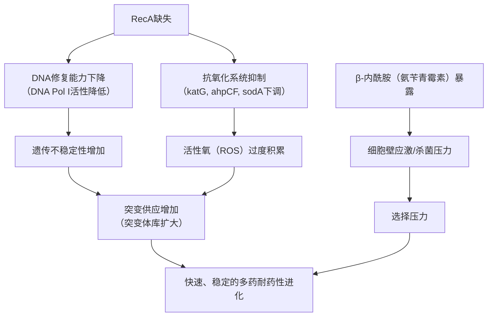

# 细菌中不依赖SOS的多药耐药性的快速进化

## 📎 快捷链接

| 类型 | 链接 |
|------|------|
| Zotero 条目 | [打开条目](zotero://select/items/0/6ICZ78FI) |
| Zotero PDF | [打开PDF](zotero://open-pdf/library/items/3BX5SBBM) |
| MinerU 解析 | [查看解析](file:///G:/zotero/llm-for-zotero-mineru/7838/full.md) |
| DOI | [在线查看](https://doi.org/10.7554/eLife.99406) |

## 一、核心概念与研究背景
- **一句话总结**：研究发现在缺乏关键修复蛋白RecA的大肠杆菌中，单次接触β-内酰胺类抗生素氨苄青霉素，竟能通过一种不依赖经典SOS反应的全新途径，在极短时间内导致细菌对多种抗生素产生稳定耐药。
- **关键概念解析**：
    - **RecA**：一种重组酶，是细菌经典DNA损伤应答——SOS反应的核心激活因子。它感知DNA损伤后，会启动一系列基因表达以促进DNA修复和细胞存活。
    - **SOS反应**：细菌在遭遇严重DNA损伤（如某些抗生素）时激活的全局性应激反应，通过上调DNA修复基因、允许跨损伤合成等机制提高存活率，但也常伴随突变率增加，是耐药性进化的重要驱动力。
    - **β-内酰胺类抗生素**：如氨苄青霉素，通过抑制细菌细胞壁合成发挥杀菌作用。传统上认为它们通过细胞壁应激间接诱导DNA损伤和SOS反应。
    - **活性氧 (ROS)**：包括超氧阴离子、过氧化氢等在内的化学活性含氧分子。高水平的ROS会攻击DNA、蛋白质和脂质，造成氧化损伤，是导致突变的重要诱因。

## 二、遭遇的瓶颈与中间问题
- **现有挑战**：在本研究前，细菌耐药性快速进化的研究主要聚焦于**DNA损伤性抗生素**（如氟喹诺酮类）通过**RecA/SOS依赖途径**诱导突变。对于β-内酰胺这类不直接断裂DNA的抗生素，其短期暴露下的耐药性进化机制，特别是是否也依赖SOS反应，尚不清楚。
- **具体难点**：
    1.  **理论悖论**：RecA作为DNA修复和SOS反应的核心蛋白，其缺失理论上应降低细菌的遗传稳定性和应激适应能力，从而**减缓**耐药性进化。但实验观察到的现象（快速耐药）与此预期**完全相反**。
    2.  **机制黑箱**：在RecA缺失的背景下，是什么力量在极短时间内（单次8小时暴露）驱动了多药耐药性的产生？是突变率的普遍性提升（诱变机制），还是对已有罕见突变的筛选富集（选择机制）？
    3.  **通路模糊**：如果新机制不依赖SOS，那么具体涉及哪些替代性的修复、应激或代谢通路？

## 三、揭秘过程与解决方案
- **破局思路**：作者没有局限于传统的SOS框架，而是从观察到的“反常”表型（ΔrecA菌株快速耐药）出发，提出了一个核心假设：**RecA的缺失可能同时破坏了DNA修复和抗氧化防御两大系统，创造了一个高突变率和高选择压力的“进化温床”**。这是一个从基因型（RecA缺失）到表型（快速耐药）的因果链推断。
- **一步步揭秘**：
    1.  **表型确认与机制初判**：首先构建ΔrecA突变株，通过单次氨苄青霉素暴露实验，确认了其耐药性快速、稳定进化的表型（MIC增加20倍）。通过分析96个独立培养物的突变分布（图1F， 呈高度偏态的“大奖”模式）和统计波动测试，**关键地排除了“普遍诱变”假设，确立了“选择驱动”机制**——即抗生素从已存在的、因RecA缺失而增多的罕见突变体库中，筛选出了耐药菌。
    2.  **锁定耐药突变类型**：对耐药分离株进行全基因组测序（图2A），发现了三类主要突变：`ampC`启动子突变（增加β-内酰胺酶表达，特异性耐药）、`acrB`突变（增强AcrAB-TolC外排泵，导致多药耐药）和`ftsI`突变（改变药物靶点）。用外排泵抑制剂NMP处理能逆转`acrB`突变株的耐药性（图2D），直接证实了突变的功能。
    3.  **探究RecA的非SOS功能**：通过测试一系列SOS通路相关突变体（`lexA3`, `dpiB/A`, `sulA`, `polB/dinB/umuDC`），发现它们在氨苄青霉素暴露后均未出现快速耐药（图3A），从而**将RecA的作用与SOS反应解耦**。进而利用单分子定位显微镜发现，RecA缺失抑制了DNA聚合酶I的表达及其与染色体的共定位（图3D, E），揭示了**SOS非依赖的DNA修复缺陷**。
    4.  **揭示氧化应激核心作用**：通过转录组测序，发现ΔrecA菌株中大量**抗氧化基因（如`katG`, `ahpCF`, `sodA`等）被特异性下调**（图4F）。流式细胞术直接检测证实，ΔrecA菌株在氨苄青霉素暴露后**ROS水平急剧升高**（图4G）。加入抗氧化剂谷胱甘肽不仅能降低ROS（图4H），更能**完全阻止**耐药性的产生（图4I），且不影响细菌存活率（图4J），最终证实了ROS是驱动突变和选择的关键因素。

## 四、核心技术路线
- **整体架构**：研究采用了“**遗传模型构建 → 表型鉴定 → 机制分层解析**”的经典范式，巧妙整合了多种组学与成像技术。
    ```
    [表型发现] 单次药物暴露 → ΔrecA菌株快速多药耐药
           ↓
    [机制区分] 波动测试 → 确立“选择”而非“诱变”机制
           ↓
    [靶点鉴定] 全基因组测序 → 锁定ampC, acrB, ftsI等耐药突变
           ↓
    [通路解构]
        ├─ 遗传学：SOS突变体排除 → 证明非SOS依赖
        ├─ 成像：SMLM → 发现DNA修复缺陷（DNA Pol I）
        └─ 多组学：RNA-seq → 发现抗氧化系统全面抑制
               ↓
    [因果验证] 抗氧化剂（GSH）回补实验 → 证实ROS的核心作用
    ```
- **关键创新点**：
    1.  **发现“修复-氧化还原”协同进化轴**：首次系统阐明RecA的缺失通过**同时损害DNA修复**和**下调抗氧化防御**，形成一个促进遗传不稳定的“双打击”模型。
    2.  **定义不依赖SOS的快速耐药范式**：证明了即使在缺乏经典SOS反应的情况下，单次β-内酰胺暴露也能通过“**ROS升高 → DNA损伤积累 → 突变体库扩大 → 抗生素选择富集**”的路径，实现快速耐药进化。

## 五、结果呈现与证据链
- **核心结论**：RecA缺失通过一种**不依赖SOS的“修复-氧化还原”轴**机制，导致细菌在β-内酰胺胁迫下，通过**增加ROS驱动的突变供应**和**抗生素的选择压力**，实现多药耐药性的快速、稳定进化。
- **证据展示**：
    - **耐药速度与稳定性**：ΔrecA菌株单次氨苄青霉素暴露8小时后MIC增加20倍，且耐药性可在无抗生素培养基中稳定遗传（图1C, D）。
    - **选择驱动证据**：突变频率分布呈高度右偏态（图1F），与泊松分布显著偏离（补充图5），符合Luria-Delbrück选择模型。
    - **耐药突变谱**：测序发现`ampC`启动子、`acrB`、`ftsI`等基因发生非同义突变（图2A）。
    - **修复缺陷证据**：ΔrecA菌株中DNA聚合酶I表达和染色体共定位均显著下降（图3D, E）。
    - **氧化应激证据**：ΔrecA菌株中抗氧化基因显著下调（图4F），ROS水平升高（图4G），且添加抗氧化剂可逆转耐药（图4I）。

## 六、局限性与待解决问题
1.  **模型单一性**：研究仅在**实验室标准大肠杆菌K-12 MG1655株**中进行，RecA的功能及其缺失效应在其他细菌种类（如沙门氏菌、铜绿假单胞菌）或临床分离株中可能不同。
2.  **ROS检测方法**：使用DCFH-DA等荧光探针检测ROS具有一定局限性，可能无法完全区分不同类型的ROS，且探针本身可能受细胞代谢状态影响。
3.  **长期进化影响**：研究聚焦于单次短期暴露，未探究在**长期、亚抑菌浓度**的β-内酰胺压力下，该途径是否仍为主导，以及会产生何种更复杂的耐药基因型。
4.  **未探索干预策略**：虽然证实了抗氧化剂在实验条件下的作用，但未深入探讨**靶向RecA或ROS通路作为“进化抑制剂”** 在临床治疗中的潜在应用和挑战。
5.  **机制普适性**：除β-内酰胺外，其他作用机制的抗生素（如氨基糖苷类、四环素类）是否也能在ΔrecA背景下通过类似途径诱导快速耐药，有待验证。

## 七、与沙门氏菌/细菌基因组学研究的关联
- **可直接借鉴的方法/思路**：
    1.  **“选择vs诱变”的统计框架**：可将**波动测试与最大似然估计**（MLE）应用于沙门氏菌等病原体，评估特定基因突变或环境压力下耐药性的进化是来自突变率提升还是选择富集。
    2.  **多组学与超分辨率成像联用**：结合**全基因组测序、转录组学与单分子显微镜**，系统解析非模型或临床菌株中耐药突变的功能影响及相关调控网络。
    3.  **关注“非经典”耐药通路**：在研究沙门氏菌耐药性时，不应只局限于已知的耐药基因或SOS反应，应关注**DNA修复、氧化应激、代谢重编程**等基础生理状态的改变对进化速率的影响。
- **应避免的陷阱**：
    1.  **直接外推结论**：大肠杆菌K-12株的RecA缺失表型不一定在所有革兰氏阴性菌中复现。沙门氏菌的RecA功能、抗氧化系统构成及细胞壁应激反应可能有差异，需实验验证。
    2.  **忽视菌株特异性**：临床分离的沙门氏菌株基因组背景复杂，可能已携带各类耐药基因或调控元件变异，在类似实验中产生的突变谱和进化路径可能与实验室菌株大相径庭。
    3.  **低估环境复杂性**：本研究在均匀的液体培养基中进行。在宿主体内（如肠道、巨噬细胞内），营养、免疫压力、微生物群落等复杂因素会强烈影响ROS水平和突变选择，机制可能更为复杂。



Tags: #论文笔记 #微生物学 #耐药性进化 #大肠杆菌 #氧化应激 #DNA修复 #基因组学 #eLife