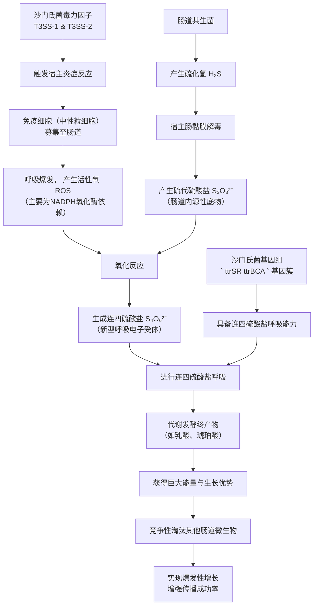

# Gut inflammation provides a respiratory electron acceptor for Salmonella

## 📎 快捷链接

| 类型 | 链接 |
|------|------|
| Zotero 条目 | [打开条目](zotero://select/items/0/YNB9VWYT) |
| Zotero PDF | [打开PDF](zotero://open-pdf/library/items/J4KKW5VY) |
| MinerU 解析 | [查看解析](file:///G:/zotero/llm-for-zotero-mineru/8502/full.md) |
| DOI | [在线查看](https://doi.org/10.1038/nature08719) |

## 一、核心概念与研究背景
- **一句话总结**：沙门氏菌通过触发宿主肠道炎症，利用其产生的活性氧将肠内无害的硫代硫酸盐氧化成一种特殊的电子受体——连四硫酸盐，从而获得呼吸代谢优势，打败竞争微生物，在肠道中大量生长。
- **关键概念解析**：
    - **S. Typhimurium (鼠伤寒沙门氏菌)**：一种导致急性肠胃炎的侵袭性病原体。
    - **T3SS-1 和 T3SS-2 (III型分泌系统)**：沙门氏菌的两套“分子注射器”，分别负责侵袭肠上皮细胞和在黏膜巨噬细胞内存活，是触发炎症的核心毒力因子。
    - **Tetrathionate (连四硫酸盐, S₄O₆²⁻)**：一种含硫化合物。传统上认为其主要存在于土壤或腐尸中，用于实验室富集培养沙门氏菌。本文揭示其可在发炎肠道内生成。
    - **Thiosulphate (硫代硫酸盐, S₂O₃²⁻)**：肠道共生菌产生剧毒的硫化氢(H₂S)后，宿主肠黏膜将其解毒转化而成的化合物，在肠道腔内本底存在。
    - **Tetrathionate Respiration (连四硫酸盐呼吸)**：沙门氏菌特有的代谢能力，利用连四硫酸盐作为末端电子受体进行呼吸作用。与发酵相比，呼吸能产生更多能量。
    - **Competitive Index (竞争指数, CI)**：通过比较两种不同菌株在同一环境中生长后的数量比例，来衡量其相对生长优势的指标。CI > 1 表示第一种菌株占优。

## 二、遭遇的瓶颈与中间问题
- **现有挑战**：在感染过程中，沙门氏菌如何能在充满发酵菌、厌氧且“敌对”的发炎肠道环境中，反而实现爆发性增长？炎症通常被认为对病原体不利。
- **具体难点**：
    1.  **电子受体匮乏**：健康肠道厌氧，缺乏氧气作为电子受体，微生物主要依赖发酵获取能量，生长受限。
    2.  **传统认知局限**：连四硫酸盐呼吸在沙门氏菌致病性研究中被认为不重要，因为哺乳动物宿主内没有已知的连四硫酸盐来源。
    3.  **机制不明**：已知炎症能促进沙门氏菌过度生长，但其背后的代谢和分子机制是未解之谜。

## 三、揭秘过程与解决方案
- **破局思路**：作者的灵感来源于对**肠道硫代谢**的重新审视和**富集培养原理**的逆向思考。他们意识到，实验室用碘（强氧化剂）将硫代硫酸盐氧化成连四硫酸盐来富集沙门氏菌，那么发炎肠道中招募的免疫细胞（产生大量活性氧，也是强氧化剂）是否也能在体内完成类似反应？
- **一步步揭秘**：
    1.  **提出假设**：炎症 → 免疫细胞浸润 → 产生活性氧(ROS) → 氧化肠腔中的硫代硫酸盐 → 生成连四硫酸盐。
    2.  **验证生成**：使用小鼠结肠炎模型，通过LC-MS/MS检测，发现**只有在引发炎症的感染中才能检测到连四硫酸盐**。感染不引发炎症的毒力缺失株（ΔinvAΔspiB）则无此现象。
    3.  **证明优势**：设计竞争实验，将野生型与无法进行连四硫酸盐呼吸的突变体（ΔttrA）等量混合感染小鼠。结果发现，**在发炎肠道内容物中，野生型细菌数量比突变体高约80倍**。在不发炎的情况下（如感染毒力缺失株或全身性感染），两者无差异。
    4.  **定位来源**：在感染**NADPH氧化酶（Cybb）缺失**的小鼠中，野生型相对于突变体的生长优势消失，且检测不到连四硫酸盐生成。这表明**NADPH氧化酶产生的活性氧是体内生成连四硫酸盐的关键**。
    5.  **阐明优势本质**：在厌氧的肠道环境中，发酵终产物（如乳酸、琥珀酸）无法被进一步利用。沙门氏菌通过连四硫酸盐呼吸，能够**利用这些其他微生物无法呼吸的“废料”作为电子供体**，从而获得巨大的能量和生长优势。

## 四、核心技术路线
- **整体架构**：结合**小鼠结肠炎模型**和**牛结扎回肠袢模型**进行体内实验；利用**LC-MS/MS**进行代谢物定量；通过**竞争性生长实验**和**基因敲除小鼠**进行功能验证。
- **关键创新点**：
    1.  **视角转换**：将经典的**体外富集培养原理**创新性地应用于**活体感染环境**的解释。
    2.  **机制串联**：首次将**宿主免疫反应（炎症、ROS产生）** 与**病原体特定代谢通路（连四硫酸盐呼吸）** 及**肠道微生态竞争**三者通过一个简单的化学反应（氧化还原反应）有机联系起来。
    3.  **证据闭环**：构建了从“炎症发生”→“代谢物生成”→“生长优势”→“关键酶验证”的完整证据链。

## 五、结果呈现与证据链
- **核心结论**：肠道炎症通过免疫细胞（主要依赖NADPH氧化酶）产生活性氧，将内源性硫代硫酸盐氧化为连四硫酸盐。沙门氏菌利用其独有的连四硫酸盐呼吸能力，在厌氧环境中代谢发酵终产物，从而获得比其他依赖发酵的肠道微生物更强的生长优势。
- **证据展示**：
    - **图1e**：LC-MS/MS数据直接证明，仅在引发炎症的感染中能检测到连四硫酸盐。
    - **图2d/图4a-c**：竞争指数显示，野生型在发炎肠道中比ΔttrA突变体有约80倍的生长优势。
    - **图2d (Cybb⁻/⁻小鼠)**：在缺失NADPH氧化酶的小鼠中，野生型的生长优势消失，证明了活性氧的关键作用。
    - **图3 (牛回肠袢模型)**：显示生长优势主要发生在靠近发炎黏膜的**黏液层**，而非肠腔液体中，这与活性氧和底物（硫代硫酸盐）的空间分布一致。

## 六、局限性与待解决问题
- **模型局限性**：研究主要使用小鼠和牛模型，其肠道生理、菌群组成和炎症反应与人类感染存在差异。需要人类临床样本的验证。
- **动态过程**：研究聚焦于感染急性期（4天或8小时），连四硫酸盐呼吸在感染慢性期或携带状态中的作用尚不清楚。
- **浓度与梯度**：未精确测量发炎肠道内连四硫酸盐的局部浓度梯度，以及其生成的时空动态。
- **底物竞争**：除连四硫酸盐外，炎症可能产生其他电子受体（如硝酸盐）。本研究未系统评估这些途径的相对重要性。
- **代谢物影响**：连四硫酸盐呼吸过程本身产生的代谢产物（如硫代硫酸盐）对肠道微环境和宿主细胞的影响未深入探究。

## 七、与沙门氏菌/细菌基因组学研究的关联
- **可直接借鉴的方法/思路**：
    1.  **代谢通路挖掘**：利用基因组学分析病原菌特有的电子受体利用基因簇（如沙门氏菌的` ttr `基因簇），并探究其在不同宿主环境中的表达调控，是理解其生态位适应的关键。
    2.  **微生态竞争策略**：研究应关注病原体如何“改造”宿主环境（如诱导炎症产生特定代谢物），从而创造对自己有利而对共生菌不利的条件。这种“生态工程”策略具有普遍性。
    3.  **反向思维**：从经典的体外培养或诊断技术（如富集培养）中寻找灵感，可能揭示其在感染生物学中的新功能。
- **应避免的陷阱**：
    1.  **忽视宿主因素**：不能孤立地研究病原菌基因组和代谢，必须将其置于动态的宿主-微生物互作环境中考虑。宿主免疫反应是重要的变量。
    2.  **过度简化体内环境**：体外单一菌株的纯培养实验无法模拟体内复杂的营养竞争、空间结构和氧化还原梯度。模型系统的选择（如本文的发炎vs不发炎）至关重要。
    3.  **忽略能量代谢**：在分析基因组时，除了关注毒力岛，也应重视能量获取和碳源利用相关的代谢基因，这可能是决定病原体在特定生态位竞争力的核心。

Tags: #论文笔记 #微生物学 #沙门氏菌 #肠道炎症 #呼吸代谢 #微生物竞争 #宿主-病原体互作 #Nature