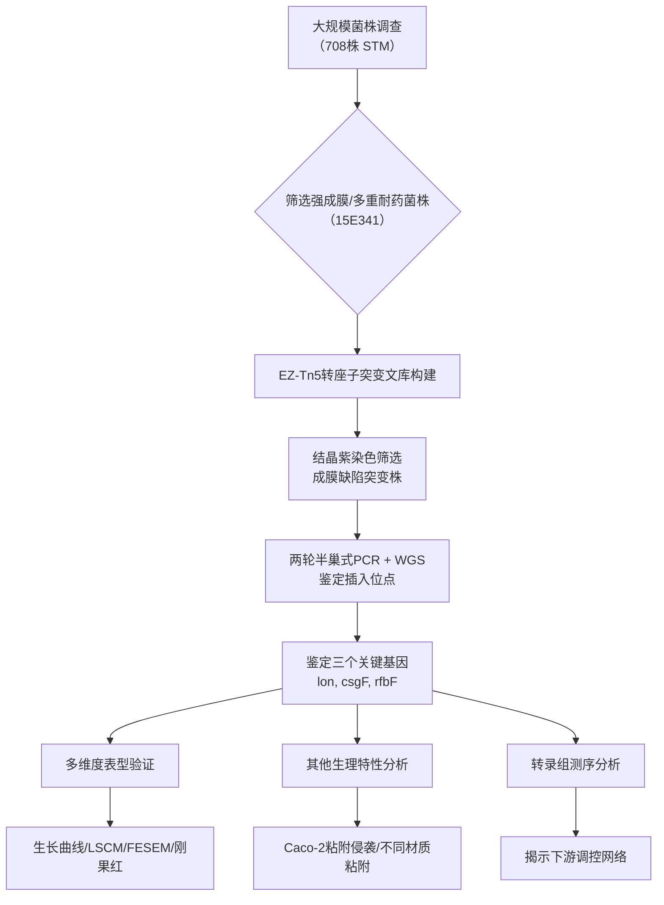

# 鼠伤寒沙门菌生物被膜形成相关基因的鉴定研究

## 📎 快捷链接

| 类型 | 链接 |
|------|------|
| Zotero 条目 | [打开条目](zotero://select/items/0/None) |
| Zotero PDF | [打开PDF](zotero://open-pdf/library/items/YZXKKDB8) |
| MinerU 解析 | [查看解析](file:///G:/zotero/llm-for-zotero-mineru/8731/full.md) |
| DOI | [在线查看](https://doi.org/) |

## 一、核心概念与研究背景
- **一句话总结**：本研究通过大规模调查和转座子突变筛选，成功鉴定出三个调控鼠伤寒沙门菌生物被膜形成的关键基因（`lon`, `csgF`, `rfbF`），为防控沙门菌持续感染提供了新靶点。
- **关键概念解析**：
    - **鼠伤寒沙门菌 (*Salmonella* Typhimurium, STM)**：沙门菌属中最重要的流行血清型之一，是导致人类食源性胃肠炎的主要病原体。
    - **生物被膜 (Biofilm)**：细菌附着于表面，由自身分泌的胞外聚合物质（EPS）包裹形成的结构化群落。能显著增强细菌对抗生素、消毒剂和宿主免疫的抵抗力，是导致慢性感染和传播的关键因素。
    - **结晶紫染色法 (Crystal Violet Staining)**：一种常用的半定量评估生物被膜形成能力的方法，结晶紫可被EPS中的基质和细菌细胞吸附。
    - **转座子随机插入突变 (Transposon Random Insertion Mutagenesis)**：一种基因功能筛选的经典方法。利用转座子（如EZ-Tn5）随机插入基因组，破坏基因功能，通过表型筛选鉴定关键基因。
    - **卷曲菌毛 (Curli)** 和 **纤维素 (Cellulose)**：沙门菌生物被膜基质的重要组成成分，分别由`csg`和`bcs`基因簇编码，负责细胞间粘附和生物被膜的结构稳定性。
    - **肽链内切酶 La (Lon protease)**：一种ATP依赖的丝氨酸蛋白酶，通过降解特定的调控蛋白（如转录因子）来影响多种细胞过程，包括生物被膜形成。

## 二、遭遇的瓶颈与中间问题
- **现有挑战**：
    1. 沙门菌（特别是强毒力、多重耐药株）生物被膜形成的分子机制仍不清晰，关键的调控基因尚未被充分挖掘和鉴定。
    2. 生物被膜介导的抗生素耐受是沙门菌临床治疗和食品安全控制的难题，缺乏有效的干预靶点。
- **具体难点**：
    1. 如何从大量临床菌株中高效筛选出具有代表性（如强成膜、多重耐药）的模式菌株用于机制研究。
    2. 如何从基因组水平系统性、无偏倚地鉴定出调控生物被膜形成的新基因。
    3. 鉴定出的基因如何影响生物被膜的结构组分（如卷曲菌毛、纤维素）以及其他相关生理特性（如粘附能力）。

## 三、揭秘过程与解决方案
- **破局思路**：采用“**宏观调查-微观筛选-机制验证**”的经典研究范式。先从流行病学角度掌握强成膜菌株的普遍特征（如耐药性），再利用转座子突变技术建立一个“基因敲除文库”，通过表型反向筛选找到成膜缺陷的突变株，从而锁定关键基因。
- **一步步揭秘**：
    1.  **大规模表型调查**：对708株动物源和人源鼠伤寒沙门菌进行结晶紫染色，确定强成膜菌株的比例及其耐药表型与耐药基因特征。
    2.  **构建突变文库与筛选**：选取一株强成膜、多重耐药菌株（15E341）作为亲本，利用EZ-Tn5转座子构建随机插入突变文库。通过结晶紫染色筛选成膜能力缺陷的突变子。
    3.  **鉴定突变位点**：对筛选到的3个突变株，采用两轮半巢式PCR和全基因组测序（WGS）精确定位转座子插入位点，锁定三个靶基因：`lon`, `csgF`, `rfbF`。
    4.  **系统性表型验证**：
        - 通过生长曲线排除生长缺陷对成膜的影响。
        - 用结晶紫染色、激光共聚焦显微镜（LSCM）、扫描电子显微镜（FESEM）从宏观到微观证实突变株成膜能力显著降低。
        - 用刚果红染色检测卷曲菌毛和纤维素的表达变化。
        - 用RT-qPCR检测基因在生物被膜不同形成阶段的表达动态。
    5.  **功能拓展与机制初探**：
        - 测试突变株对Caco-2细胞及不同材质（橡胶管、玻璃珠）表面的粘附与侵袭能力。
        - 对野生株和突变株进行转录组测序（RNA-Seq），通过差异表达基因（DEGs）和富集分析，揭示这三个基因影响的下游通路。

## 四、核心技术路线
- **整体架构**：

- **关键创新点**：
    1.  **系统性**：首次对如此大样本量（708株）的动物源和人源鼠伤寒沙门菌进行生物被膜能力、耐药表型和耐药基因的联合分析。
    2.  **发现新靶点**：鉴定出`rfbF`（参与LPS合成）是一个在沙门菌中与生物被膜形成相关报道较少的新基因，为开发新型生物被膜抑制剂提供了潜在靶点。
    3.  **多层次证据链**：不仅证明了基因缺失导致表型缺陷，还通过转录组学初步构建了基因调控网络，将单一基因功能置于更广阔的细胞网络中进行理解。

## 五、结果呈现与证据链
- **核心结论**：
    1.  88.56%的测试鼠伤寒沙门菌能形成生物被膜，其中**强成膜菌株占3.81%**。
    2.  强成膜菌株呈现多重耐药表型，对环丙沙星和庆大霉素耐药率高达86.96%，并高比例携带`oqxAB`（70.40%）等重要耐药基因。
    3.  成功鉴定三个生物被膜形成关键基因：`lon`、`csgF`和`rfbF`。
- **证据展示**：
    1.  **耐药性数据**：强成膜菌株对CIP, GEN, AZM, CAZ, CTX的耐药率具体数值。
    2.  **成膜能力测定**：突变株`lon::Tn`, `csgF::Tn`, `rfbF::Tn`在结晶紫染色OD值上显著低于野生株。
    3.  **显微结构**：LSCM 3D重建和FESEM图像直观显示突变株形成的生物被膜稀薄、结构松散。
    4.  **表面表型**：刚果红平板上突变株菌落更光滑（卷曲菌毛/纤维素表达减少），其中`lon::Tn`和`csgF::Tn`颜色更浅。
    5.  **粘附能力**：突变株对Caco-2细胞的粘附能力显著下降（侵袭能力无差异），在橡胶管和玻璃珠表面的粘附率也显著降低。
    6.  **转录组证据**：RNA-Seq显示，在突变株中，**鞭毛基因上调**，而**菌毛（如`csg`）和糖代谢相关酶基因下调**，表明生物被膜形成受多种基因协同调控。

## 六、局限性与待解决问题
1.  **样本代表性**：强成膜菌株比例仅3.81%，其特征是否代表普遍规律需更多研究验证。
2.  **基因功能确认**：研究使用的是转座子插入突变，理论上存在极性效应。未进行基因的**回复互补实验**（complementation）以确证表型缺陷完全由目标基因中断引起。
3.  **`rfbF`机制未明**：`rfbF`编码葡萄糖-1-磷酸胞苷酰转移酶，参与脂多糖（LPS）O抗原合成。其如何影响生物被膜形成的**具体分子机制**（例如，是通过改变LPS结构影响表面性质，还是存在其他间接途径）有待深入阐明。
4.  **转录组数据挖掘不足**：对RNA-Seq的差异基因和通路分析停留在描述阶段，未对关键上调/下调通路进行实验验证。
5.  **生物被膜异质性**：研究主要关注宏观和微观结构，未对生物被膜内细菌的代谢异质性（如活跃层与休眠层）进行分析。

## 七、与沙门氏菌/细菌基因组学研究的关联
- **可直接借鉴的方法/思路**：
    1.  **“表型-基因型”关联分析**：先对大量临床分离株进行表型（如成膜能力、耐药性）普查，再选取有代表性的菌株进行深度机制研究，是连接流行病学与基础研究的有效桥梁。
    2.  **转座子突变筛选技术**：对于无遗传操作系统的细菌或进行全基因组水平的功能基因筛选，EZ-Tn5等商品化转座子文库是高效工具。
    3.  **多层次表型验证体系**：结合定量染色（结晶紫、刚果红）、显微成像（LSCM, FESEM）和细胞/材质粘附实验，可以全面评估一个基因对生物被膜各方面特性的影响。
    4.  **转录组学作为机制探索的起点**：通过比较野生株与突变株的转录组，可以快速获得下游受影响的基因和通路列表，为后续深入的机制研究（如ChIP-seq、双杂交、生化实验）提供方向。
- **应避免的陷阱**：
    1.  **忽视生物被膜的异质性**：不能将生物被膜视为均质结构，应考虑其内部不同区域（表层 vs 深层）和不同状态细胞（活跃 vs 休眠）的差异。
    2.  **过分依赖单一表型指标**：结晶紫染色易受死细胞和残留培养基干扰，需结合活/死细胞染色、CFU计数等多种方法综合判断。
    3.  **忽略基因间的互作网络**：单个基因突变可能引发下游广泛的转录变化，需谨慎区分直接调控和间接效应。回复互补实验和基因过表达实验是确认基因功能的金标准。
    4.  **实验室条件与体内/自然环境的差距**：在实验室培养基中鉴定的生物被膜基因，在宿主体内复杂环境（如肠道、胆汁）或食品加工表面的作用可能不同，需设计更贴近实际的模型进行验证。

Tags: #论文笔记 #微生物学 #鼠伤寒沙门菌 #生物被膜 #转座子突变 #基因鉴定 #耐药性 #硕士学位论文