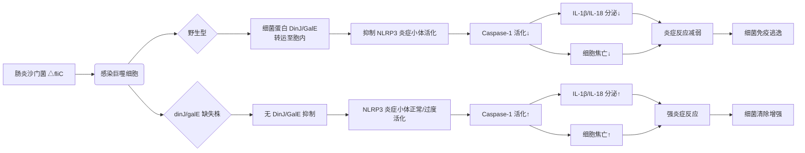

# 肠炎沙门菌抑制炎症小体活化基因的筛选及功能研究

## 📎 快捷链接

| 类型 | 链接 |
|------|------|
| Zotero 条目 | [打开条目](zotero://select/items/0/None) |
| Zotero PDF | [打开PDF](zotero://open-pdf/library/items/HW89HDKC) |
| MinerU 解析 | [查看解析](file:///G:/zotero/llm-for-zotero-mineru/8733/full.md) |
| DOI | [在线查看](https://doi.org/) |

## 一、核心概念与研究背景
- **一句话总结**：本研究通过构建沙门菌突变体文库，筛选并鉴定出两个能抑制宿主细胞NLRP3炎症小体活化的新基因（`dinJ`和`galE`），揭示了沙门菌逃避免疫清除的新机制。
- **关键概念解析**：
    - **炎症小体 (Inflammasome)**：细胞内的多蛋白复合物，是固有免疫的核心。本研究聚焦于**NLRP3**和**NLRC4**两种，它们能感知病原相关分子模式（PAMPs），激活Caspase-1，导致促炎细胞因子IL-1β/IL-18成熟释放，并引发细胞焦亡（Pyroptosis）。
    - **肠炎沙门菌 (Salmonella Enteritidis)**：重要的人兽共患食源性病原菌，能在宿主巨噬细胞内存活复制，其与宿主免疫系统的博弈是研究热点。
    - **毒素-抗毒素系统 (Toxin-Antitoxin, TA)**：细菌内普遍存在的调控系统。本研究发现的**DinJ**是RelB/DinJ家族的**抗毒素**蛋白，通常被认为参与应激反应和持留菌形成，本研究揭示了其新的免疫调节功能。
    - **UDP-葡萄糖-4-差向异构酶 (GalE)**：参与脂多糖（LPS）和荚膜多糖合成的糖代谢关键酶，其缺失影响细菌毒力，本研究首次将其与炎症小体抑制联系起来。
    - **转座子突变文库筛选**：一种高通量遗传学方法，通过随机插入突变破坏基因，再通过表型筛选鉴定目标基因。

## 二、遭遇的瓶颈与中间问题
- **现有挑战**：在本研究之前，已知沙门菌能调控炎症反应，但其**具体通过哪些细菌自身基因产物来抑制炎症小体（特别是NLRP3）活化**，其分子机制在很大程度上仍是未知的。
- **具体难点**：
    1.  **筛选效率**：如何从成千上万的基因中，高效、准确地筛选出调控炎症小体活化的候选基因？
    2.  **模型干扰**：沙门菌的鞭毛蛋白（FliC）是已知的NLRC4炎症小体强激活剂。研究NLRP3调控时，如何排除FliC的干扰？
    3.  **功能验证**：如何证明筛选出的基因（`dinJ`和`galE`）的缺失或存在，**直接导致**炎症小体活化表型的变化，而非通过影响细菌生长、侵袭等间接方式？

## 三、揭秘过程与解决方案
- **破局思路**：
    1.  **模型简化**：使用**鞭毛蛋白缺失株（△fliC）** 作为亲本株构建文库。此举排除了FliC对NLRC4的持续激活，使筛选体系能更专注于探测对**NLRP3炎症小体**的调控作用。
    2.  **两步筛选策略**：结合高通量初筛（LDH释放）和功能验证复筛（Caspase-1活化、IL-1β分泌），提高准确性。
- **一步步揭秘**：
    1.  **文库构建与初筛**：以△fliC为亲本，构建转座子随机插入突变文库。感染巨噬细胞（J774A.1），通过检测乳酸脱氢酶（LDH）释放量（反映细胞死亡）计算Z值，筛选出显著增强（Z≥2）或减弱（Z≤-2）细胞死亡的突变株。初筛获得25株增强型，47株减弱型。
    2.  **功能复筛与基因定位**：对初筛阳性株进行复筛，检测更特异的炎症小体活化指标（Caspase-1剪切、IL-1β分泌）。最终锁定2株（#831, #1552）稳定增强活化的突变株。通过**任意PCR**定位转座子插入位点，分别鉴定出`dinJ`和`galE`基因。
    3.  **功能验证**：
        - 构建基因缺失株（△dinJ, △galE）和回补株。
        - 证明缺失不影响细菌基本生长和侵袭能力，排除间接影响。
        - 在细胞和动物模型中系统验证：缺失株诱导更强的炎症小体活化；回补株恢复表型；在**NLRP3敲除**巨噬细胞中表型消失，证实其**特异性**。
    4.  **机制初探**：利用FRET实验证明DinJ和GalE蛋白可在感染过程中**转运至宿主细胞内**，提示其可能直接在宿主细胞质中发挥作用。

## 四、核心技术路线
- **整体架构**：`转座子文库构建` → `LDH释放高通量初筛` → `Caspase-1/IL-1β功能复筛` → `任意PCR基因定位` → `缺失/回补株构建与体外功能验证` → `特异性验证（使用KO细胞）` → `体内功能验证` → `亚细胞定位初探（FRET）`
- **关键创新点**：
    1.  **筛选策略创新**：首次利用**△fliC沙门菌**构建突变文库，定向筛选抑制NLRP3炎症小体的基因，避免了鞭毛蛋白的背景干扰。
    2.  **功能蛋白创新**：首次发现**抗毒素蛋白DinJ**和**糖代谢酶GalE**在沙门菌感染中具有抑制NLRP3炎症小体活化的新功能。
    3.  **关联发现**：将细菌的TA系统、核心代谢途径与宿主NLRP3炎症小体活化直接联系起来，提供了新的免疫逃逸视角。

## 五、结果呈现与证据链
- **核心结论**：
    1.  `dinJ`和`galE`是肠炎沙门菌中抑制NLRP3炎症小体活化的**新基因**。
    2.  DinJ蛋白通过抑制NLRP3炎症小体活化，**帮助细菌在小鼠体内逃避免疫清除**（△dinJ感染后脏器载量降低）。
    3.  GalE蛋白对细菌毒力至关重要（△galE口服感染小鼠存活率100%），其抑制炎症小体的机制与DinJ类似。
- **证据展示**：
    - **筛选证据**：文库筛选结果，Z值分布图，突变株#831和#1552的二次验证数据。
    - **功能证据**：缺失株（△dinJ, △galE）与亲本株（△fliC）在感染细胞后，LDH释放、Caspase-1 p20剪切、IL-1β分泌的对比柱状图。
    - **特异性证据**：在`Nlrp3-/-` BMDMs中，各菌株诱导的炎症小体活化表型无差异；在`Nlrc4-/-` BMDMs中，表型差异依然存在。
    - **体内证据**：
        - **DinJ**：△dinJ感染小鼠血清IL-1β/IL-18更高，肝脾细菌载量更低。
        - **GalE**：△galE口服感染小鼠存活率100%（亲本株100%死亡）。

## 六、局限性与待解决问题
- **局限性**：
    1.  **机制不透彻**：研究停留在“发现DinJ和GalE能抑制NLRP3”，但**未阐明其确切的分子机制**。DinJ作为抗毒素，如何与NLRP3通路相互作用？GalE通过改变LPS等表面分子间接影响，还是直接作用？不清楚。
    2.  **模型单一性**：研究主要使用NLRP3和NLRC4敲除细胞，未探索对其他炎症小体（如AIM2、Pyhin）的影响。
    3.  **动物模型差异**：DinJ功能验证使用腹腔注射，GalE使用口服灌胃，感染途径不同，结论的直接可比性受限。
    4.  **菌株背景**：所有研究基于△fliC突变株。在野生型沙门菌中，DinJ和GalE的抑制作用是否依然显著，或与其他毒力因子如何协同，有待验证。
- **待解决问题**：
    - DinJ和GalE蛋白的**宿主靶蛋白**是什么？
    - 这些蛋白是通过**III型分泌系统**转运的吗？
    - 它们抑制炎症小体活化的**生化细节**（如是否干扰ASC寡聚化、pro-Caspase-1切割等）？
    - 在**自然感染过程**和不同沙门菌血清型中，这两个基因的功能是否保守？

## 七、与沙门氏菌/细菌基因组学研究的关联
- **可直接借鉴的方法/思路**：
    1.  **定向筛选策略**：研究特定免疫通路时，可先用已知激活剂的突变株（如本研究的△fliC）构建文库，减少背景噪音，聚焦目标。
    2.  **功能验证流程**：“文库构建→初筛→复筛→基因定位→缺失回补→多模型验证”的完整链条，是鉴定新毒力/免疫调节基因的范式。
    3.  **关注“非经典”功能基因**：TA系统成员（如DinJ）和代谢核心酶（如GalE）可能具有未被认知的免疫调节功能，值得在其他病原菌中探索。
- **应避免的陷阱**：
    1.  **忽略基本表型**：在报道新功能前，必须排除基因缺失对细菌生长、存活、侵袭等基础表型的影响。
    2.  **单一指标判断**：不能仅凭LDH释放（细胞死亡）就判断炎症小体活化，必须结合**Caspase-1剪切**和**IL-1β/IL-18成熟分泌**等金标准指标。
    3.  **特异性验证缺失**：必须使用相应的**炎症小体组分敲除细胞**来验证抑制作用的特异性。
    4.  **机制黑箱化**：表型关联发现后，应尽早投入机制研究（如互作蛋白筛选、信号通路分析），否则工作价值有限。

Tags: #论文笔记 #微生物学 #沙门氏菌 #炎症小体 #NLRP3 #毒素-抗毒素系统 #免疫逃逸 #转座子突变筛选