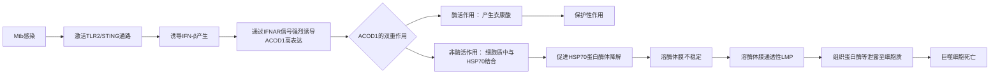

# ACOD1-mediated lysosomal membrane permeabilization contributes to Mycobacterium tuberculosis–induced macrophage death

## 📎 快捷链接

| 类型 | 链接 |
|------|------|
| Zotero 条目 | [打开条目](zotero://select/items/0/BBH5K9GS) |
| Zotero PDF | [打开PDF](zotero://open-pdf/library/items/ACUYSS3C) |
| MinerU 解析 | [查看解析](file:///G:/zotero/llm-for-zotero-mineru/8786/full.md) |
| DOI | [在线查看](https://doi.org/10.1073/pnas.2424656122) |

## 一、核心概念与研究背景
- **一句话总结**：本研究发现，结核分枝杆菌感染巨噬细胞后，会通过干扰素-β诱导ACOD1过度表达，ACOD1会以“非酶活”方式促进溶酶体稳定蛋白HSP70的降解，导致溶酶体破裂和细胞死亡。
- **关键概念解析**：
    - **ACOD1 (IRG1)**：传统认知中是一种线粒体酶，催化顺乌头酸生成免疫代谢物衣康酸。本研究揭示其在高表达时，会大量存在于细胞质中，并具有非酶促的“支架”功能。
    - **溶酶体膜通透性 (LMP)**：溶酶体膜完整性丧失，导致内部水解酶（如组织蛋白酶）泄露到细胞质中，是多种细胞死亡途径的共同关键事件。
    - **干扰素-β (IFN-β) 与细胞死亡 (Co-DMD)**：指Mtb感染诱导巨噬细胞产生的IFN-β，与Mtb本身共同作用，促进巨噬细胞死亡的现象。单独IFN-β并不致死。
    - **HSP70**：在溶酶体膜上起稳定和保护作用的分子伴侣蛋白。

## 二、遭遇的瓶颈与中间问题
- **现有挑战**：在本研究前，已知Mtb感染可通过多种途径杀死巨噬细胞，但具体机制，特别是**I型干扰素信号如何下游精确调控细胞死亡**的分子通路尚不明确。同时，ACOD1的经典功能（产生衣康酸）被认为具有抗炎和免疫调节作用，其如何参与细胞死亡是悖论。
- **具体难点**：
    1.  **模型难题**：`Acod1−/−`小鼠的原代巨噬细胞（BMDM）在培养基中生长状态极差（细胞小、增殖慢、基础存活率低），使得直接比较其与野生型细胞在感染后的死亡变得困难，结论难以解读。
    2.  **功能悖论**：如何解释ACOD1（及其产物衣康酸已知的保护性作用）在促进细胞死亡中的作用？需要区分其酶活依赖与非酶活依赖的功能。
    3.  **靶点定位**：早期抑制剂筛选发现蛋白酶抑制剂CI-XII能完全保护细胞，但使用其衍生探针进行亲和纯化后，并未找到预期的钙蛋白酶（Calpain）靶点，而是拉下了多种溶酶体蛋白酶，令机制探索一度陷入困惑。

## 三、揭秘过程与解决方案
- **破局思路**：作者采用了**正交遗传学与生物化学双轨并行**的策略。遗传学（CRISPRa筛选）独立发现了ACOD1，生物化学（抑制剂筛选）指向了溶酶体蛋白酶。将两者结合，最终**将问题从“哪种蛋白酶”转向了“为何溶酶体会破裂”**，从而聚焦于溶酶体膜稳定性这一核心。
- **一步步揭秘**：
    1.  **发现候选**：通过RNA测序和全基因组CRISPRa筛选，鉴定出ACOD1是受IFN-β诱导、且其过表达能促进感染细胞死亡的关键基因。
    2.  **验证作用**：在RAW264.7巨噬细胞系中，过表达ACOD1加剧Mtb诱导的死亡，而敲除ACOD1则减轻死亡，证实其促死亡作用。
    3.  **排除经典途径**：发现ACOD1的促死亡作用不依赖于其酶活性（即不依赖于衣康酸生产），因为催化失活的ACOD1突变体仍能促进死亡，且衣康酸本身具有保护作用。
    4.  **揭示亚细胞定位与相互作用**：在高表达状态下，ACOD1不仅存在于线粒体，还大量分布于细胞质。在细胞质中，它与溶酶体膜稳定蛋白HSP70发生相互作用。
    5.  **阐明作用机制**：ACOD1的结合促进了HSP70通过蛋白酶体途径的降解。HSP70的减少导致溶酶体膜不稳定，发生LMP。
    6.  **连接死亡表型**：LMP后，组织蛋白酶等半胱氨酸蛋白酶泄露至细胞质，使用广谱半胱氨酸蛋白酶抑制剂K777可以保护细胞，从而将ACOD1-HSP70-LMP轴与最终的细胞死亡联系起来。

## 四、核心技术路线
- **整体架构**：

- **关键创新点**：
    1.  **功能范式突破**：首次揭示ACOD1除了经典的酶活性外，还具有重要的**非酶促蛋白-蛋白相互作用功能**，且这种功能在特定条件下（高表达）主导细胞命运。
    2.  **定位重发现**：发现ACOD1在免疫刺激下会从线粒体“重定位”或大量存在于细胞质，为其新功能提供了空间基础。
    3.  **通路连接**：将“干扰素信号-ACOD1”轴与“溶酶体依赖性细胞死亡”这一特定细胞死亡形式直接连接，为理解Mtb免疫病理提供了新机制。

## 五、结果呈现与证据链
- **核心结论**：Mtb感染诱导的IFN-β信号使巨噬细胞ACOD1过度表达。过量的ACOD1在细胞质中通过非酶活方式，介导HSP70的蛋白酶体降解，从而破坏溶酶体稳定性，引发LMP和组织蛋白酶依赖的细胞死亡。
- **证据展示**：
    - **遗传学筛选**：Fig. 1C 显示，在两种独立的CRISPRa筛选中，ACOD1的过表达均显著促进Mtb感染的巨噬细胞死亡。
    - **蛋白表达验证**：Fig. 1D 和 Fig. S1C 显示，Mtb感染后，ACOD1蛋白水平在BMDM和RAW264.7细胞中均显著上调。
    - **细胞死亡表型**：Fig. 2D/E 显示，在RAW264.7细胞中，ACOD1过表达加剧死亡，敲除则减轻死亡。
    - **非酶活机制**：文中引用数据显示，催化失活的ACOD1突变体仍能促进死亡，而补充衣康酸则起保护作用。
    - **HSP70降解**：免疫印迹（Western Blot）结果显示，在ACOD1过表达的Mtb感染细胞中，HSP70蛋白水平显著下降（Fig. S3A）。
    - **溶酶体功能证据**：共聚焦显微镜显示，ACOD1过表达的细胞中，溶酶体标志物LAMP1的信号强度减弱且弥散（Fig. S3B），与LMP发生一致。使用广谱组织蛋白酶抑制剂K777能显著保护细胞（Fig. 3B）。

## 六、局限性与待解决问题
1.  **模型局限性**：由于`Acod1−/−`原代巨噬细胞生理状态不佳，关键结论主要基于RAW264.7巨噬细胞系，其与体内生理巨噬细胞可能存在差异。在体内模型中验证该通路至关重要。
2.  **机制细节待解**：ACOD1与HSP70相互作用的具体结构域、如何精确调控HSP70向蛋白酶体的降解（是否涉及特定的E3连接酶）等分子细节尚不清楚。
3.  **抑制剂特异性**：使用的蛋白酶抑制剂（如K777）虽具有广谱性，但可能存在脱靶效应，无法完全排除其他蛋白酶或死亡途径的参与。
4.  **病理生理意义**：LMP和组织蛋白酶泄露在体内的感染过程中，对细菌清除、免疫细胞募集和病理发展的具体贡献仍需在动物模型中阐明。

## 七、与沙门氏菌/细菌基因组学研究的关联
- **可直接借鉴的方法/思路**：
    1.  **CRISPRa筛选策略**：该研究中使用“IFN-β诱导型ISG文库”和“全基因组文库”进行双筛选，并交叉验证候选基因的方法，非常适用于寻找病原体感染后宿主因子介导特定细胞表型（如死亡、炎性体激活）的关键分子。沙门氏菌感染同样会强烈激活IFN信号，可用此方法寻找其下游效应分子。
    2.  **抑制剂筛选与靶点鉴定**：结合细胞表型筛选与基于活性的蛋白质谱分析（如文中使用的CI-XII衍生探针）来发现功能靶点的思路，可用于解析沙门氏菌效应蛋白或毒力因子引发的宿主细胞反应机制。
    3.  **关注“非经典功能”**：本研究提醒我们，一个代谢酶（ACOD1）可能通过蛋白-蛋白相互作用发挥完全独立于其代谢活性的功能。在研究沙门氏菌调控的宿主代谢酶或应激蛋白时，应考虑其可能存在的非酶活“兼职”功能。
- **应避免的陷阱**：
    1.  **勿忽视亚细胞定位**：蛋白的功能与其定位密切相关。研究宿主蛋白响应细菌感染时，需像本文一样关注其定位变化（如从线粒体到细胞质）。
    2.  **区分酶活与非酶活功能**：在利用基因敲除/过表达研究代谢酶功能时，需通过催化失活突变体、代谢物补充等实验，严格区分其催化活性与蛋白相互作用介导的表型，避免得出片面结论。
    3.  **谨慎使用细胞系**：关键结论需在生理相关的原代细胞或体内模型中验证，尤其是在RAW264.7等永生化细胞系中获得的表型。

---
Tags: #论文笔记 #免疫学 #微生物学 #结核分枝杆菌 #ACOD1 #溶酶体 #细胞死亡 #CRISPR筛选 #PNAS