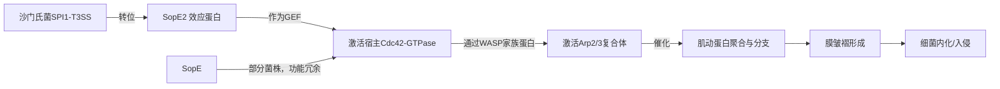

# Identification of SopE2 from Salmonella typhimurium, a conserved guanine nucleotide exchange factor for Cdc42 of the host cell

## 📎 快捷链接

| 类型 | 链接 |
|------|------|
| Zotero 条目 | [打开条目](zotero://select/items/0/GAKFANKB) |
| Zotero PDF | [打开PDF](zotero://open-pdf/library/items/5TA8QAUC) |
| MinerU 解析 | [查看解析](file:///G:/zotero/llm-for-zotero-mineru/9079/full.md) |
| DOI | [在线查看](https://doi.org/10.1111/j.1365-2958.2000.01870.x) |

## 一、核心概念与研究背景
- 一句话总结：本研究解决了“大多数鼠伤寒沙门氏菌菌株缺少已知的入侵关键效应蛋白SopE，但所有菌株却都能高效入侵宿主细胞”这一矛盾，发现了存在于所有菌株中的、功能等效的保守效应蛋白SopE2。
- 关键概念解析：
    - **III型分泌系统 (SPI1-T3SS)**: 沙门氏菌通过该系统像“分子注射器”一样，将一系列效应蛋白直接注入宿主细胞内，操控其信号通路，是触发入侵（膜皱褶）和诱导腹泻的关键毒力装置。
    - **Rho GTPase (Cdc42)**: 宿主细胞内调控肌动蛋白细胞骨架的关键分子开关。活化状态（与GTP结合）能启动下游信号，导致肌动蛋白重排，形成膜皱褶，包裹并内吞细菌。
    - **鸟苷酸交换因子 (GEF)**: 催化GTPase（如Cdc42）释放GDP、结合GTP，从而激活GTPase的蛋白。SopE和SopE2都是此类分子。
    - **Arp2/3复合体**: 细胞内肌动蛋白成核的核心机器。被活化的Cdc42信号通路（通过WASP蛋白）激活后，能催化新的肌动蛋白丝从现有丝上分支生长，产生推动膜变形的物理力量。
    - **膜皱褶 (Membrane Ruffling)**: 沙门氏菌入侵非吞噬细胞时，宿主细胞膜形成的波浪状突起，是细菌“触发式”入侵（Trigger mechanism）的标志事件，依赖于肌动蛋白的聚合。

## 二、遭遇的瓶颈与中间问题
- 现有挑战：在本研究之前，已知的关键入侵因子SopE是由噬菌体编码的，并非所有鼠伤寒沙门氏菌菌株都携带（仅存在于少数菌株）。这引发了一个根本疑问：**没有SopE的大多数菌株，是如何实现Cdc42活化与高效入侵的？** 是存在其他完全不同的机制，还是存在未被发现的SopE类似物？
- 具体难点：
    1.  **SopE的局限性**：已知的、唯一被鉴定为Cdc42强效GEF的效应蛋白SopE分布不普遍，无法解释大多数菌株的入侵表型。
    2.  **寻找新因子的挑战**：在未知新基因序列的情况下，如何从海量基因组信息中识别出功能等效的“隐藏”效应蛋白？
    3.  **功能保守性证明**：即使找到了序列相似的蛋白，也需要严格证明它确实是被T3SS转位、具有GEF活性、并在细胞水平和感染水平上对入侵功能有贡献。

## 三、揭秘过程与解决方案
- **破局思路**：作者采用了一种“从线索到基因，再到功能”的经典发现策略。核心灵感来源于：
    1.  **血清学线索**：用SopE的抗体在缺失SopE的突变株培养上清中检测到了微弱但特异的交叉反应条带，暗示存在一个免疫原性相似的同源蛋白。
    2.  **基因组挖掘**：利用当时刚发布的伤寒沙门氏菌基因组草图序列，通过同源比对，**“按图索骥”** 找到了与sopE序列相似的基因片段（sopE2）。
- **一步步揭秘**：
    1.  **序列发现与确认**：在伤寒沙门氏菌基因组数据库中发现sopE类似序列（在伤寒沙门氏菌中为假基因）。以此序列为探针，在鼠伤寒沙门氏菌SL1344基因组中PCR扩增并克隆出完整的、无突变的**sopE2**基因。
    2.  **分布保守性证明**：通过Southern blot和Western blot分析包含21株不同来源的鼠伤寒沙门氏菌SARA菌株集合，证明**sopE2基因和SopE2蛋白在所有测试菌株中均存在且表达**，与sopE的局限性分布形成鲜明对比。
    3.  **转位功能验证**：构建带表位标签的SopE2融合蛋白，通过检测其在T3SS活性条件下的分泌情况，并利用T3SS关键组分（invG, invJ）的突变株，证明SopE2**确实是通过SPI1-T3SS转位至宿主细胞内的效应蛋白**。
    4.  **生化活性鉴定**：进行体外GEF活性测定，直接证明纯化的SopE2蛋白片段能高效催化Cdc42的核苷酸交换，证实其**Cdc42特异性GEF活性**。
    5.  **细胞功能与感染表型分析**：
        - **转染实验**：证明单独表达SopE2足以在COS7细胞中诱导Cdc42活化、Arp2/3复合体募集、肌动蛋白重排和细胞入侵。
        - **突变体分析**：构建sopE和sopE2的单突变及双突变株，进行细胞入侵实验。结果显示，**双突变株的Arp2/3复合体募集和膜皱褶诱导能力严重受损，细菌入侵效率显著降低**，证明SopE2在功能上部分冗余，但共同负责了该过程。

## 四、核心技术路线
- **整体架构**：研究采用了“**基因组信息引导下的候选基因鉴定 → 表达与转位验证 → 生化与细胞功能分析 → 感染表型关联**”的多层次验证技术路线。
- **关键创新点**：
    1.  **发现策略的创新**：巧妙利用了初步的基因组序列数据和免疫学线索，解决了在无先验知识下发现新效应蛋白的难题。
    2.  **解决了核心矛盾**：发现了SopE2，完美解释了为什么所有鼠伤寒沙门氏菌菌株（无论是否携带sopE）都具备通过激活Cdc42通路入侵细胞的能力。
    3.  **功能冗余与精细调控**：揭示了沙门氏菌利用两个高度同源但分布不同的GEF（SopE和SopE2）来激活同一通路，增强了该毒力功能的稳健性。

## 五、结果呈现与证据链
- **核心结论**：SopE2是一种在鼠伤寒沙门氏菌中保守分布的、通过SPI1-T3SS转位的效应蛋白，其作为Cdc42的特异性GEF，在介导Arp2/3复合体募集、膜皱褶形成和高效细胞入侵过程中发挥关键作用。
- **证据展示**：
    1.  **分布保守性**：图2的Southern和Western blot图清晰地显示，与sopE仅存在于少数菌株不同，sopE2基因和SopE2蛋白在所有21株SARA菌株中均检出。
    2.  **T3SS依赖的转位**：图3的Western blot显示，SopE2M45的分泌依赖于功能性的SPI1-T3SS（invG、invJ突变后分泌消失）。
    3.  **GEF活性**：文中数据表明，纯化的SopE2 (aa 69-240) 片段能高效促进Cdc42的鸟苷酸交换。
    4.  **细胞功能充分性**：转染实验表明，SopE2单独表达即可引起表型变化（图4推测，文中提及）。
    5.  **感染功能必要性**：sopE±sopE2双突变株在诱导膜皱褶（图5A）和细胞入侵（图5B）能力上严重缺陷，而单突变株影响较小，证明两者功能部分冗余但共同负责主要功能。

## 六、局限性与待解决问题
1.  **机制细节待阐明**：研究证明了SopE2是GEF，但其激活Cdc42后如何精确触发WASP/Arp2/3通路及肌动蛋白聚合的详细时空动态和调控机制未完全解析。
2.  **与其他效应蛋白的协作**：SopE2如何与SipA、SipC等其他直接作用于肌动蛋白的效应蛋白协同工作，以实现最高效的入侵，尚不清楚。
3.  **体内作用与剂量效应**：研究主要基于细胞感染模型。SopE2在动物肠道感染过程中的具体作用、其表达水平和活性是否受宿主微环境精细调控，有待进一步研究。
4.  **伤寒沙门氏菌中的情况**：论文指出，sopE2在伤寒沙门氏菌中是一个假基因（移码突变）。那么伤寒沙门氏菌是否依赖其他机制或另一套效应蛋白来入侵？这个问题未被解答。

## 七、与沙门氏菌/细菌基因组学研究的关联
- **可直接借鉴的方法/思路**：
    1.  **“线索引导的基因组挖掘”范式**：当已知因子无法解释所有表型时，可结合免疫学、生化或遗传学线索，利用日益丰富的基因组/宏基因组数据搜索同源或功能类似物。
    2.  **系统性功能验证流程**：从序列发现、分布保守性分析、转位验证、生化活性测定到突变体表型分析的多级验证策略，是鉴定和确认新效应蛋白的黄金标准。
    3.  **关注“管家”毒力因子**：除了研究水平基因转移获得的、分布可变的毒力因子（如SopE），应同等重视研究位于核心基因组、分布高度保守的毒力相关因子（如SopE2），它们是理解病原体基础毒力的基石。
- **应避免的陷阱**：
    1.  **避免仅凭序列相似性下结论**：序列相似不代表功能相同。必须进行严格的转位和功能实验验证。
    2.  **警惕“假阳性”效应蛋白**：在基因组预测中，可能存在许多具有T3SS分泌信号但并无实际毒力功能的“乘客蛋白”。需通过突变体感染实验验证其对毒力的贡献。
    3.  **考虑物种/血清型特异性**：本研究聚焦于鼠伤寒沙门氏菌。在研究其他血清型或沙门氏菌种时，其保守的效应蛋白谱可能有所不同，不能简单套用。

**图注：SopE2介导的沙门氏菌入侵信号通路示意图。SopE2作为保守的GEF，激活Cdc42，进而通过Arp2/3复合体重排肌动蛋白骨架，驱动膜皱褶和细菌入侵。SopE（部分菌株）具有相同功能。**

Tags: #论文笔记 #微生物学 #沙门氏菌 #鼠伤寒沙门氏菌 #III型分泌系统 #效应蛋白 #GEF #Cdc42 #细胞骨架 #细菌入侵 #Molecular Microbiology