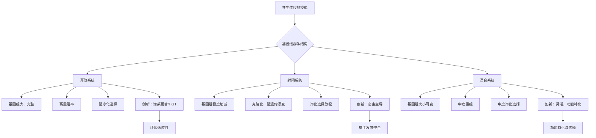

# Genetic innovations in animal–microbe symbioses

## 📎 快捷链接

| 类型 | 链接 |
|------|------|
| Zotero 条目 | [打开条目](zotero://select/items/0/RKD9GR5R) |
| Zotero PDF | [打开PDF](zotero://open-pdf/library/items/KXW88A9C) |
| MinerU 解析 | [查看解析](file:///G:/zotero/llm-for-zotero-mineru/9196/full.md) |
| DOI | [在线查看](https://doi.org/10.1038/s41579-024-01074-2) |

## 一、核心概念与研究背景
- **一句话总结**：本文提出，理解动物-微生物共生关系中多样的遗传创新（如基因获得、丢失、重组等）的关键在于分析共生体的**基因组群体结构**，并将其分为“开放”、“封闭”和“混合”三种模式。
- **关键概念解析**：
    - **共生体传播模式**：共生体如何在不同宿主代际间传递，是垂直（亲代到子代）、水平（个体间）还是混合传播。这是决定共生体基因组进化的核心因素。
    - **基因组综合征**：指在特定进化力量（如遗传漂变、基因流、自然选择）作用下，共生体基因组呈现的一系列**关联的、可预测的特征**（如基因组大小、GC含量、基因丢失程度、选择压力强度等）。
    - **开放共生**：以大多数肠道菌群为代表。共生体通过环境或宿主间频繁水平传播，基因组**保持较大、完整**，类似自由生活细菌，具有高重组率和强净化选择。
    - **封闭共生**：以许多昆虫专性胞内共生菌（如蚜虫的 *Buchnera*）为代表。共生体通过严格的母系垂直传递，造成克隆化和种群瓶颈，导致**基因组极度缩减、基因丢失、GC含量降低、净化选择放松**。
    - **混合共生**：兼具上述两种特征，以兼性共生菌（如蚜虫的 *Hamiltonella defensa*）为代表。主要垂直传播但偶尔水平传播，因此**基因组大小可变、存在大量附属基因、中度净化选择**，且基因组重排频繁。

## 二、遭遇的瓶颈与中间问题
- **现有挑战**：尽管宏基因组测序揭示了共生体的惊人多样性，但对于**不同共生体如何根据其群体结构实现特定功能创新的机制**仍不清楚。许多共生系统难以培养和进行遗传操作，使得验证基因和通路的功能非常困难。
- **具体难点**：
    1. **实验验证困难**：大多数共生体（尤其是封闭系统中的）无法在体外培养，难以通过基因敲除等经典方法验证其功能。
    2. **因果关系的混淆**：如何区分共生体的基因组特征（如基因丢失）是进化的原因还是结果。
    3. **宿主创新的视角缺失**：研究大多聚焦于共生体，而**宿主为维持和控制共生关系所进行的遗传创新**研究相对不足。

## 三、揭秘过程与解决方案
- **破局思路**：作者的核心灵感是**不纠缠于具体共生功能（如营养或防御）的多样性，而是追溯至更根本的共生体群体遗传学**。他们提出，共生体的**传播模式**决定了其群体结构，而群体结构则塑造了可预测的“基因组综合征”和创新路径。
- **一步步揭秘**：
    1. **分类框架建立**：基于传播模式，将共生系统划分为开放、封闭、混合三类。
    2. **基因组特征关联**：通过大量基因组数据对比（如图2），展示三类共生体在基因组大小、GC含量、dN/dS比值、共线性等方面的显著差异。
    3. **创新模式归纳**：
        - **开放系统**：创新主要通过**谱系更替**和**基因水平转移**实现。
        - **封闭系统**：创新被迫由**宿主**主导，如获得新共生体或**宿主基因组获取细菌基因**。
        - **混合系统**：创新兼具上述特点，并可利用**兼性共生体的移动性**进行防御等特定功能的灵活进化。
    4. **宿主创新凸显**：强调在封闭系统中，宿主通过发育整合（如形成含菌细胞）、免疫调控或从共生体“窃取”基因来推动共生关系进化。

## 四、核心技术路线
- **整体架构**：论文构建了一个基于**共生体传播模式**的统一概念框架，用于解释动物-微生物共生关系中遗传创新的多样性。
- **关键创新点**：
    1. **从“功能分类”到“群体结构分类”**：超越了传统的营养/防御等功能性分类，提出了一个更具预测力的进化生物学分类框架。
    2. **强调“基因组综合征”**：系统阐述了不同群体结构下，共生体基因组特征、进化动力和创新方式的关联性。
    3. **整合宿主视角**：明确将**宿主遗传创新**（如获得新功能基因、发育整合）作为共生关系维持和进化的关键驱动力，尤其是在封闭系统中。

## 五、结果呈现与证据链
- **核心结论**：动物-微生物共生的遗传创新模式**主要由共生体的群体结构（开放、封闭、混合）所决定**。这种结构通过影响有效种群大小、基因流和选择强度，塑造了共生体的基因组进化轨迹和创新路径。
- **证据展示**：
    - **关键图表**：论文中的 **Fig. 1** 直观展示了三类共生系统的群体结构差异。**Fig. 2** 提供了强有力的基因组证据，对比了代表菌株在基因组大小、GC含量、dN/dS值和共线性上的鲜明对比。
    - **系统发育一致性**：在封闭系统中，共生体与宿主的系统发育树高度一致（共进化），是亿万年垂直传递的证据。
    - **机制实例**：
        - **水平基因转移（HGT）**：如海绵共生体获取新代谢通路基因。
        - **基因组简化**：*Buchnera* 基因组中大量基因丢失，仅保留为宿主合成必需氨基酸的核心基因。
        - **宿主基因获取**：豆象虫从共生体中获得了功能性的氨基酸转运蛋白基因。
        - **兼性共生体的可塑性**：*Hamiltonella defensa* 通过可移动的噬菌体获得防御因子，并通过偶尔的水平传播在不同宿主（如蚜虫、粉虱）间共享。

## 六、局限性与待解决问题
1.  **机制深度的局限**：对于“封闭系统”中宿主如何精确调控共生体、或如何整合细菌基因的分子机制，大多数案例仍停留在“是什么”而非“如何做”。
2.  **宿主创新研究的不足**：目前研究对宿主侧遗传创新的探索仍远少于对共生体的基因组学研究，尤其是非昆虫宿主。
3.  **动态变化的考虑不足**：框架偏向于描述相对稳定的共生状态，但共生关系的建立、瓦解和转换过程中的遗传动态变化较少涉及。
4.  **环境因素的整合**：如何将环境波动（如营养变化、病原体压力）更具体地融入该群体结构框架，解释创新的具体触发点，有待进一步研究。

## 七、与沙门氏菌/细菌基因组学研究的关联
- **可直接借鉴的方法/思路**：
    1. **传播模式分析框架**：研究沙门氏菌在宿主（人、动物、环境）间传播时，可借鉴“开放”、“封闭”、“混合”的思维框架，分析其基因组岛、毒力岛等可移动元件的获取、维持和丢失是否与其传播动态相关。
    2. **基因组综合征的视角**：比较不同血清型或不同宿主来源的沙门氏菌基因组时，关注基因组大小、GC含量、dN/dS、附属基因组等特征，这些特征可能反映了其传播策略和宿主适应性的差异。
    3. **关注水平基因转移（HGT）**：沙门氏菌作为开放或混合系统中的典型，其致病性进化严重依赖HGT。本研究中对共生体HGT机制的总结（如通过移动元件）可直接用于分析沙门氏菌毒力基因和耐药基因的传播。
- **应避免的陷阱**：
    1. **简单类比**：沙门氏菌是**兼性致病菌/共生菌**，其进化动力与专性互利共生体不同。不能直接将封闭系统（如专性共生菌）的进化规则套用于沙门氏菌。沙门氏菌面临更复杂的选择压力（免疫清除、抗生素、竞争性菌群）。
    2. **忽视环境储库**：在分析沙门氏菌传播时，必须将其**环境储库**（水、土壤、食物）作为关键的一环纳入考量，这是其“开放”特性的核心，与许多专性共生体仅限宿主内循环不同。

Tags: #论文笔记 #微生物共生 #基因组学 #宿主-微生物互作 #进化创新 #Nature Reviews Microbiology