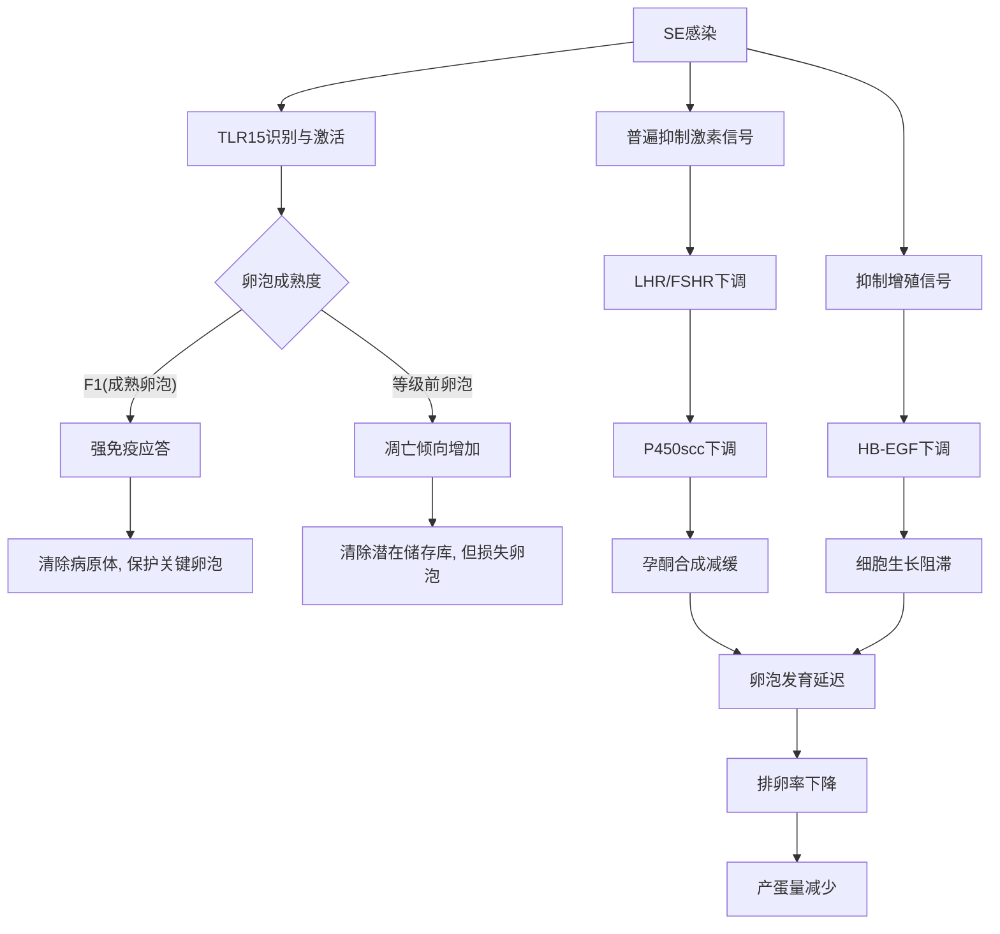

# Salmonella Enteritidis Infection Slows Steroidogenesis and Impedes Cell Growth in Hen Granulosa Cells

## 📎 快捷链接

| 类型 | 链接 |
|------|------|
| Zotero 条目 | [打开条目](zotero://select/items/0/T6CJVMP2) |
| Zotero PDF | [打开PDF](zotero://open-pdf/library/items/DV4W2QWP) |
| MinerU 解析 | [查看解析](file:///G:/zotero/llm-for-zotero-mineru/9377/full.md) |
| DOI | [在线查看](https://doi.org/10.1637/10846-041414-Reg.1) |

## 一、核心概念与研究背景
- **一句话总结**：本研究旨在阐明**肠炎沙门氏菌（SE）感染导致蛋鸡产蛋量下降**的分子机制，具体通过体外实验揭示SE感染如何干扰鸡卵泡颗粒细胞（cGCs）的免疫反应、激素应答和细胞命运。
- **关键概念解析**：
    - **肠炎沙门氏菌（Salmonella Enteritidis, SE）**：一种重要的人兽共患病原体，可通过污染鸡蛋传播。感染产蛋鸡会导致“卵巢-输卵管-鸡蛋”垂直传播链，并造成产蛋量下降。
    - **卵泡颗粒细胞（cGCs）**：位于卵巢卵泡中的体细胞，负责响应促性腺激素（LH/FSH）、合成类固醇激素（如孕酮）并支持卵母细胞发育。其功能直接影响卵泡成熟、排卵和产蛋。
    - **TLR15（Toll样受体15）**：**禽类特有**的模式识别受体，在识别病原相关分子模式（PAMPs）和启动先天免疫应答中起关键作用。SE感染可诱导其表达。
    - **P450scc（细胞色素P450侧链裂解酶）**：类固醇激素合成的**关键起始酶**，催化胆固醇转化为孕烯醇酮，是孕酮合成的限速步骤。
    - **卵泡等级（Follicular Hierarchy）**：禽类卵巢中卵泡按大小和发育阶段排列成等级序列。**等级前卵泡**（小黄卵泡，G3）处于增殖期；**等级卵泡**（F1-F4，G1/G2）进入成熟和排卵准备期。

## 二、遭遇的瓶颈与中间问题
- **现有挑战**：先前研究已观察到SE感染会降低产蛋率并影响卵巢功能，但具体机制不清。特别是，**宿主细胞（cGCs）在不同成熟阶段如何协调“免疫防御”与“生理功能”（如激素合成、细胞增殖）的冲突**，是理解感染病理的关键瓶颈。
- **具体难点**：
    1.  **时空调控的复杂性**：SE感染对cGCs的影响是否因卵泡成熟度（G1, G2, G3）和感染时间（4小时 vs. 20小时）而异？
    2.  **激素信号的干扰**：SE感染是否会干扰体内至关重要的LH/FSH信号通路，从而影响下游的类固醇生成？
    3.  **细胞命运的转变**：SE感染是否会通过改变增殖/凋亡相关基因的表达，来重塑不同等级卵泡中cGCs的命运？

## 三、揭秘过程与解决方案
- **破局思路**：作者的核心灵感在于**构建一个能模拟体内激素调控的体外感染模型**。他们认为，要真正理解SE感染的后果，必须在给予促性腺激素（LH/FSH）刺激的背景下，观察cGCs的反应。这模拟了感染期间下丘脑-垂体-性腺轴仍在工作的生理状态。
- **一步步揭秘**：
    1.  **建立分组模型**：将cGCs按卵泡成熟度分为三组：**G1组**（F1卵泡，最大，用LH处理）、**G2组**（F2-F4卵泡，用FSH处理）、**G3组**（等级前小卵泡，用FSH处理）。
    2.  **实施干预**：对各组cGCs进行SE感染（感染组）或不感染（对照组），并在感染前/后加入相应的激素（LH/FSH）。
    3.  **多维度检测**：在感染后4小时（4 hpi）和20小时（20 hpi）两个时间点，利用qRT-PCR检测一系列关键基因的表达变化：
        - **免疫相关**：`TLR15`
        - **激素应答与类固醇合成相关**：`LHR`, `FSHR`, `P450scc`
        - **细胞增殖相关**：`EGFR`, `HB-EGF`
        - **凋亡相关**：`Bcl-2`
    4.  **综合分析**：通过比较不同组别、不同时间点的基因表达模式，整合出SE感染对cGCs功能影响的全貌。

## 四、核心技术路线
- **整体架构**：**体外原代细胞培养与感染模型 + 激素刺激 + 时间序列基因表达分析**。
    ```
    [cGCs分离 (F1, F2-4, Prehier.)] 
            ↓
    [分组：G1(+LH), G2(+FSH), G3(+FSH)]
            ↓
    [SE感染 (50:1 MOI) vs. 对照]
            ↓
    [孵育 4hpi & 20hpi]
            ↓
    [RNA提取 & qRT-PCR检测目标基因]
            ↓
    [数据分析与机制整合]
    ```
- **关键创新点**：
    1.  **生理相关性**：在感染实验中加入了LH/FSH激素处理，更贴近体内感染时的微环境。
    2.  **区分发育阶段**：系统性地比较了来自**三个关键发育阶段**（F1、F2-F4、等级前）卵泡的cGCs对同一感染的差异反应。
    3.  **多靶点关联分析**：同时检测了免疫（TLR15）、激素受体（LHR, FSHR）、类固醇合成酶（P450scc）、增殖因子（HB-EGF）和凋亡调控因子（Bcl-2），将多个生物学过程联系起来。

## 五、结果呈现与证据链
- **核心结论**：SE感染通过 **“劫持”细胞资源**，优先保障最成熟卵泡（F1）的免疫清除能力（以凋亡较小卵泡细胞为代价），同时抑制了所有卵泡cGCs的激素应答和增殖能力，从而**整体上延迟了卵泡发育和类固醇生成，最终导致排卵率下降和产蛋减少**。
- **证据展示**（主要基于论文图1及描述）：
    1.  **免疫应答呈卵泡成熟度依赖性**：
        - `TLR15` 表达在感染后被显著诱导。
        - **诱导强度**：**G1 > G2 > G3**。在F1卵泡细胞（G1）中，TLR15的诱导最快、最强，表明成熟卵泡具有更强的病原识别和免疫启动能力。
    2.  **激素信号与类固醇生成被全面抑制**：
        - 激素受体：SE感染导致 `LHR` (G1) 和 `FSHR` (G2, G3) 的mRNA表达在多个时间点**显著下调**。
        - 合成酶：`P450scc` 的表达在所有组别中均**受到抑制**，尤其是在G1和G2的晚期时间点。
        - **意义**：即使给予激素刺激，细胞也“听不见”或“响应迟钝”，导致孕酮等激素的合成能力下降。
    3.  **细胞增殖受阻，凋亡增加**：
        - 增殖因子：促增殖的 `HB-EGF` 表达在感染后**显著下降**，尤其是在等级前卵泡细胞（G3）中。
        - 凋亡相关：抗凋亡因子 `Bcl-2` 的表达变化复杂，但与细胞凋亡率的观察结合，提示感染可能使较小卵泡的cGCs更倾向于走向凋亡。
    4.  **一个权衡策略**：数据支持一个模型——机体面对SE感染时，可能采取“**保大弃小**”的策略：
        - **在最大、即将排卵的F1卵泡**：通过强烈的TLR15免疫应答来清除病原，保护关键卵泡。
        - **在较小的等级前卵泡**：通过诱导细胞凋亡来消灭潜在的病原储存库，但代价是损失这些卵泡。

## 六、局限性与待解决问题
1.  **体外模型的局限性**：体外培养的单层cGCs无法完全模拟体内卵巢复杂的三维结构、血液循环、与其他细胞类型（如卵泡膜细胞）的旁分泌相互作用。
2.  **缺乏蛋白与功能验证**：研究主要基于mRNA水平的变化。需要进一步验证关键蛋白（如LHR, P450scc）的表达水平和功能活性（如孕酮分泌量）是否相应改变。
3.  **时间点覆盖有限**：4 hpi和20 hpi可能错过了关键的动态变化过程。增加更早和更晚的时间点可能揭示更完整的调控网络。
4.  **凋亡机制未深入**：虽然观察到小卵泡细胞凋亡倾向增加，但未深入研究具体的凋亡信号通路（如Caspase激活）。
5.  **激素浓度的代表性**：使用的LH和FSH浓度（100 ng/mL）是否完全模拟感染应激下的生理浓度？高浓度激素本身可能产生非特异性影响。
6.  **供体动物的单一性**：实验使用25周龄的Hy-Line蛋鸡，结果是否适用于其他品种或不同产蛋阶段的鸡有待验证。

## 七、与沙门氏菌/细菌基因组学研究的关联
- **可直接借鉴的方法/思路**：
    1.  **考虑宿主细胞状态**：在研究细菌与宿主细胞相互作用时，必须考虑**宿主细胞的分化或生理状态**（如本研究中的卵泡成熟度）。不同状态的细胞，其转录组、受体表达和代谢状态不同，对感染的反应可能截然相反。
    2.  **体外模型的生理化**：建立更仿生的体外感染模型。例如，在共培养体系中加入激素或细胞因子刺激，以模拟特定感染部位的微环境。
    3.  **多时间点、多层次的组学分析**：结合转录组（如RNA-seq）、蛋白质组和代谢组学，在不同时间点系统分析感染后的宿主反应全景，寻找关键调控节点。
- **应避免的陷阱**：
    1.  **忽视宿主异质性**：避免将感染结果简单归因于“细菌效应”，而忽略宿主细胞亚群（如不同成熟度的细胞）可能存在的反应异质性。
    2.  **过度依赖单一模型**：体外发现的机制必须在体内模型（如动物感染实验）中得到验证，以确认其生理和病理相关性。
    3.  **关联性与因果性**：基因表达变化与最终病理表型（产蛋下降）之间可能存在多重间接关系。需要功能实验（如基因敲低/过表达）来建立因果关系。



**注释**：此ASCII图概述了论文提出的核心机制。SE感染（A）触发免疫应答，其强度取决于卵泡成熟度（C）。同时，感染普遍抑制了激素信号通路（H→I→J→K）和细胞增殖（L→M→N），最终导致卵泡发育受阻和产蛋下降。机体可能采取“保大（F1）弃小（等级前）”的策略（F, G）。

Tags: #论文笔记 #微生物学 #免疫学 #细胞生物学 #沙门氏菌 #宿主-病原互作 #原代细胞培养 #qPCR #禽类疾病 #生殖生理