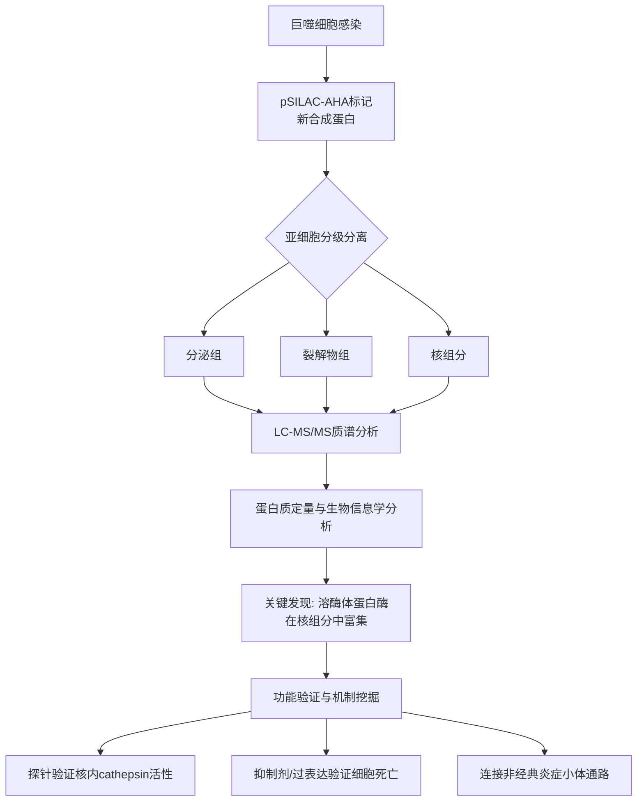

# Spatiotemporal proteomics uncovers cathepsin-dependent macrophage cell death during Salmonella infection

## 📎 快捷链接

| 类型 | 链接 |
|------|------|
| Zotero 条目 | [打开条目](zotero://select/items/0/W2APAYR8) |
| Zotero PDF | [打开PDF](zotero://open-pdf/library/items/ZLKWAKVX) |
| MinerU 解析 | [查看解析](G:/zotero/llm-for-zotero-mineru/10632/full.md) |
| DOI | [在线查看](https://doi.org/10.1038/s41564-020-0736-7) |

## 一、核心概念与研究背景
- **一句话总结**：本研究通过创新的“时空蛋白质组学”技术，揭示了沙门氏菌感染过程中，巨噬细胞内溶酶体蛋白酶cathepsin异常转运至细胞核，并触发依赖于非经典炎症小体的细胞死亡新机制。
- **关键概念解析**：
    - **pSILAC-AHA**：一种结合“脉冲稳定同位素标记氨基酸细胞培养”与“点击化学”的技术，用于特异性地富集、鉴定和定量感染过程中宿主细胞**新合成**的蛋白质。
    - **Cathespin (Cathepsin)**：一类主要存在于溶酶体中的半胱氨酸或天冬氨酸蛋白酶，传统上认为其功能是降解细胞内物质。本研究发现其被异常运输至细胞核，并具有促细胞死亡的功能。
    - **非经典炎症小体 (Non-canonical inflammasome)**：主要由胞内模式识别受体Caspase-11（小鼠）/ Caspase-4/5（人）组成的信号复合物。它直接感知细菌LPS，进而切割Gasdermin D蛋白，导致细胞焦亡。
    - **细胞焦亡 (Pyroptosis)**：一种由炎症小体激活的、伴随大量炎症因子释放的程序性细胞死亡方式，是宿主对抗病原体的重要免疫防御。
    - **重要性**：传统研究多关注感染后蛋白质总丰度的变化，而本技术能揭示蛋白质的**合成速率**与**空间定位**的动态变化，从而发现被掩盖的新生物学机制（如cathepsin的核转位）。

## 二、遭遇的瓶颈与中间问题
- **现有挑战**：沙门氏菌等胞内病原体如何在感染的复杂动态过程中，操纵宿主细胞内吞-溶酶体系统以促进自身生存并调控宿主细胞死亡，其具体机制，尤其是蛋白质的时空动态变化，尚不清楚。
- **具体难点**：
    1.  **技术瓶颈**：如何在感染这一动态过程中，同时高分辨率地追踪宿主**新合成**蛋白的**时间**（不同感染阶段）和**空间**（亚细胞定位）变化。
    2.  **现象不明**：前期研究已知沙门氏菌能促进溶酶体酶分泌，但对其他亚细胞区室（如细胞核）的蛋白质变化知之甚少。
    3.  **机制空白**：即使观察到cathepsin在细胞核内，也不清楚它们是“货物”还是“执行者”，其活性如何、是否直接参与调控感染诱导的细胞死亡。

## 三、揭秘过程与解决方案
- **破局思路**：作者创造性地将已有的用于分泌蛋白定量的pSILAC-AHA方法，拓展到**多个亚细胞区室**（分泌组、裂解物组、核组分）和**多个感染时间点**进行系统采样。这为发现“cathepsin异常核定位”这一关键线索提供了可能。
- **一步步揭秘**：
    1.  **发现线索**：通过pSILAC-AHA蛋白质组学分析，作者发现在感染后期（20小时），多种溶酶体蛋白酶（如cathepsin B, D, L等）在**核组分**和**分泌组**中的丰度显著上调，而在裂解物组中变化不大，提示发生了**异常的亚细胞重定位**。
    2.  **排除假象**：作者排除了这是由于细胞核纯化过程中溶酶体污染所致（因为溶酶体膜蛋白Lamp1/2未在核组分中富集），并确认这种富集针对的是溶酶体内腔蛋白（cathepsins），而非所有溶酶体蛋白。
    3.  **验证活性与定位**：使用细胞可渗透的cathepsin活性探针（DCG04-FL）结合核提取实验和荧光显微镜，**直接证实**感染后细胞核内存在**具有活性的**cathepsin。
    4.  **追溯上游信号**：发现cathepsin的核转位依赖于沙门氏菌的**SPI-2 III型分泌系统**，该系统在细菌胞内存活和增殖中起关键作用。
    5.  **关联功能**：使用cathepsin抑制剂（CA-074-Me）和将cathepsin天然抑制剂Stefin B靶向至细胞核的实验，证明**抑制cathepsin活性可以显著减少沙门氏菌诱导的细胞死亡**。
    6.  **连接免疫通路**：进一步实验表明，cathepsin活性是**非经典炎症小体介导的细胞焦亡所必需的**。将LPS直接转染至细胞质足以触发cathepsin的核积累和依赖cathepsin的细胞死亡。
    7.  **揭示调控机制**：最终发现，cathepsin活性抑制会降低Gasdermin D的表达，揭示了cathepsin在非经典炎症小体调控中的**上游新角色**。

## 四、核心技术路线
- **整体架构**：时空解析的宿主-病原体界面蛋白质组学。
- **关键创新点**：将pSILAC-AHA与**亚细胞分级分离**相结合，首次在感染过程中实现了对新合成蛋白质在多个亚细胞区室（分泌组、裂解物组、核组分）的动态定量。
- **流程图**：

## 五、结果呈现与证据链
- **核心结论**：沙门氏菌通过其SPI-2分泌系统，诱导宿主巨噬细胞新合成的、具有活性的溶酶体蛋白酶cathepsin重新转运至细胞核。这些核内cathepsin活性是激活非经典炎症小体、切割Gasdermin D并最终导致细胞焦亡所必需的。
- **证据展示**：
    1.  **蛋白质组学数据**（图1, 2, 3）：展示了cathepsins在核组分和分泌组中随时间上调的定量数据。
    2.  **活性探针成像与生化分析**（图4）：直接显示感染细胞核内存在活性cathepsin。
    3.  **遗传学与药理学实验**（图5，及后续结果）：
        - SPI-2突变株感染导致核cathepsin活性降低。
        - cathepsin抑制剂CA-074-Me或核靶向Stefin B能显著抑制细胞死亡。
        - LPS转染足以独立引发cathepsin核积累和细胞死亡。
    4.  **机制串联**（图6）：cathepsin抑制剂处理导致Gasdermin D表达下降，建立了cathepsin与非经典炎症小体之间的调控联系。
- **这些结果如何回应前面提到的“中间问题”**：
    - **技术问题**：pSILAC-AHA+亚细胞分馏解决了“时空分辨率”问题。
    - **现象问题**：定量数据直接揭示了cathepsin的“异常重定位”。
    - **机制问题**：一系列功能实验证明了核内cathepsin不是“旁观者”，而是细胞死亡的“关键执行者”，并串联起了非经典炎症小体通路。

## 六、局限性与待解决问题
1.  **体外模型局限性**：研究主要在小鼠RAW264.7巨噬细胞系中进行，其生理相关性需要在原代巨噬细胞和体内感染模型中进一步验证。
2.  **物种差异**：非经典炎症小体的核心感受器在小鼠中是Caspase-11，在人中是Caspase-4/5。cathepsin依赖性细胞死亡机制在人类沙门氏菌感染中是否保守尚待研究。
    - *注：有观点认为，尽管核心通路保守，但具体cathepsin的种类、定位效率和下游效应可能存在物种差异。*
3.  **机制细节待挖**：
    - cathepsin是如何被“主动”运输到细胞核的？其转运的分子机器（如哪些转运蛋白或核定位信号）是什么？
    - 核内cathepsin的具体底物是什么？除了影响Gasdermin D表达，是否直接切割核内其他关键调控蛋白？
    - cathepsin如何精确调控Gasdermin D的表达水平？是转录调控还是转录后调控？
4.  **通路交叉**：细胞死亡是复杂网络。cathepsin依赖的死亡途径与其他已知的死亡途径（如经典炎症小体、坏死性凋亡）之间如何交互和平衡？

## 七、与沙门氏菌/细菌基因组学研究的关联
- **可直接借鉴的方法/思路**：
    1.  **pSILAC-AHA+亚细胞分馏**：这套“时空蛋白质组学”范式可直接应用于研究其他胞内病原体（如结核分枝杆菌、李斯特菌）与宿主的互作，系统性挖掘被传统方法忽略的蛋白质重定位事件。
    2.  **“功能蛋白酶组学”策略**：使用活性探针（如DCG04）结合蛋白质组学或生化分离，是鉴定感染中活化蛋白酶的有力工具。
    3.  **机制挖掘路径**：从“组学发现” → “细胞定位与活性验证” → “药理学/遗传学功能实验” → “信号通路串联”的研究逻辑清晰有效。
- **应避免的陷阱**：
    1.  **勿忽视动态**：仅比较感染前后蛋白质总丰度，可能会错过像cathepsin重定位这样关键的动力学变化。
    2.  **注意分馏纯度**：亚细胞分馏实验必须设立严格的质控（如检测标志物蛋白），以排除不同区室间的交叉污染对结论的干扰。
    3.  **谨慎使用抑制剂**：像CA-074-Me这类抑制剂可能存在脱靶效应，需结合遗传学手段（如靶向表达抑制剂、基因敲除/敲降）进行验证。
    4.  **体内外差异**：体外发现的机制必须在更具生理意义的模型（如类器官、动物模型）中进行验证。

Tags: #论文笔记 #微生物学 #免疫学 #蛋白质组学 #细胞死亡 #Nature Microbiology