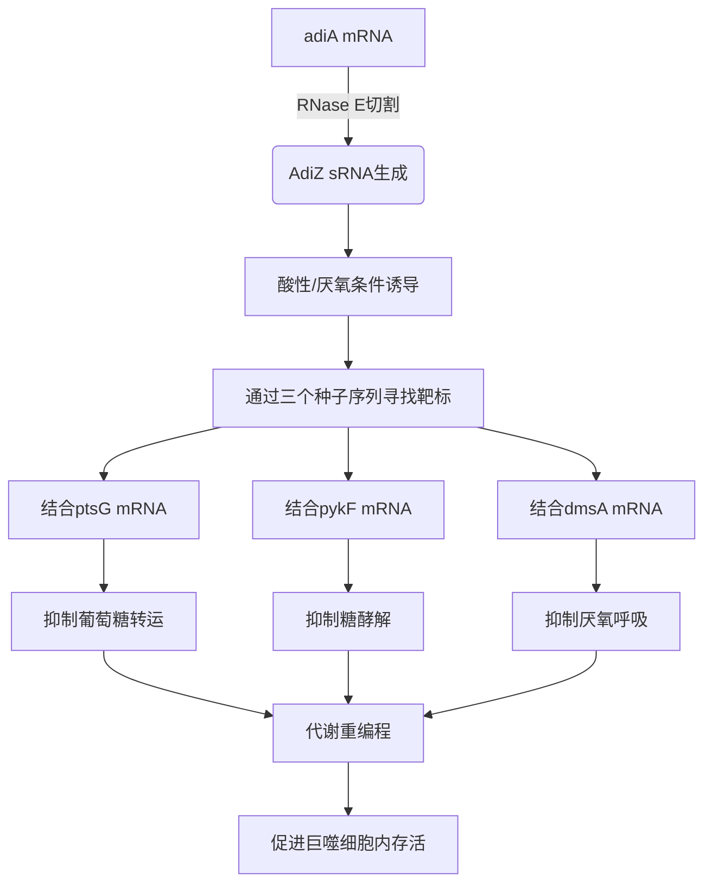

# 3- UTR-derived small RNA couples acid resistance to metabolic reprogramming of Salmonella within macrophages

## 📎 快捷链接

| 类型 | 链接 |
|------|------|
| Zotero 条目 | [打开条目](zotero://select/items/0/XQ8PPI2R) |
| Zotero PDF | [打开PDF](zotero://open-pdf/library/items/KAWHQEJ2) |
| MinerU 解析 | [查看解析](G:/zotero/llm-for-zotero-mineru/11325/full.md) |
| DOI | [在线查看](https://doi.org/-) |

## 一、核心概念与研究背景
- 一句话总结：沙门氏菌通过一个由3' UTR衍生的小RNA（AdiZ），将其关键的酸耐受系统与巨噬细胞内的代谢重编程直接耦合，以促进其存活。
- 关键概念解析：
  - **酸耐受机制 (Acid Resistance)**：沙门氏菌在感染过程中（胃肠道、巨噬细胞吞噬体）应对酸性环境的关键。主要依赖精氨酸脱羧酶系统（AdiA/AdiC），其通过消耗H⁺（将精氨酸转化为乙酰腐胺）来中和酸性。
  - **小RNA (sRNA) 及其生成**：细菌中广泛存在的非编码RNA，通常由RNase E等内切酶从mRNA前体（如3' UTR）切割产生，通过与靶标mRNA碱基配对调控其翻译和稳定性。本文的AdiZ（原名STnc1180）即从 `adiA` mRNA的3' UTR释放而来。
  - **代谢重编程 (Metabolic Reprogramming)**：细菌进入宿主细胞（如巨噬细胞）后，因环境变化（低氧、营养受限）而调整其能量代谢途径（如从有氧呼吸转向糖酵解/厌氧呼吸）的过程。本文揭示了AdiZ通过抑制糖酵解和厌氧呼吸相关基因来协调这一过程。
  - **巨噬细胞内的生态位**：沙门氏菌在巨噬细胞内存活的关键环境是“沙门氏菌含液泡（SCV）”，该环境呈微酸性（~pH 5.0）和低氧，对细菌的代谢和应激反应提出了特殊要求。

## 二、遭遇的瓶颈与中间问题
- **现有挑战**：在研究前，酸耐受（如AdiA系统）和对宿主环境的代谢适应被视为沙门氏菌的两个相对独立的生存策略。它们之间是否存在直接的分子层面联系，尤其是通过转录后调控实现的快速耦合，尚不清楚。
- **具体难点**：
  1.  **生物生成之谜**：已知STnc1180（AdiZ）来自 `adiA` mRNA，但其确切的加工（如RNase E切割）机制和调控条件（何时、何处被释放）不明。
  2.  **功能未知**：该sRNA的调控靶标和生物学功能完全未知，它可能只是一个副产物，也可能在感染中起关键作用。
  3.  **功能验证**：即便找到潜在靶标，如何证明它们在真实的宿主细胞感染环境（巨噬细胞内）中具有生理意义是一大挑战。

## 三、揭秘过程与解决方案
- **破局思路**：作者从一个已知但功能未知的sRNA（STnc1180）出发，利用先进的RNA相互作用组学技术系统性地“钓鱼”找靶标，并将发现的分子机制置于感染模型中进行功能验证。
- **一步步揭秘**：
  1.  **定位与验证sRNA生成**：通过生物信息学分析，发现AdiZ在沙门氏菌属中高度保守（图1B，C）。通过构建RNase E温度敏感突变体，并在酸性（pH 5.5）厌氧条件下诱导，证实AdiZ由RNase E从 `adiA` mRNA的3' UTR切割产生。
  2.  **描绘诱导条件**：Northern blot实验证明，AdiZ的表达被**酸性（pH 5.5）和厌氧条件**强烈协同诱导（图1F），与巨噬细胞内的环境高度吻合。
  3.  **系统性寻找靶标**：采用两种互补的RNA相互作用组技术：
      - **RIL-seq**：在体内捕获与Hfq蛋白结合的RNA-RNA相互作用。
      - **MAPS-seq**：进一步提高相互作用的鉴定分辨率。
      这两种技术共同鉴定出AdiZ的三个高置信度直接靶标：`ptsG`（葡萄糖转运）、`pykF`（糖酵解）、`dmsA`（厌氧呼吸）。
  4.  **验证直接相互作用**：
      - **体外验证**：SHAPE-MaP结构探测显示AdiZ与靶标mRNA存在互补区域（图4）。
      - **体内验证**：使用荧光素酶报告基因系统，证明AdiZ能显著抑制报告基因的表达。
      - **关键突变**：通过引入单点突变破坏预测的碱基配对，证明了相互作用的关键性（图5）。
  5.  **连接生理功能**：在小鼠巨噬细胞感染模型和体内（小鼠）感染模型中，发现ΔadiZ突变株在巨噬细胞内的增殖能力下降，在小鼠肝脏和脾脏中的竞争适应性显著降低（图6），证明了AdiZ在感染过程中的重要性。

## 四、核心技术路线
- **整体架构**：研究分为三个模块：1) sRNA的鉴定与表达分析；2) sRNA靶标的系统性筛选与验证；3) sRNA-靶标轴在感染中的功能解析。
- **关键创新点**：
  1.  **机制发现**：首次揭示RNase E对 `adiA` mRNA 3' UTR的特异性切割是AdiZ生成的机制。
  2.  **技术整合**：结合RIL-seq和MAPS-seq两种前沿技术，全面、高可信度地描绘了AdiZ的RNA相互作用网络。
  3.  **多功能靶向**：发现一个sRNA（AdiZ）通过**三个不同的种子序列**同时调控三个关键代谢通路的基因。
- **流程图**：

## 五、结果呈现与证据链
- **核心结论**：AdiZ是一个由酸耐受基因 `adiA` 共表达产生的调控性sRNA。它在巨噬细胞内酸性低氧环境下诱导，通过直接抑制糖酵解和厌氧呼吸相关基因（`ptsG`, `pykF`, `dmsA`），协调沙门氏菌的代谢重编程，从而支持其胞内生存。**这实现了“酸耐受”与“代谢适应”两个生理过程的耦合**。
- **证据展示**：
  1.  **表达验证**：Northern blot清晰显示AdiZ在pH 5.5+厌氧条件下强烈诱导（图1F）。
  2.  **靶标鉴定**：RIL-seq/MAPS-seq数据显示AdiZ与 `ptsG`, `pykF`, `dmsA` mRNA存在强烈的、Hfq依赖的相互作用（图3）。
  3.  **机制解析**：SHAPE-MaP结构图（图4）和碱基配对示意图（图4A）直观展示了AdiZ与靶标的互补区域。报告基因实验和点突变实验（图5）提供了功能验证。
  4.  **功能证据**：巨噬细胞感染实验显示ΔadiZ突变株在感染后期（8-24小时）增殖能力下降（图6A-C）。小鼠竞争感染实验显示，ΔadiZ突变株在肝脏和脾脏中的竞争优势显著减弱（图6D）。
- **回应中间问题**：上述结果完整回答了“AdiZ如何生成”（RNase E切割）、“它调控谁”（三个代谢基因）、“它如何调控”（直接碱基配对）以及“它有什么用”（促进胞内生存）这四个核心问题。

## 六、局限性与待解决问题
1.  **生理条件复杂性**：研究主要在体外特定条件（pH 5.5 + 厌氧）和小鼠模型中进行。人体感染过程中，沙门氏菌经历的pH和氧浓度梯度可能更复杂，AdiZ的动态表达和功能阈值有待进一步探索。
2.  **调控动力学**：研究证实了AdiZ对靶标的抑制，但未深入探讨这种调控的动力学（例如，对mRNA降解速率的精确影响）以及是否存在其他辅助因子或反馈调节环路。
3.  **靶标网络完整性**：虽然鉴定了三个关键靶标，但AdiZ是否还调控其他与酸耐受或胞内生存相关的基因？是否存在其他功能未知的3' UTR衍生sRNA参与类似耦合？
4.  **菌株与血清型特异性**：研究基于沙门氏菌血清型Typhimurium SL1344。AdiZ在其他沙门氏菌血清型（如引起伤寒的Typhi）或相关肠道病原菌中的保守性和功能差异有待研究。
5.  **与母基因功能的权衡**：AdiZ与AdiA蛋白从同一mRNA产生，其表达水平是否存在最优平衡？在感染中，是AdiA的酸中和作用更重要，还是AdiZ的代谢调控作用更关键？

## 七、与沙门氏菌/细菌基因组学研究的关联
- **可直接借鉴的方法/思路**：
  1.  **靶标发现范式**：利用RIL-seq/MAPS-seq系统性鉴定sRNA靶标的技术流程，可用于研究其他功能未知的sRNA。
  2.  **“一因多效”sRNA研究**：一个sRNA同时调控多个靶标以实现生理功能耦合的范例，为研究其他多靶标sRNA提供了分析框架。
  3.  **转录后调控网络挖掘**：提示在分析细菌在宿主细胞内的适应机制时，应重视转录后调控层面的快速响应网络。
- **应避免的陷阱**：
  1.  **避免仅凭序列预测靶标**：生物信息学预测假阳性高，必须结合相互作用组学数据和实验验证。
  2.  **注意母基因共表达的影响**：在分析sRNA功能时，需排除其母基因（如本研究的 `adiA`）产物可能带来的表型混淆。本研究通过仅表达AdiZ的质粒部分规避了此问题。
  3.  **体内模型选择需谨慎**：小鼠模型的结果不一定完全适用于人体感染，需结合多模型或临床样本进行验证。

Tags: #论文笔记 #微生物学 #RNA生物学 #沙门氏菌 #小RNA #RIL-seq #代谢重编程 #酸耐受 #Cell Host & Microbe