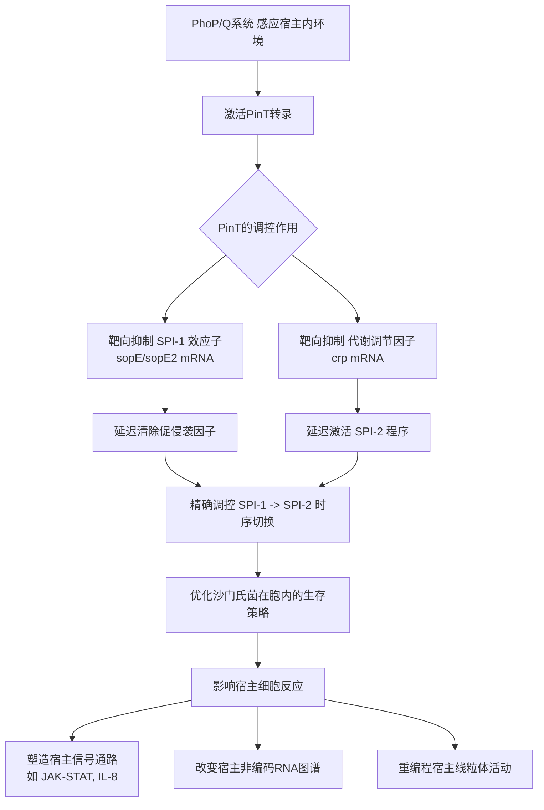

# 双RNA测序揭示宿主‑病原体相互作用中非编码RNA的功能

## 📎 快捷链接

| 类型 | 链接 |
|------|------|
| Zotero 条目 | [打开条目](zotero://select/items/0/9CPQB9V3) |
| Zotero PDF | [打开PDF](zotero://open-pdf/library/items/CBWK8X58) |
| MinerU 解析 | [查看解析](file:///G:/zotero/llm-for-zotero-mineru/9067/full.md) |
| DOI | [在线查看](https://doi.org/10.1038/nature16549) |

## 一、核心概念与研究背景
- **一句话总结**：研究开发并应用“双RNA测序”技术，同步分析沙门氏菌感染过程中病原体和宿主的全转录组，从而揭示了一个名为 **PinT** 的关键细菌小RNA（sRNA）如何作为“计时器”，精细调控毒力基因的表达时序，并深刻影响宿主免疫反应。
- **关键概念解析**：
    - **双RNA测序 (Dual RNA-seq)**：一种无需物理分离病原体与宿主细胞，通过生物信息学方法从混合RNA样本中同时解析细菌和真核宿主转录组的技术。其重要性在于能原位捕捉感染动态和种间相互作用。
    - **非编码RNA (ncRNA)**：不编码蛋白质的RNA，包括细菌的sRNA和宿主的长非编码RNA（lncRNA）、miRNA等。它们在基因表达调控中起关键作用，但在感染中功能未被充分阐明。
    - **沙门氏菌毒力岛 (SPI-1 & SPI-2)**：沙门氏菌基因组上编码毒力因子的区域。SPI-1主要编码与宿主细胞入侵相关的III型分泌系统（T3SS）和效应蛋白；SPI-2主要编码与细菌在细胞内存活和复制相关的T3SS和效应蛋白。两者存在严格的时序切换。
    - **PhoP/Q双组分系统**：沙门氏菌感应宿主细胞内环境（如低pH、抗微生物肽）并激活包括SPI-2在内的众多毒力基因的核心调控系统。

## 二、遭遇的瓶颈与中间问题
- **现有挑战**：
    1.  **sRNA功能研究的困境**：大多数细菌sRNA基因的缺失在动物感染模型中仅导致轻微或无表型，被认为主要进行“精细调节”，使得其在毒力中的真实功能难以通过传统毒力测定发现。
    2.  **传统转录组学的局限**：常规RNA-seq研究通常在物理分离病原体与宿主后分别进行，破坏了天然的相互作用界面，且多聚焦于mRNA，忽略了大量非编码转录组信息。
- **具体难点**：
    1.  **PinT的表型微弱**：尽管PinT在全基因组筛选中被预测为毒力因子，但其基因缺失在标准细胞感染和小鼠模型中表型不明显，难以解析其分子功能。
    2.  **解析sRNA的靶标与下游效应**：如何确定一个sRNA在感染环境中的特异性靶标，并建立其从细菌调控到宿主反应的完整信号通路。

## 三、揭秘过程与解决方案
- **破局思路**：作者的核心灵感在于**采用能够原位、全局、动态解析感染过程的“双RNA测序”技术**。他们不满足于简单的基因敲除表型观察，而是通过高分辨率时间序列数据，在转录组层面系统性寻找与细菌特定sRNA表达变化相关联的、宿主和病原体两侧的分子事件。
- **一步步揭秘**：
    1.  **建立系统与发现线索**：在HeLa细胞感染模型中进行双RNA测序，首先鉴定出 **PinT是感染诱导最强的细菌sRNA**，其表达受PhoP/Q系统控制。
    2.  **构建突变体进行功能筛查**：构建`ΔpinT`突变菌株，重复双RNA测序时间序列实验。通过比较野生型与突变体感染下的**全局转录组差异**，发现PinT缺失导致沙门氏菌**SPI-2毒力基因过早激活**。
    3.  **鉴定靶标与作用机制**：
        - **体外脉冲表达**鉴定直接靶标：发现PinT在早期抑制SPI-1效应子`SopE/SopE2`的mRNA。
        - **体外条件转换**重现调控：证实PinT通过抑制代谢调节因子`CRP`的mRNA，来延迟SPI-2基因（如`ssaG`）的激活，确立了 **PinT -> CRP -> SPI-2** 的调控通路。
    4.  **建立“计时器”模型**：综合实验证据，提出PinT作为“计时器”的模型：在细菌被吞噬后，PhoP激活PinT，PinT通过抑制`SopE/SopE2`（促侵袭）和`CRP`（促SPI-2），**精确延迟从SPI-1程序向SPI-2程序的切换**。
    5.  **追溯宿主反应**：在双RNA测序的宿主转录组数据中，通过**种间相关性分析**，发现PinT调控的细菌毒力基因网络与宿主 **JAK-STAT信号通路** 变化显著相关。实验验证`ΔpinT`感染导致宿主`SOCS3`（JAK-STAT通路抑制因子）过早激活和`STAT3`磷酸化减少。

## 四、核心技术路线
- **整体架构**：
    ```
    1. 样本制备：沙门氏菌感染HeLa细胞，FACS分选含不同细菌数(GFP+)的感染细胞及未感染对照。
    2. 建库测序：提取总RNA，进行rRNA去除后的高通量测序。
    3. 生物信息分析：将reads比对至细菌和人类基因组，分别定量编码与非编码RNA。
    4. 动态分析：对感染后多个时间点（0， 2， 4， 8， 16， 24 h）进行时间序列分析。
    5. 功能验证：利用`ΔpinT`突变株、互补株、报告基因融合、Western blot、qRT-PCR等进行验证。
    6. 宿主关联：通过统计相关性分析连接病原体与宿主转录组变化。
    ```
- **关键创新点**：
    1.  **方法学创新**：系统性地将**双RNA测序**应用于细菌sRNA功能研究，成功从混合样本中同时解析病原体与宿主的全转录组（包括编码和非编码RNA）。
    2.  **概念创新**：发现并定义了细菌sRNA作为**毒力程序“计时器”**的新功能模式，精细调控毒力基因的时序表达，而非简单的开关。
    3.  **分析创新**：引入**种间相关性分析**，在组学水平建立了细菌调控因子（PinT）与宿主特定信号通路（JAK-STAT）之间的功能联系。

## 五、结果呈现与证据链
- **核心结论**：
    1.  PinT是一个PhoP依赖的沙门氏菌sRNA，在多种宿主细胞内感染时被强烈诱导（>100倍）。
    2.  PinT通过靶向抑制`SopE/SopE2`和`CRP`的mRNA，**延迟沙门氏菌从SPI-1（侵袭）到SPI-2（胞内存活）程序的切换**。
    3.  PinT介导的毒力基因时序调控，通过影响SopE/SopE2等效应子，深刻重塑宿主细胞反应，特别是 **JAK-STAT信号通路**。
    4.  沙门氏菌感染导致宿主lncRNA表达谱发生广泛且PinT依赖性的改变。
- **证据展示**：
    - **PinT功能**：`ΔpinT`突变体感染早期（4h）SPI-2基因表达显著高于野生型（图3b）；蛋白质水平上，`ΔpinT`细菌中SopE清除不完全、SteC积累更快（图3e）。
    - **靶标验证**：体外脉冲表达PinT导致SopE/SopE2蛋白水平下降（图3c）；`crp`基因缺失能抵消PinT对SPI-2的抑制（图3d）。
    - **宿主影响**：`ΔpinT`感染的HeLa细胞中，`SOCS3` mRNA在早期（4h）即显著高于野生型感染（图4c）；Western blot显示STAT3磷酸化水平降低（图4d）。
    - **全局影响**：双RNA测序显示，感染影响宿主~44%的检测到的lncRNA，其中近半数变化依赖于PinT（图4a）。

## 六、局限性与待解决问题
1.  **模型系统局限性**：研究主要使用HeLa细胞，其免疫背景（如低TLR活性）可能无法完全代表体内复杂的免疫微环境（如巨噬细胞、肠道上皮）。需要在更生理相关的模型（如类器官、原代细胞、动物模型）中验证。
2.  **PinT的体内表型**：尽管在细胞模型中功能明确，但`pinT`缺失在小鼠感染竞争模型中无明显表型（文中引用的TraDIS数据），这提示其作用可能在特定宿主或感染阶段更为关键，或存在功能冗余。
3.  **机制深度不足**：PinT如何精确“计时”？其表达动力学如何与PhoP活性、环境信号整合？PinT影响宿主线粒体RNA表达和定位的具体分子机制是什么？这些仍有待深入。
4.  **非编码RNA功能注释**：虽然鉴定了大量感染相关的宿主lncRNA，但绝大多数lncRNA的具体功能和作用机制未被阐明。

## 七、与沙门氏菌/细菌基因组学研究的关联
- **可直接借鉴的方法/思路**：
    1.  **双RNA-seq作为标准工具**：对于研究任何细胞内病原体（沙门氏菌、结核分枝杆菌、李斯特菌等）的毒力调控，双RNA-seq应作为发现新调控因子和解析其宿主效应的首选高通量方法。
    2.  **sRNA功能研究范式**：从“表型筛查”转向“组学关联分析”。通过比较野生型与sRNA突变体的**双RNA-seq时间序列**，直接关联细菌sRNA表达变化与宿主转录组反应，能高效发现sRNA的隐蔽功能。
    3.  **关注“计时器”功能**：在分析细菌毒力基因调控网络时，应特别注意那些负责**时序切换**的调节因子（如PinT、其他受PhoP/Q调控的sRNA），而不仅仅是开关。
- **应避免的陷阱**：
    1.  **过度依赖单一细胞系**：需在多种宿主细胞类型中验证发现，尤其是原代免疫细胞。
    2.  **忽视低丰度转录本**：sRNA和某些lncRNA丰度低，需要优化测序深度和分析流程才能可靠检测。
    3.  **将相关性误认为因果性**：双RNA-seq提供的种间相关性是强有力的线索，但最终机制必须通过遗传学（突变、互补）和生化实验（如验证RNA-RNA相互作用）来确认。



Tags: #论文笔记 #微生物学 #宿主-病原体相互作用 #沙门氏菌 #小RNA #转录组学 #毒力调控 #JAK-STAT通路 #Nature