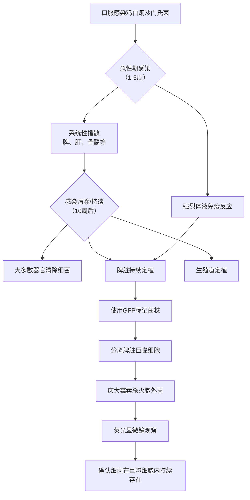

# Salmonella enterica Serovar Pullorum Persists in Splenic Macrophages and in the Reproductive Tract during Persistent, Disease-Free Carriage in Chickens

## 📎 快捷链接

| 类型 | 链接 |
|------|------|
| Zotero 条目 | [打开条目](zotero://select/items/0/ENDD3N2P) |
| Zotero PDF | [打开PDF](zotero://open-pdf/library/items/IEVM6D5A) |
| MinerU 解析 | [查看解析](file:///G:/zotero/llm-for-zotero-mineru/9147/full.md) |
| DOI | [在线查看](https://doi.org/10.1128/IAI.69.10.6021-6029.2001) |

## 一、核心概念与研究背景
- 一句话总结：本研究揭示了鸡白痢沙门氏菌如何在无临床症状的鸡体内长期“隐身”并最终通过鸡蛋垂直传播的秘密，其关键在于细菌躲藏在脾脏的巨噬细胞内。
- 关键概念解析：
    - **Salmonella enterica serovar Pullorum (鸡白痢沙门氏菌)**：一种重要禽类病原体，引起雏鸡高死亡率的急性系统性疾病（白痢病），但能导致成年鸡无症状持续感染，并通过蛋传播。
    - **持续感染 (Persistent, Disease-Free Carriage)**：指病原体在宿主体内存活数月甚至数年，但宿主不表现明显的临床症状。这是许多宿主限制性沙门氏菌（如伤寒沙门氏菌）的共同特征。
    - **垂直传播 (Vertical Transmission)**：病原体通过生殖细胞（如蛋黄）从亲代传播给子代。对于禽类病原体，这是疾病在群体中维持和传播的关键途径。
    - **细胞内寄生 (Intracellular Residence)**：细菌（如沙门氏菌）进入宿主细胞（尤其是巨噬细胞）内存活和繁殖，以此逃避宿主免疫系统的清除。

## 二、遭遇的瓶颈与中间问题
- **现有挑战**：已知鸡白痢沙门氏菌可引起无症状的持续感染并垂直传播，但**不知道持续感染的具体细胞学位置**，也不清楚细菌**如何逃避免疫清除**，特别是为什么在性成熟期细菌数量会回升。
- **具体难点**：
    1.  如何在复杂的组织样本中精确定位并证明细菌处于细胞内，尤其是哪种免疫细胞内。
    2.  感染期间产生强烈的体液免疫反应（抗体），但细菌仍能持续存在，矛盾现象暗示其存在免疫逃避机制，但机制不明。
    3.  细菌感染鸡蛋的途径可能不止一种（卵巢或输卵管），需要精确界定。

## 三、揭秘过程与解决方案
- **破局思路**：作者的灵感来源于两个关键线索：
    1.  **免疫学线索**：尽管有强抗体反应，细菌仍持续存在，强烈提示其为**细胞内感染**。沙门氏菌与巨噬细胞的相互作用是已知的。
    2.  **技术线索**：为了直观地看到细菌在宿主内的位置，可以使用**荧光标记**的细菌。
- **一步步揭秘**：
    1.  **建立长期感染模型 (实验一)**：用鸡白痢沙门氏菌口服感染1日龄雏鸡，长期跟踪42周。观察临床症状、病变、各器官细菌定植量及抗体反应。
    2.  **定位感染部位**：系统性地检测脾、肝、骨髓、肌肉、盲肠、泄殖腔、气囊、**卵巢和输卵管**等多个部位，绘制细菌“藏匿地图”。
    3.  **锁定关键组织**：发现急性期后，细菌从大多数组织清除，但**脾脏和生殖道**是长期持续感染的主要部位。
    4.  **寻找细胞“避难所” (实验二)**：基于上述发现和“细胞内感染”假设，构建表达**绿色荧光蛋白(GFP)** 的稳定菌株。感染鸡后，分离脾脏巨噬细胞，利用抗生素杀灭细胞外细菌，并通过荧光显微镜直接观察巨噬细胞内的细菌。
    5.  **证实细胞内定居**：直接观察到GFP标记的细菌位于脾脏巨噬细胞内，从而证实了持续感染的主要细胞场所。

## 四、核心技术路线
- **整体架构**：动物感染实验（长期跟踪） + 细菌荧光标记与细胞分离鉴定。
- **关键创新点**：
    1.  **稳定表达系统**：使用带有**nirB启动子**的质粒，该启动子在细菌进入宿主厌氧环境（如细胞内）时能稳定驱动GFP表达，避免了表达丢失问题，是技术成功的关键。
    2.  **细胞水平验证**：结合**巨噬细胞分离技术**（利用贴壁特性）与**庆大霉素保护实验**（杀灭胞外菌），并辅以免疫荧光（KUL01抗体标记巨噬细胞膜），实现了对“细菌-细胞”互作的直接可视化和定量分析。

## 五、结果呈现与证据链
- **核心结论**：
    1.  鸡白痢沙门氏菌能在感染鸡的脾脏和生殖道中持续存在超过**40周**。
    2.  在性成熟期（约20周后），细菌会重新定植卵巢和输卵管，导致约**6%** 的鸡蛋被感染。
    3.  **脾脏是持续感染的主要器官，其内的巨噬细胞是细菌的主要“避难所”**。
    4.  持续感染期间，宿主产生了针对沙门氏菌的强烈体液免疫反应（IgG抗体滴度高）。
- **证据展示**：
    1.  **组织载菌量数据 (表1)**：显示了细菌在不同时间点在各组织中的存在和数量变化趋势。
    2.  **抗体反应曲线 (ELISA)**：显示感染后特异性IgG抗体水平持续升高并维持高位。
    3.  **GFP荧光图像**：直接显示了在脾脏分离的巨噬细胞内，存在发出绿色荧光的细菌。
    4.  **生殖道分离数据**：在卵巢、输卵管（特别是漏斗部和膨大部）分离到细菌，并在鸡蛋中检测到。

## 六、局限性与待解决问题
1.  **机制深度不足**：研究证实了细菌在巨噬细胞内持续存在，但**未能阐明其具体的免疫逃避机制**（如抑制溶酶体融合、调控宿主细胞凋亡等）。
2.  **生殖道感染机制不明**：细菌是如何进入并定植于生殖道的？是直接血行播散至生殖组织，还是通过感染的巨噬细胞迁移？论文未探讨。
3.  **样本量与代表性**：每个时间点仅5只鸡，虽然趋势明显，但更大样本量能提供更强的统计效力。实验鸡为特定品系（商业褐壳蛋鸡），结果是否适用于其他品种尚不确定。
4.  **“6%感染率”的普适性**：这是一个实验条件下的数据，野外或不同感染剂量下是否与此一致未知。
5.  **未研究其他免疫细胞**：虽然聚焦于巨噬细胞，但树突状细胞等其他抗原呈递细胞是否也参与持续感染未被考察。

## 七、与沙门氏菌/细菌基因组学研究的关联
- **可直接借鉴的方法/思路**：
    - **细胞内感染定位技术**：GFP标记 + 庆大霉素保护实验 + 特异性细胞分选/鉴定，是研究沙门氏菌等胞内菌持续感染的经典范式，可应用于研究其他沙门氏菌血清型在宿主内的生态位。
    - **长期感染动物模型**：该研究提供的从急性感染到长期无症状携带的完整动物模型，是评估疫苗和治疗策略的重要平台。
    - **垂直传播研究范式**：系统检测卵巢、输卵管和鸡蛋的标准化方法，为研究其他可通过生殖途径传播的病原体提供了参考。
- **应避免的陷阱**：
    - **血清型特异性外推**：鸡白痢沙门氏菌是高度宿主适应的血清型，其持续感染机制（如对鸡巨噬细胞的特异性适应）可能与广谱宿主血清型（如鼠伤寒沙门氏菌）不同，不宜直接套用结论。
    - **忽略环境因素**：实验在受控的SPF或清洁环境下进行，实际生产中的免疫状态、混合感染、环境压力可能显著影响持续感染的发生率和机制。
    - **对“持续感染”的过度简化**：持续感染是一个动态的平衡，可能涉及细菌的休眠、周期性再激活等多种状态，仅用“在巨噬细胞内”可能无法完全概括。

Tags: #论文笔记 #微生物学 #免疫学 #沙门氏菌 #鸡白痢 #持续感染 #巨噬细胞 #垂直传播 #荧光标记 #细胞内病原体