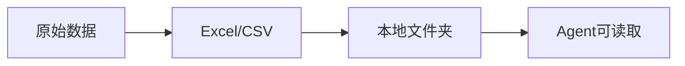
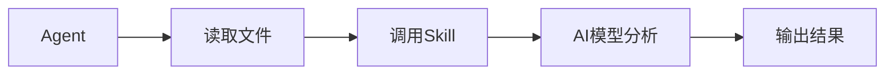
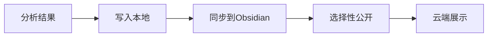
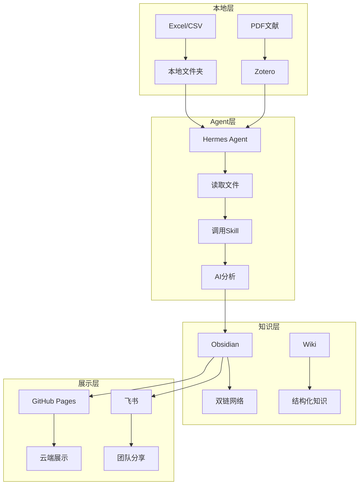

# 一、为何选择这样展示？——AI时代的知识管理与展示新范式

> **核心观点**：传统PPT是"静态展示"，而[[obsidian]] + [[AI Agent]] 的组合是"动态知识网络"——它不仅是展示工具，更是思考、记录、分享的一体化解决方案。

---
## 🎯 一句话总结

**我的做法**：本地笔记（Excel/Markdown） → [[AI Agent]] 读取分析 → 结合[[知识库]]（Wiki/Zotero） → 输出到本地 → 选择性同步云端分享

**链条**：
```
本地文件 → Agent读取 → AI模型分析 → Skill执行 → 输出到本地 → 同步到Obsidian → 选择性公开
```
![[vetsci-12-00391-g003.png|300]]

---

## 📊 系统架构：类比人脑

| 组件                  | 类比      | 功能      | 示例              |
| ------------------- | ------- | ------- | --------------- |
| [[obsidian]]        | 🧠 大脑   | 知识存储与连接 | 笔记库、双链网络        |
| [[Wiki]]/[[Zotero]] | 💾 记忆   | 文献与参考资料 | 论文、书籍、网页        |
| [[AI Agent]]        | 🤖 神经网络 | 执行与协调   | Hermes Agent    |
| [[AI模型]]            | 🧠 模型层  | 判断与生成   | GPT-4、Claude    |
| [[Skill]]           | ⚡ 神经传导  | 预设工作流   | 分析模板、处理流程       |
| 本地文件                | 🦴 实体器官 | 原始数据    | Excel、CSV、PDF   |
| 云端展示                | 📤 输出   | 分享与展示   | GitHub Pages、飞书 |

---

## 🔗 链路详解

### 第一步：本地数据准备


**示例**：
- Tn-seq分析数据：`H:\hermesp-agent\09-tnseq\result\`
- 鸽子基因组数据：`H:\hermesp-agent\sigclone-copy-core-linux_down-gezi-2026-0510\`

### 第二步：AI Agent 读取与分析


**关键能力**：
- 自动识别文件格式
- 调用专业分析流程（[[Skill]]）
- 结合[[知识库]]进行深度分析

### 第三步：知识沉淀与分享


**分享方式**：
- GitHub Pages：https://github.com/zhangyi233HIAS/PPT-show
- 飞书文档：团队内部分享
- 直接链接：发送给特定人员

---

## 💡 核心概念解释


**为什么选择Obsidian而非其他工具？**

| 对比维度      | [[obsidian]] | [[Notion]] | [[飞书]] | [[FlowUs]] |
| --------- | ------------ | ---------- | ------ | ---------- |
| **数据位置**  | 本地 ✅         | 云端 ❌       | 云端 ❌   | 云端 ❌       |
| **双链系统**  | 强大 ✅         | 弱 ❌        | 无 ❌    | 弱 ❌        |
| **离线使用**  | 支持 ✅         | 不支持 ❌      | 不支持 ❌  | 不支持 ❌      |
| **AI集成**  | 灵活 ✅         | 有限 ⚠️      | 有限 ⚠️  | 有限 ⚠️      |
| **自定义程度** | 极高 ✅         | 中等 ⚠️      | 低 ❌    | 中等 ⚠️      |
| **隐私控制**  | 完全 ✅         | 部分 ⚠️      | 部分 ⚠️  | 部分 ⚠️      |

详见：[[本地笔记库obsidian优势]]
#### 什么是 [[Markdown]]（.md）？

#### 什么是 [[AI Agent]]？

#### 什么是 [[Skill]]？

#### 什么是 [[知识库]]？

---

## ✅ 较PPT展示的优势

### 1. AI友好性
| 维度 | PPT | 本系统 |
|------|-----|--------|
| AI读取 | ❌ 困难（二进制格式） | ✅ 容易（纯文本） |
| AI分析 | ❌ 需要OCR | ✅ 直接解析 |
| AI生成 | ⚠️ 有限 | ✅ 灵活 |

### 2. 知识网络
| 维度 | PPT | 本系统 |
|------|-----|--------|
| 内容连接 | ❌ 线性（翻页） | ✅ 网络（双链跳转） |
| 思路整理 | ⚠️ 有限 | ✅ 强大（图谱视图） |
| 笔记补充 | ❌ 分离 | ✅ 一体化 |

### 3. 格式灵活性
| 维度 | PPT | 本系统 |
|------|-----|--------|
| 支持格式 | ⚠️ 有限 | ✅ 丰富（视频、Excel、PDF） |
| 嵌入内容 | ⚠️ 有限 | ✅ 灵活（iframe、链接） |
| 交互性 | ❌ 静态 | ✅ 动态（可操作） |

### 4. 分享与协作
| 维度 | PPT | 本系统 |
|------|-----|--------|
| 分享方式 | ⚠️ 有限（文件传输） | ✅ 灵活（链接、网页） |
| 观看体验 | ❌ 被动接收 | ✅ 主动探索（可跳转） |
| 下载使用 | ⚠️ 需要软件 | ✅ 任何编辑器 |

### 5. 可控性
| 维度   | PPT    | 本系统        |
| ---- | ------ | ---------- |
| 数据位置 | ⚠️ 本地  | ✅ 本地（完全可控） |
| 公开选择 | ❌ 全部或无 | ✅ 选择性公开    |
| 版本管理 | ❌ 困难   | ✅ Git追踪    |

---

## 🔧 如何打通各个组件？

### 打通方案



### 具体步骤

#### 1. 本地 → Agent
```bash
# Agent读取本地文件
read_file "H:\hermesp-agent\09-tnseq\result\06.Essential\K1.Essential_genes.xls"
```

#### 2. Agent → 分析
```python
# 调用Skill进行分析
skill_view(name='bioinformatics-stats')
# 执行分析流程
execute_code(...)
```

#### 3. 分析 → Obsidian
```bash
# 将结果写入Obsidian
write_file "H:\hermesp-agent\03-obsidian-hermes\07-PPT-show\analysis-result.md"
```

#### 4. Obsidian → 云端
```bash
# 同步到GitHub
git add .
git commit -m "Update analysis results"
git push origin main
```

---

## 📈 [[我的个人obsidian-云端分享-实际应用案例]]

---

## ⚠️ 局限性

### 1. 上手难度
**问题**：需要学习多个工具，打通链条  
**解决**：
- 提供[[快速入门]]指南
- 创建[[Skill]]模板
- 逐步学习，循序渐进

### 2. 网络依赖
**问题**：断网时无法使用AI功能  
**解决**：
- 本地笔记功能不受影响
- AI功能可降级使用
- 关键数据本地备份

### 3. 安全性
**问题**：数据在本地，需要自行备份  
**解决**：
- 使用Git进行版本控制
- 定期备份到云端
- 重要数据多重备份

### 4. 维护成本
**问题**：需要持续维护和优化  
**解决**：
- 创建[[Skill]]自动化流程
- 定期清理和整理
- 建立规范和流程
- api的token消耗贵
	- 我个人为例:一月大概1亿token(500yuan价格), 相当于50万次，长文本的网页AI对话框消耗
---
## 🚀 [[快速入门]]

详见：[[Obsidian快速入门]]

---

## 📚 相关概念

- [[obsidian]] - 本地知识管理工具
- [[Markdown]] - 轻量级标记语言
- [[AI Agent]] - 智能任务执行系统
- [[Skill]] - 预定义工作流程
- [[知识库]] - 结构化知识存储
- [[双链]] - 知识网络连接方式
- [[本地笔记库obsidian优势]] - Obsidian对比其他工具
- [[快速入门]] - 新手入门指南

---

## 🎯 总结

**为什么选择这样展示？**

1. **AI友好**：纯文本格式，易于AI读取分析
2. **知识网络**：双链系统，串联思路和知识
3. **格式灵活**：支持多种格式，内容丰富
4. **分享便捷**：链接分享，无需安装软件
5. **完全可控**：数据本地存储，选择性公开

**核心价值**：
> 这不仅是展示工具，更是**思考、记录、分享的一体化解决方案**。它让知识不再是孤立的PPT页面，而是**活的知识网络**。


正式汇报开始：[[00-索引]]
---

**最后更新**：2026年5月28日