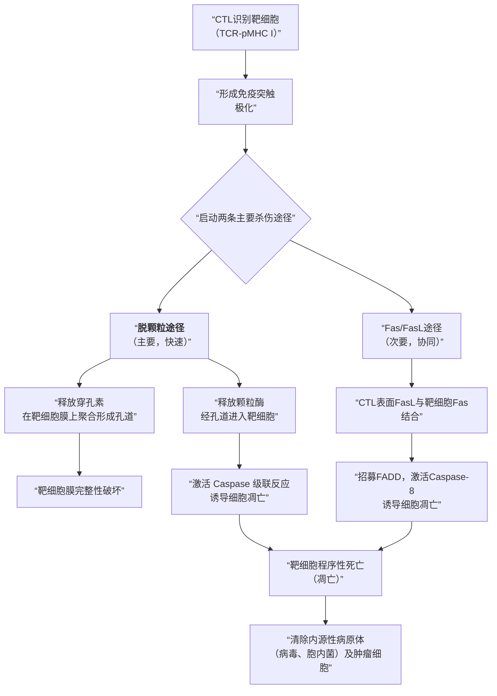

# **抗原的分子结构与免疫效应机制**  
**Antigen Molecular Structure and Mechanisms of Immune Effectors**

---

## **1. 引言：抗原的核心地位**
抗原（Antigen, Ag）是指能被特异性免疫应答（包括抗体和T细胞受体）识别并结合，进而诱导或调节免疫反应的物质。其**分子结构**直接决定了免疫系统如何“看见”它，并最终决定了免疫效应机制（effector mechanisms）的类型与强度。本笔记将深入解析抗原的结构层次，并阐明这些结构特征如何精确地启动并塑造下游的体液免疫与细胞免疫效应。

---

## **2. 抗原的结构基础：从化学本质到抗原决定簇**

### **2.1 抗原的化学分类**
*   **蛋白质抗原 (Protein Antigen)**：最常见、免疫原性最强的类型。其复杂的空间构象（conformation）和序列（sequential）表位能被B细胞和T细胞广泛识别。
*   **多糖抗原 (Polysaccharide Antigen)**：多为TI抗原（T-independent antigen），直接激活B细胞，但通常无法诱导有效的免疫记忆和类别转换。
*   **核酸抗原 (Nucleic Acid Antigen)**：自身核酸在特定情况下（如系统性红斑狼疮）可成为自身抗原。
*   **脂类抗原 (Lipid Antigen)**：如结核分枝杆菌的某些成分，可由CD1分子提呈，激活非传统的T细胞亚群。

### **2.2 抗原决定簇（表位， Epitope）——免疫识别的最小单位**
这是免疫应答的**核心靶标**。表位是抗原分子上决定抗原特异性的特殊化学基团，其结构与功能紧密相关。

#### **2.2.1 表位的类型**
*   **B细胞表位 (B-cell epitope)**：被BCR或抗体识别。
    *   **构象表位 (Conformational epitope)**：由空间上邻近、但序列上可能不连续的氨基酸或糖基组成。**依赖于抗原的天然折叠状态**。绝大多数B细胞表位属于此类。
    *   **线性表位 (Linear epitope)**：由一段连续的氨基酸序列组成。
*   **T细胞表位 (T-cell epitope)**：被TCR识别，且必须由MHC分子提呈。均为**线性短肽**，经抗原提呈细胞（APC）加工处理后产生。

#### **2.2.2 影响表位免疫原性的关键结构因素**
1.  **大小与复杂性**：足够大的分子量（通常>10 kDa）和化学结构复杂性（多种氨基酸、分支结构）提供更多潜在表位。
2.  **异物性 (Foreignness)**：与宿主自身成分的差异程度。这是免疫系统区分“自我”与“非我”的基础。例如，**[[异种抗原]]（xenogeneic antigen）** 通常具有高免疫原性。
3.  **可接近性 (Accessibility)**：位于分子表面的表位更容易被免疫细胞接触和识别。
4.  **分子骨架的稳定性**：例如，**[[β 桶状结构]]（β barrel / β sandwich）**， 常见于免疫球蛋白超家族（IgSF）成员（如抗体可变区、MHC分子、TCR），通过**链内二硫键**稳固其构象，为高亲和力、特异性的表位-受体相互作用提供了结构平台。
5.  **遗传背景**：宿主的MHC基因型决定了哪些T细胞表位能被有效提呈。

---

## **3. 抗原驱动的免疫效应机制**

抗原被识别后，通过激活不同的免疫细胞亚群，触发两大类效应机制。下图概括了其核心逻辑与路径：

```mermaid
flowchart TD
    A[“抗原 (Ag)”] --> B{“表位类型<br>提呈方式”}
    
    B --> C[“B细胞表位<br>（构象/线性）”]
    B --> D[“T细胞表位<br>（线性肽）”]
    
    C --> E[“BCR直接识别<br>→ B细胞激活”]
    D --> F[“经MHC提呈<br>→ TCR识别”]
    
    E --> G[“<b>体液免疫效应</b><br>抗体介导”]
    F --> H[“<b>细胞免疫效应</b><br>T细胞介导”]
    
    subgraph G[“体液免疫效应机制”]
        G1[“中和作用”]
        G2[“调理作用”]
        G3[“补体激活”]
        G4[“ADCC”]
    end
    
    subgraph H[“细胞免疫效应机制”]
        H1[“<b>脱颗粒途径</b><br>（穿孔素/颗粒酶）”]
        H2[“Fas/FasL途径”]
        H3[“细胞因子分泌<br>（如IFN-γ）”]
    end
    
    G --> I[“清除胞外病原体<br>（细菌、病毒、毒素）”]
    H --> J[“清除胞内病原体<br>（病毒、肿瘤）”]
```

### **3.1 体液免疫效应：抗体介导的清除**
B细胞识别**B细胞表位**后，在T细胞辅助下激活、增殖、分化，并经历两大关键过程：
1.  **体细胞高频突变与亲和力成熟**：在生发中心，B细胞受体基因发生高频率点突变，筛选出对抗原亲和力更高的B细胞克隆。此过程高度依赖**[[胞苷脱氨酶]]（activation-induced cytidine deaminase, AID）**。
2.  **抗体类别转换**：在AID和细胞因子调控下，抗体从IgM转换为IgG、IgA或IgE等，获得不同效应功能。

**抗体的效应机制完全由其Fc段与效应细胞/分子的相互作用决定，而其Fab段则特异性结合抗原**：
*   **中和作用 (Neutralization)**：抗体Fab段结合病原体表面关键位点（如病毒受体结合域），阻断其感染靶细胞的能力。
*   **调理作用 (Opsonization)**：抗体（主要是IgG）的Fc段被吞噬细胞（巨噬细胞、中性粒细胞）表面的Fc受体（FcγR）识别，极大地增强吞噬效率。
*   **补体依赖的细胞毒作用 (CDC)**：抗原-抗体复合物（特别是IgM、IgG）激活补体经典途径，形成膜攻击复合物（MAC），导致病原体或靶细胞裂解。
*   **抗体依赖性细胞介导的细胞毒作用 (ADCC)**：抗体（IgG）的Fc段与NK细胞、巨噬细胞等表面的Fc受体结合，引导这些效应细胞杀伤被抗体包被的靶细胞（如肿瘤细胞、病毒感染细胞）。

### **3.2 细胞免疫效应：T细胞介导的清除**
T细胞识别经APC加工提呈的**T细胞表位**（与MHC分子结合）。根据功能分化：
*   **CD4+ 辅助T细胞 (Th)**：通过分泌细胞因子，辅助B细胞、巨噬细胞和CD8+ T细胞活化，是免疫应答的“指挥官”。
*   **CD8+ 细胞毒性T淋巴细胞 (CTL)**：是清除胞内病原体和肿瘤细胞的“杀手”。其效应机制如图中所示：



**关键点**：
*   **[[脱颗粒途径]]（Degranulation pathway）** 是CTL快速杀伤的主要方式。CTL识别特异性抗原后，将其溶细胞颗粒（含**[[穿孔素]]（Perforin）** 和**[[颗粒酶]]（Granzyme）** ）定向释放至免疫突触。穿孔素在靶细胞膜上打孔，颗粒酶进入后激活凋亡程序。此过程需要**钙离子依赖的膜融合**。
*   **Fas/FasL途径**：CTL活化后表达Fas配体（FasL），与靶细胞表面的Fas（CD95）结合，直接启动靶细胞内部的凋亡信号通路。此途径在清除某些活化淋巴细胞和某些肿瘤细胞中尤为重要。
*   **细胞因子分泌**：CTL也分泌**IFN-γ**、**TNF-α**等，一方面直接抑制病毒复制，另一方面激活巨噬细胞，增强其杀伤能力。

---

## **4. 特殊类型的抗原与免疫逃逸**
*   **[[嗜异性抗原]]（Heterophilic antigen / Forssman antigen）**：存在于不同种属间的共同抗原。例如，A族链球菌细胞壁与人心肌组织的共同抗原，可能引发交叉反应，导致风湿性心脏病等自身免疫病理。这体现了抗原结构**相似性**带来的潜在风险。
*   **超抗原 (Superantigen, SAg)**：如金黄色葡萄球菌肠毒素。其结构能同时与TCR Vβ链和MHC II类分子外侧结合，**非特异性地**激活大量T细胞（可达总T细胞库的20%），引发过强的细胞因子风暴，与中毒性休克综合征相关。
*   **抗原变异与免疫逃逸**：病原体（如流感病毒、HIV、疟原虫）通过改变其表面关键抗原（血凝素、gp120、环子孢子蛋白）的表位结构，逃避预先存在的抗体或T细胞识别，这是疫苗研发面临的主要挑战。

---

## **5. 总结与展望**
抗原的**分子结构**，从一级序列到三维构象，特别是**抗原决定簇（表位）** 的特征，是免疫识别的物质基础。这种识别的特异性通过BCR/TCR与表位-MHC复合物的精密互作得以实现，其稳固性常受益于如**β桶状结构**等保守的蛋白质折叠模体。

识别信号随后被转导并放大，最终根据抗原的性质（如胞内/胞外）、表位类型（B/T细胞）以及所激活的免疫细胞亚群，导向截然不同的**效应机制**：抗体介导的**中和、调理、补体激活和ADCC**，或CTL介导的**穿孔素/颗粒酶依赖的脱颗粒杀伤和Fas途径**。

理解抗原结构与效应机制的关联，是理性设计**疫苗**（选择最优表位、递送系统以诱导所需效应类型）、开发**治疗性抗体**以及操纵免疫应答治疗**肿瘤和自身免疫病**的核心科学基础。未来的方向将更聚焦于基于结构生物学（如冷冻电镜解析抗原-受体复合物）的精准免疫干预。

---
**[[双向链接]] 提示**：
*   本文深度关联 [[抗原提呈]]、[[T细胞活化]]、[[B细胞活化与分化]]、[[补体系统]]、[[疫苗设计原理]] 等概念。
*   更多结构基础，请参阅 [[蛋白质折叠与免疫识别]]、[[MHC多态性]]。
*   关于AID的机制，可深入阅读 [[体细胞高频突变]] 与 [[抗体亲和力成熟]]。