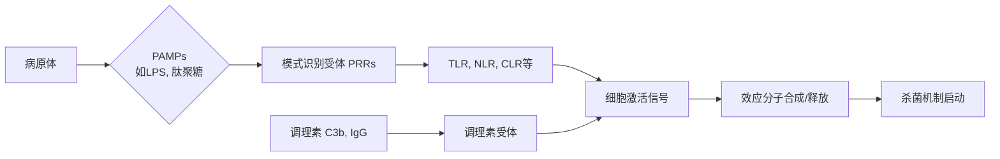

# 固有免疫的效应分子与杀菌机制：整合性概念笔记

**主题：固有免疫的效应分子与杀菌机制**
**整合深度：博士层级**
**核心概念：** 本笔记系统整合固有免疫系统在识别病原体后，所调动的一系列效应分子及其介导的直接与间接杀菌/抑菌机制。强调分子互作、区室化杀菌与信号放大的协同网络。

---

## 1. 引言：从识别到清除的逻辑链
固有免疫是宿主抵御感染的第一道防线。其核心逻辑可概括为：
[[模式识别受体]] (Pattern Recognition Receptors, PRRs) 识别 [[病原体相关分子模式]] (Pathogen-Associated Molecular Patterns, PAMPs) 或损伤相关分子模式 (DAMPs) → 激活细胞信号通路 → **上调并释放多种效应分子** → 执行杀菌/抑菌功能，同时桥接 [[适应性免疫]]。

本笔记聚焦于这一逻辑链的**效应执行端**。

## 2. 固有免疫识别与附着的分子基础
效应分子的产生与释放始于精准识别。固有免疫细胞主要通过以下受体完成对病原体的识别与附着，这是启动杀菌机制的前提。

*   **[[模式识别受体]] (PRRs):**
    *   **Toll样受体 (Toll-like Receptors, TLRs):** 如TLR4识别革兰氏阴性菌的 [[脂多糖]] (Lipopolysaccharide, LPS)，TLR2识别肽聚糖、脂磷壁酸等。是连接识别与[[炎症反应]]的关键桥梁。
    *   **NOD样受体 (NOD-like Receptors, NLRs):** 胞内受体，如NOD1/2识别细菌肽聚糖片段，激活炎症小体 (Inflammasome)，促进IL-1β等细胞因子成熟。
    *   **RIG-I样受体 (RIG-I-like Receptors, RLRs):** 识别病毒RNA。
    *   **C型凝集素受体 (C-type Lectin Receptors, CLRs):** 如**甘露糖受体 (Mannose Receptor)**，识别病原体表面的甘露糖、岩藻糖等碳水化合物结构，介导吞噬与内化。
*   **[[清道夫受体]] (Scavenger Receptors, SRs):** 识别多种配体，包括修饰的自身分子（如ox-LDL）和细菌成分（如LPS、脂磷壁酸），主要参与**病原体清除与[[凋亡]]细胞清除**。
*   **[[调理素]] (Opsonins) 受体:** 当病原体被补体片段（如C3b, iC3b）或抗体（IgG）覆盖（调理化）后，通过这些受体（如补体受体CR3、Fcγ受体）被免疫细胞高效识别和吞噬。


*图示：固有免疫识别与效应启动的简化流程图。多种受体识别病原体特征，汇聚成统一的激活信号。*

## 3. 核心效应分子库及其作用机制
识别信号通过NF-κB、MAPK、IRF等通路，诱导产生大量效应分子。这些分子按功能与存在形式可分为几大类。

### 3.1 抗菌肽 (Antimicrobial Peptides, AMPs)
小分子阳离子肽，是直接杀伤病原体的“化学武器”。
*   **[[防御素]] (Defensins):**
    *   **存在：** α-防御素主要存在于中性粒细胞颗粒及小肠潘氏细胞；β-防御素由上皮细胞等产生。
    *   **机制：** 其阳离子特性与两亲性结构，使其能**静电结合并插入带负电的微生物细胞膜**，形成孔道或破坏膜完整性，导致内容物泄漏。对细菌、真菌、包膜病毒均有效。
    *   **额外功能：** 趋化免疫细胞，调节炎症反应。
*   **Cathelicidins (如人LL-37):** 由中性粒细胞、上皮细胞产生。除直接膜损伤外，还能**中和LPS (内毒素)**，并具有免疫调节功能。

### 3.2 酶类与毒性分子
在特定细胞器（如溶酶体、分泌颗粒）中储存或由细胞释放。
*   **溶菌酶 (Lysozyme):** 广泛存在于**溶酶体**、泪液、唾液中。水解细菌细胞壁肽聚糖中N-乙酰胞壁酸与N-乙酰葡糖胺之间的β-1,4糖苷键，尤其对革兰氏阳性菌有效。
*   **[[细菌通透性增加蛋白]] (Bacterial Permeability-Increasing Protein, BPI):**
    *   **位置：** 中性粒细胞的**嗜苯胺蓝颗粒**。
    *   **机制：** 特异性结合并中和**革兰氏阴性菌**的[[脂多糖]] (LPS)。其N端结构域能**激活磷脂酶**，**降解细菌外膜磷脂**，增加膜通透性，导致细菌死亡。
*   **[[髓过氧化物酶]] (Myeloperoxidase, MPO):**
    *   **分布：** 中性粒细胞（强阳性）、单核/巨噬细胞（弱阳性）。
    *   **核心杀菌机制 —— “呼吸爆发” (Respiratory Burst):** MPO是**氧化杀菌系统**的核心酶。它利用H₂O₂和氯离子(Cl⁻)催化生成**次氯酸(HOCl)**，一种强效的氧化剂和氯化剂，能不可逆地损伤细菌蛋白质、脂质和核酸。
    *   **反应式：** `H₂O₂ + Cl⁻ + H⁺ → HOCl + H₂O` (MPO催化)
    *   **临床指标：** MPO活性是髓系细胞（尤其粒细胞）的标志，可用于白血病分型辅助诊断。

### 3.3 诱导型酶与反应性物质
*   **诱导型一氧化氮合酶 (iNOS):** 在巨噬细胞等被激活后大量表达，催化产生**一氧化氮 (NO)**。NO是一种气体信号分子和效应分子，能与超氧阴离子(O₂⁻)反应生成毒性更强的**过氧亚硝酸盐(ONOO⁻)**，破坏微生物的DNA、蛋白质和铁硫中心。

## 4. 效应分子的协同杀菌机制
上述分子并非独立作用，而是在特定时空内协同，形成多层次防御网络。

### 4.1 区室化杀菌：吞噬溶酶体的“化学战”
病原体被吞噬后，进入吞噬体 (Phagosome)，后者与[[溶酶体]]融合形成吞噬溶酶体 (Phagolysosome)。这是一个高度杀菌的微环境：
1.  **酸化：** V型ATP酶泵入H⁺，使pH降至4.5-5.0，抑制细菌生长，优化水解酶活性。
2.  **酶解：** 溶菌酶、BPI等水解细菌细胞壁。
3.  **氧化爆发：** NADPH氧化酶复合物组装在吞噬体膜上，产生O₂⁻、H₂O₂等。**MPO-H₂O₂-卤素系统**在此发挥最大效能，生成HOCl等。
4.  **抗菌肽释放：** 防御素等从颗粒中释放至吞噬溶酶体内。

```mermaid
graph TD
    subgraph 吞噬溶酶体 (pH 4.5-5.0)
        A[NADPH氧化酶] -->|产生| B(O₂⁻, H₂O₂);
        C[溶酶体融合] -->|释放| D[溶菌酶, BPI, MPO等];
        B --> E[MPO催化];
        E --> F(HOCl 等次氯酸);
        D --> G[水解细菌细胞壁];
        F --> H[氧化损伤];
        G & H --> I[病原体被杀灭];
    end
```
*图示：吞噬溶酶体内的多层次协同杀菌机制。化学酶解与氧化应激共同作用。*

### 4.2 胞外杀菌与“胞外陷阱”
*   **脱颗粒作用：** 中性粒细胞、肥大细胞等可将其颗粒内容物（如MPO、防御素、[[类胰蛋白酶]] (Tryptase)）释放到细胞外。
    *   **[[类胰蛋白酶]]的功能：** 作为肥大细胞的主要分泌蛋白酶，它通过**激活蛋白酶激活受体(PARs)**，引起**平滑肌缓慢收缩、血管强烈扩张和毛细血管通透性增强**，从而**招募更多免疫细胞（如[[嗜酸性粒细胞]]、[[中性粒细胞]]）** 到感染部位，**放大炎症反应**。
*   **中性粒细胞胞外陷阱 (Neutrophil Extracellular Traps, NETs):** 中性粒细胞在特定刺激下，经历一种特殊的细胞死亡（NETosis），将其解聚的染色质（DNA）与胞质内颗粒蛋白（如MPO、弹性蛋白酶、防御素）混合，释放到细胞外，形成网状结构。NETs能**物理捕获病原体**，并通过高浓度的**局部效应分子将其杀死**，限制其扩散。

## 5. 调控与临床意义
*   **反馈与放大：** 某些效应分子（如NO、类胰蛋白酶）本身是强效的炎症介质或趋化因子，能进一步**招募和激活更多免疫细胞**，形成正反馈回路。
*   **组织保护与病理：** 这些强大效应分子的失活或调控失衡可能导致宿主组织损伤（如急性肺损伤、自身免疫病）。例如，MPO衍生的氧化剂与动脉粥样硬化等慢性病相关。
*   **治疗靶点：** 对这些机制的深入理解，为开发新型抗感染药物（如AMPs模拟物）、免疫调节剂和抗炎药物提供了理论基础。

## 总结
固有免疫的效应分子构成了一个高度协同、多层次、区室化的杀菌武器库。从PRRs识别PAMPs开始，信号通路被激活，驱动效应分子（抗菌肽、酶、毒性物质）的合成与精确投放。它们在吞噬溶酶体内发动“化学战”，或通过脱颗粒、形成NETs在胞外发挥作用。这一过程不仅直接清除病原体，还通过释放炎症介质和趋化因子，精细地**招募、激活和桥接适应性免疫**，共同构筑完整的免疫防御体系。

---
**术语索引：** [[病原体相关分子模式]], [[模式识别受体]], [[脂多糖]], [[防御素]], [[细菌通透性增加蛋白]], [[髓过氧化物酶]], [[类胰蛋白酶]], [[溶酶体]], [[单核巨噬细胞系统]], [[中性粒细胞]], [[嗜酸性粒细胞]], [[肥大细胞]], [[调理素]], [[平滑肌]], [[血管]], [[毛细血管]]