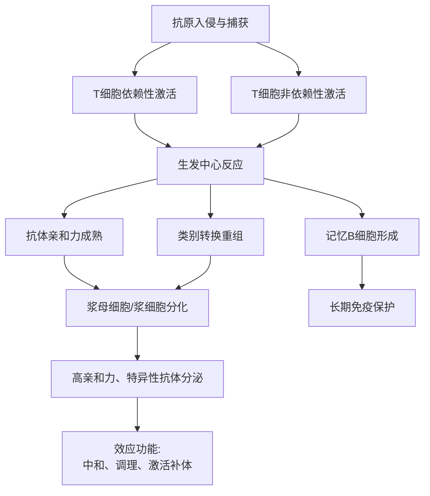
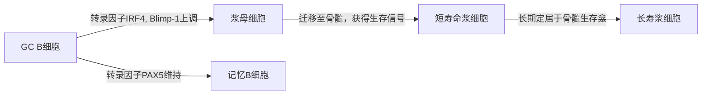

# 体液免疫应答过程与浆细胞的发育、功能
## 整合版概念笔记

---
### **1. 引言：体液免疫的核心目标**
[[体液免疫应答]] 是适应性免疫系统中由[[B淋巴细胞]]介导的、以产生[[抗体]]为核心效应的防御机制。其终极功能是清除胞外病原体（如细菌、病毒颗粒）及其毒素。这一过程精密、高效，并具备强大的记忆能力。本笔记将系统梳理从抗原识别到[[浆细胞 (Plasma Cell)]]产生的全过程，并深入解析浆细胞这一“抗体工厂”的发育轨迹与功能特性。

---

### **2. 体液免疫应答的完整流程**

体液免疫应答是一个多步骤、多细胞协作的级联反应。其核心流程可概括如下图所示：

下面对流程中的关键阶段进行详解：

#### **2.1 抗原识别与B细胞激活**
初始B细胞通过其表面的[[B细胞受体 (BCR)]] 特异性识别天然抗原。对于蛋白质抗原，完全的激活通常需要[[辅助性T细胞 (Th cell)]]的帮助（T细胞依赖性应答）。
1.  **信号一：抗原交联BCR**，提供初级活化信号。
2.  **信号二：共刺激信号**。活化的B细胞上调[[CD40]]等共刺激分子，与活化Th细胞表面的[[CD40L (CD154)]]结合，接收关键的第二信号。
3.  **细胞因子支持**：Th细胞分泌[[IL-4, IL-21]]等细胞因子，驱动B细胞的增殖、分化和类别转换。

#### **2.2 生发中心反应：抗体的“精加工车间”**
激活的B细胞进入[[淋巴滤泡]]，快速增殖形成**生发中心 (Germinal Center, GC)**。这是体液免疫应答发生质变的核心场所，主要完成两大事件：
1.  **体细胞高频突变 (Somatic Hypermutation, SHM) 与亲和力成熟 (Affinity Maturation)**：
    *   B细胞可变区基因发生高频点突变。
    *   在GC的[[滤泡树突状细胞 (FDC)]]提呈的抗原“筛选”下，只有携带**高亲和力BCR**的B细胞才能获得生存信号并被选择、扩增。
    *   **结果**：产生的后代细胞对抗原的亲和力逐代提高。

2.  **类别转换重组 (Class Switch Recombination, CSR)**：
    *   在Th细胞细胞因子（如IL-4诱导向IgG1和IgE转换，TGF-β诱导向IgA转换）的指令下，B细胞重链恒定区基因发生重组。
    *   **结果**：抗体的**效应功能**发生改变（如从IgM转换为IgG、IgA、IgE），但抗原特异性不变。

#### **2.3 浆细胞的分化命运**
经过GC反应的B细胞（GC B细胞）主要有两种分化结局：
*   **浆细胞 (Plasma Cell)**：终末分化的**效应细胞**，专职合成与分泌抗体，通常离开GC迁移至[[骨髓]]或炎症部位。
*   **记忆B细胞 (Memory B Cell)**：长期存活的“哨兵细胞”，不分泌抗体，但能快速在二次应答中被激活，分化为浆细胞或更多的记忆细胞。

---

### **3. 浆细胞的发育谱系与形态学动态**

浆细胞并非一个均一的群体，而是一个从**浆母细胞**到**长寿浆细胞**的连续发育谱系。其形态和分子特征发生显著变化。

#### **3.1 发育阶段概述**

**关键转录因子开关**：
*   **[[PAX5]]**：维持B细胞身份，在GC B细胞中高表达。
*   **[[Blimp-1 (PRDM1)]]**：浆细胞分化的主调控因子，它抑制PAX5和[[BCL-6]]（GC反应的关键因子），并直接激活浆细胞相关基因（如[[XBP-1]]）。
*   **[[IRF4]]**：剂量依赖性作用，在GC反应晚期高水平表达，与Blimp-1协同，驱动浆细胞分化。

#### **3.2 分阶段形态学与分子特征详解**
以下表格对比了浆细胞发育各阶段的特征，整合了已有的形态学描述：

| 特征维度 | **浆母细胞 (Plasmablast)** | **幼稚浆细胞 (Proplasmacyte)** | **成熟浆细胞 (Mature Plasma Cell)** |
| :--- | :--- | :--- | :--- |
| **发育阶段** | GC反应早期输出或急性感染应答期 | 由浆母细胞向成熟浆细胞过渡 | 终末分化，位于骨髓或组织 |
| **别名** | 原始浆细胞 | - | - |
| **形状** | 圆形或椭圆形 | 椭圆形 | 椭圆形或梨形 |
| **直径** | 15～20μm | 12～16μm | 10～20μm（变化大） |
| **细胞核** | **占细胞2/3以上**，圆形，可偏位。**染色质呈粗颗粒网状，紫红色**。**核仁2～5个，清晰**。 | **占细胞约1/2**，圆形，**偏位明显**。**染色质开始聚集，呈深紫红色**。核仁模糊或消失。 | **显著偏位**，常呈车轮状（钟面样）。染色质**高度聚集、固缩**，呈深紫块状。**核仁消失**。 |
| **细胞质** | 量多，**深蓝色，不透明**。核周可有淡染区，不含颗粒。 | 量多，**不透明蓝色**。近核处**淡染区较大**。 | **极其丰富**，**嗜碱性强**（深蓝），核周有明显**淡染区（初质）**，常含**空泡**或**Russell小体**。 |
| **主要功能** | **快速增殖**，开始分泌低水平抗体（主要是IgM）。 | 逐渐增强分泌能力，形态向成熟过渡。 | **专职分泌细胞器**，无BCR表达，每秒可分泌数千个抗体分子。 |
| **关键标志** | CD38⁺, CD27⁺, CD20^lo, CD138⁺/⁻, Ki-67⁺（增殖） | CD38⁺⁺, CD138⁺⁺, CD20⁻ | **CD38⁺⁺⁺, CD138⁺⁺⁺, CD20⁻, CD19⁻/⁺**, XBP1⁺, Blimp-1⁺ |

**注**：上表中“幼稚浆细胞”是传统形态学概念，在发育谱系上它更接近于一个从浆母细胞到成熟浆细胞的过渡态，现代流式细胞术和单细胞测序常将其归为浆母细胞或早期浆细胞的一部分。最终，所有浆细胞亚群都高度表达**CD138 (Syndecan-1)**和**CD38**，并丧失B细胞标志物如**CD20**。

---

### **4. 浆细胞的终极功能与命运**

#### **4.1 核心功能：抗体分泌工厂**
成熟浆细胞的结构完全适应其功能：
*   **丰富的粗面内质网 (rER)**：占细胞质体积的50%以上，是抗体多肽链合成和初步折叠的场所。
*   **发达的高尔基体**：对抗体进行糖基化修饰和分选。
*   **缺乏表面免疫球蛋白 (sIg)**：不再参与抗原识别，完全专注于生产。
*   **独特的代谢**：高度依赖**外源性氨基酸**和**自噬作用**来维持庞大的蛋白质合成负荷，并依赖**线粒体**提供能量。

#### **4.2 生存、定位与免疫记忆**
*   **短寿命浆细胞 (SLPC)**：主要在应答早期（约1周内）由浆母细胞分化而来，存在于脾脏、淋巴结等次级淋巴器官。寿命短（数天），快速产生初始抗体（主要是IgM）。
*   **长寿浆细胞 (LLPC)**：由经历完整GC反应的B细胞分化而来，最终**迁移并定植于骨髓**等特定“生存龛”。它们的寿命可达数月、数年甚至终生。
    *   **生存龛 (Niche)**：由骨髓中的[[基质细胞]]、[[嗜酸性粒细胞]]、[[巨核细胞]]等通过提供**接触信号**（如CD44-透明质酸、[[VCAM-1]]-[[VLA-4]]）和**可溶性因子**（如[[APRIL]], [[BAFF]], [[IL-6]]）共同构成。
    *   **意义**：LLPC是维持**基础抗体滴度**和**长期体液免疫记忆**的核心，为机体提供持续数十年的保护（如麻疹疫苗接种后产生的抗体）。

#### **4.3 在病理生理中的角色**
*   **保护性角色**：疫苗起效和自然感染后长期免疫的基石。
*   **致病性角色**：
    *   **自身免疫病**：自身反应性浆细胞持续产生致病性自身抗体（如抗核抗体、抗dsDNA抗体）。
    *   **过敏性疾病**：产生IgE的浆细胞是过敏反应的核心。
    *   **恶性肿瘤**：[[多发性骨髓瘤]]是浆细胞的单克隆恶性增殖，产生大量单克隆免疫球蛋白（M蛋白）。

---

### **5. 总结**
体液免疫应答是一个由**抗原启动、T细胞辅助、GC中心精密调控**的动态过程。浆细胞作为其终末效应细胞，经历从**快速增殖的浆母细胞**到**专职分泌的成熟浆细胞**的发育历程，形态上伴随**核质比下降、染色质固缩、胞质嗜碱性增强和内质网扩张**等显著变化。根据寿命和功能，浆细胞可分为**短寿命浆细胞**（快速应答）和**长寿浆细胞**（长期记忆）。理解浆细胞发育与功能的全程，是掌握疫苗保护机制、自身免疫病发病原理以及多发性骨髓瘤治疗策略的关键。

---
**相关概念双向链接**：
*   [[体液免疫应答]]
*   [[B淋巴细胞]]
*   [[B细胞受体 (BCR)]
*   [[辅助性T细胞 (Th cell)]]
*   [[生发中心 (Germinal Center)]]
*   [[体细胞高频突变 (SHM)]]
*   [[类别转换重组 (CSR)]]
*   [[记忆B细胞 (Memory B Cell)]]
*   [[滤泡树突状细胞 (FDC)]]
*   [[长寿浆细胞 (LLPC)]]
*   [[生存龛 (Niche)]]
*   [[多发性骨髓瘤]]