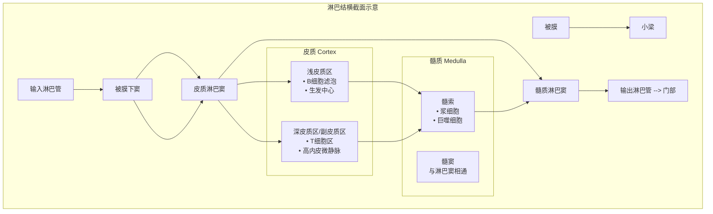

# 黏膜淋巴组织与淋巴结结构：功能解剖学整合

## 引言
适应性免疫应答的启动依赖于**抗原**的捕获、处理以及**淋巴细胞**的激活。这两个核心事件主要发生在两个关键的解剖学位置：**黏膜相关淋巴组织** 和 **次级淋巴器官**（尤其是**淋巴结**）。本笔记旨在深度整合这些结构，阐释它们如何作为统一的功能单元，共同构筑机体免疫监视与应答的“诱导-效应”回路。

---

## 第一部分：黏膜免疫诱导部位——MALT

**黏膜相关淋巴组织** 是指位于消化、呼吸、泌尿生殖道等黏膜内，无明确被膜的淋巴组织集合体，是黏膜免疫应答的 **诱导位点**。

### 1.1 共同特征
*   **上皮屏障特化**：覆盖的上皮常特化为**滤泡相关上皮**，其中含有专门的**微褶细胞**，可高效摄取肠腔/管腔抗原。
*   **生发中心**：富含**B细胞滤泡**，是产生分泌型IgA的**浆细胞**前体发育的重要场所。
*   **效应细胞募集**：激活的淋巴细胞通过特定的归巢受体（如α4β7整合素、CCR9）返回黏膜部位发挥效应。

### 1.2 肠相关淋巴组织
GALT是最大、研究最深入的MALT，是诱导针对肠道病原体免疫应答的核心。

```mermaid
graph TD
    subgraph A [肠相关淋巴组织 (GALT) 结构]
        B[诱导部位<br>Inductive Site]
        C[效应部位<br>Effector Site]
    end

    B --> D[<b>Peyer‘s Patches</b><br>（派尔集合淋巴结）<br>• 滤泡相关上皮含<b>M细胞</b><br>• T/B细胞滤泡（生发中心）]
    B --> E[<b>Isolated Lymphoid Follicles</b><br>（孤立淋巴滤泡）<br>• 小肠 & 大肠分布]
    B --> F[<b>Appendix</b><br>（阑尾）]

    subgraph G [连接]
        H[淋巴管]
        I[血液]
    end

    D & E & F --> H
    H --> J[<b>Mesenteric Lymph Nodes</b><br>（肠系膜淋巴结）<br>• 最大的肠道淋巴结<br>• 包含T细胞区 & B细胞滤泡]

    J --> I
    I --> C
    C --> K[肠固有层<br>• 分泌IgA的浆细胞<br>• 效应T细胞]
```

*   **集合淋巴小结**：回肠壁内的次级淋巴组织，是口服耐受和针对肠道病原体免疫应答的**主要诱导部位**。其表面覆盖的**滤泡相关上皮**是其关键标志。
*   **孤立淋巴滤泡**：散在于整个肠道的**小淋巴滤泡**，结构与功能与Peyer‘s patches类似，共同构成分布式的免疫监视网络。
*   **阑尾**：富含淋巴组织的盲管样结构，其功能被认为类似于一个大型的、局部的Peyer’s patch。
*   **肠系膜淋巴结**：作为肠道引流淋巴结，是GALT诱导产生的**激活淋巴细胞**离开肠道后的第一个主要**整流站**。在此，抗原信息被进一步处理，免疫应答被放大和精细化。

### 1.3 鼻相关淋巴组织
NALT（或Waldeyer‘s环）是上呼吸道黏膜免疫的诱导中心。
*   **组成**：咽扁桃体、腭扁桃体、舌扁桃体及鼻咽部的弥散淋巴组织，共同构成**咽淋巴环**。
*   **解剖特点**：位于鼻咽和口腔后部**复层扁平上皮**下，直接接触吸入的空气抗原。
*   **功能**：类似于GALT，但针对的是经**呼吸道**进入的病原体，是诱导呼吸道黏膜免疫（尤其是鼻腔IgA应答）的关键部位。

---

## 第二部分：免疫应答的“整流与放大器”——淋巴结

**淋巴结**是位于淋巴管汇集通路上、被膜包裹的豆形次级淋巴器官。它是**适应性免疫应答**，特别是针对全身性感染和组织损伤应答的**主要启动部位**，也是黏膜来源抗原和细胞**汇聚、放大和记忆形成**的关键场所。

### 2.1 结构框架：被膜-小梁支架系统
淋巴结的结构支架由致密结缔组织构成，形成了高度有序的微环境，以优化细胞间相互作用。
*   **被膜**：包裹淋巴结外表面的结缔组织。
*   **淋巴结小梁**：从被膜和门部伸入实质的结缔组织索，彼此相连，构成淋巴结的**粗支架**。**血管**穿行于小梁内，为淋巴结实质供血。
*   **意义**：小梁系统将淋巴结实质划分为多个小室，限定了细胞迁移的路径，并为**淋巴窦**和**血管网络**提供了结构基础。

### 2.2 实质分区：功能特化的微环境
淋巴结实质可分为三个功能区，由**网状组织**（由**网状细胞**和**网状纤维**构成）提供精细的立体支撑。



*   **皮质**
    *   **浅皮质区**：主要由**B细胞滤泡**构成。受抗原刺激后，滤泡内出现**生发中心**，是B细胞经历**亲和力成熟**和**类别转换**、最终分化为**浆细胞**或**记忆B细胞**的场所。
    *   **深皮质区/副皮质区**：主要为**T细胞区**，富含**高内皮微静脉**。这是**初始T细胞**从血液进入淋巴结的**主要门户**，也是**树突状细胞**与T细胞相遇、启动**T细胞应答**的核心区域。
*   **髓质**
    *   **髓索**：由**淋巴组织**组成的索状结构，内含大量**浆细胞**、**巨噬细胞**和**B细胞**。浆细胞在此产生抗体，进入髓窦。
    *   **髓窦**：与皮质淋巴窦相通，是淋巴液汇集并最终经**输出淋巴管**离开的通道。

### 2.3 淋巴循环：抗原与细胞的“高速公路”
淋巴液在淋巴结内的流动路径，是抗原递呈和细胞互动的**物理保障**。
1.  **输入**：携带抗原和**抗原递呈细胞**的淋巴液经数条**输入淋巴管**进入。
2.  **初遇**：淋巴液首先进入**被膜下窦**，一个宽敞的扁囊状空间，包绕整个淋巴结皮质外层。抗原和**树突状细胞**在此被拦截。
3.  **渗滤**：淋巴液渗入**皮质淋巴窦**，流经**B细胞滤泡**和**T细胞区**。抗原被固定在**滤泡树突状细胞**表面，供B细胞识别；**树突状细胞**则将抗原递呈给T细胞。
4.  **汇集**：处理后的淋巴液汇集至**髓窦**。
5.  **输出**：最终经**输出淋巴管**（通常在淋巴结门部）离开淋巴结，回流至更大的淋巴导管。

### 2.4 淋巴：流动的免疫介质
**淋巴液**是淋巴循环的载体，其本身也是免疫信息的传递者。
*   **来源与成分**：是组织液渗入淋巴毛细管形成的。来自肠道的淋巴（**乳糜**）因富含乳糜微粒而呈乳白色；其他部位淋巴通常无色透明。
*   **流量与意义**：安静时，每天约有2-4升淋巴回流，相当于全身**血浆**总量，持续不断地将外周组织的抗原、细胞碎片和免疫细胞运输至**淋巴结**等中枢。
*   **病理**：淋巴回流受阻可导致**淋巴水肿**（非凹陷性水肿）。

---

## 第三部分：整合视角——从黏膜诱导到全身效应

黏膜淋巴组织与淋巴结并非孤立存在，而是通过**淋巴-血液循环**紧密相连，形成一个**功能连续体**。

1.  **诱导启动**：在黏膜（如GALT），**M细胞**摄取抗原，递送给**树突状细胞**。后者携带抗原迁移至局部诱导部位（如Peyer‘s patches），激活初始**T细胞**和**B细胞**。
2.  **迁移整流**：激活的**淋巴母细胞**离开黏膜，进入**传入淋巴管**，被运输至区域引流**淋巴结**（如肠系膜淋巴结）。
3.  **放大与记忆**：在淋巴结内，这些已接触过抗原的细胞与**滤泡辅助T细胞**等进一步互作，在**生发中心**内增殖、分化，产生高亲和力的**浆细胞**和**记忆细胞**，从而**放大**免疫应答并建立**免疫记忆**。
4.  **效应归巢**：新产生的**效应细胞**和**记忆细胞**离开淋巴结，经**胸导管**进入血液循环，并凭借特定的**归巢受体**，精准地迁移回黏膜部位或其他感染部位，执行免疫效应功能（如分泌IgA、细胞毒性作用）。

**核心要点**：**黏膜淋巴组织**是“前线观察哨”和“初等兵训练营”，负责抗原的早期捕获和免疫应答的**诱导**。**淋巴结**则是“后方指挥部与兵工厂”，负责免疫信息的**整合**、应答的**放大**、免疫记忆的**形成**以及效应细胞的**大规模生产与派遣**。两者的协同工作，确保了免疫应答既具有**局部特异性**（如黏膜屏障防御），又具备**全身系统性**（如记忆和再应答）。