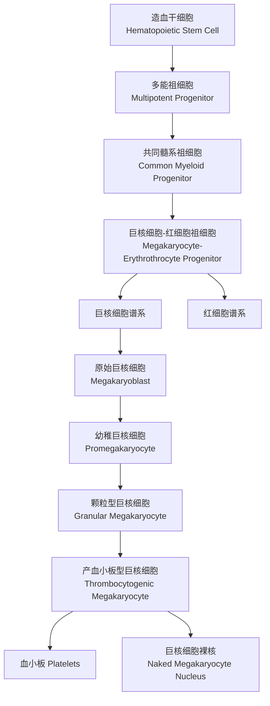
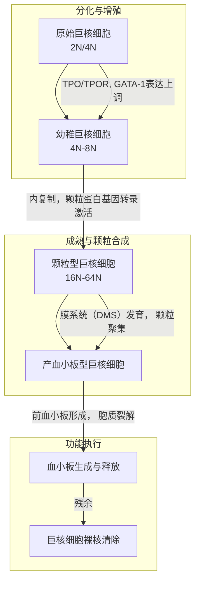

# 巨核细胞的发育与血小板生成机制：一个整合视角

## 1. 概述
巨核细胞（Megakaryocyte, MK）是骨髓中体积最大、最独特的造血细胞，其核心功能是通过一个高度有序的细胞质裂解过程，产生维持止血功能所必需的**血小板（platelet）**。理解巨核细胞从[[造血干细胞]]终末分化、经历多倍体化、直至释放血小板的全过程，是理解正常止血与众多血液疾病病理生理的关键。

## 2. 发育起源与谱系承诺
巨核细胞起源于**造血干细胞**。在关键转录因子（如[[GATA-1]], [[FOG-1]], [[RUNX1]], [[NF-E2]]）和细胞因子（主要为**血小板生成素，Thrombopoietin, TPO**）的共同调控下，造血干细胞分化产生**巨核细胞-红细胞祖细胞**，随后谱系特化，进入巨核细胞发育路径。

## 3. 巨核细胞发育的形态学阶段
巨核细胞的成熟伴随着独特的细胞核多倍体化与细胞质区室化。下图整合了发育各阶段的核心事件与关键分子标志物。

### 3.1 原始巨核细胞
- **定义**：巨核细胞发育的最早可识别形态阶段。
- **形态**：细胞较小（直径15-30μm），核质比高。细胞核圆形或稍不规则，染色质细致，可见1-3个核仁。胞质量少，深蓝色，无颗粒。

### 3.2 幼稚巨核细胞
- **形态**：如已有[[幼稚巨核细胞]]笔记所述，胞体明显增大（直径30～50μm），开始出现分叶核，核仁消失，胞质量增多并出现淡染区。此阶段细胞已开始**内复制**，DNA含量增加至4N-8N。

### 3.3 颗粒型巨核细胞
- **形态与功能**：如[[颗粒型巨核细胞]]笔记所述，此为最关键的成熟阶段。特征为：
    1.  **多倍体化完成**：核分叶增多且不规则，DNA含量可达16N-64N，为血小板生产储备巨大的生物合成能力。
    2.  **胞质区室化**：胞质极度丰富，充满由**分界膜系统**、**α-颗粒**、**致密颗粒**和**溶酶体**构成的复杂内膜系统。这些细胞器将被精确分配至未来的血小板中。

### 3.4 产血小板型巨核细胞
- **定义与过程**：如[[产血小板型巨核细胞]]笔记所述。成熟巨核细胞伸出**前血小板突起**，这些突起进一步分支，其内部包含预先组装好的细胞器和颗粒。最终，突起在**骨髓窦周隙**中发生程序性碎裂，释放出上千个**血小板**。此过程完成后，残留的细胞核即[[巨核细胞裸核]]，将被骨髓中的**巨噬细胞**吞噬清除。

## 4. 核心机制解析

### 4.1 多倍体化机制
巨核细胞的多倍体化是通过一种独特的细胞周期——**内复制周期**实现的。细胞经历“G1-S-G2-M”周期，但在M期，**有丝分裂被中止于后期/末期之间**，细胞核不分裂，但DNA继续复制。结果产生一个具有单一巨大细胞核、但DNA含量为正常细胞（2N）数倍（如4N， 8N， 16N…）的多倍体细胞。这一过程由关键的**细胞周期调节因子**精确控制，如周期蛋白依赖性激酶**CDK1**的抑制、**RhoA/ROCK**信号通路的激活等，旨在暂停分裂，转向合成大量细胞质和颗粒内容物。

### 4.2 血小板生成机制
血小板生成是一个高度动态的细胞骨架重塑过程。
1.  **膜系统重组**：**分界膜系统** 是由高尔基体衍生而来、遍布胞质的内膜管网。它与质膜融合，极大增加了细胞的表面积，并为血小板膜的形成提供来源。
2.  **细胞骨架重排**：在**Rho/ROCK**和**肌动蛋白**动力学调控下，细胞质中形成**前血小板区**。微管和肌动蛋白丝的组装驱动形成前血小板。
3.  **前血小板形成与释放**：前血小板是从巨核细胞边缘伸出的长突起，它可进一步分支。最终，前血小板在血流剪切力及内在程序的共同作用下，从巨核细胞上断裂下来，形成约2000-3000个循环血小板。

## 5. 调控网络
- **核心细胞因子**：**TPO** 及其受体 **c-Mpl** 的信号是贯穿巨核细胞发育全程的最核心调节因子，主要通过 **JAK2-STAT** 通路发挥作用。
- **转录因子级联**：
    - **GATA-1/FOG-1复合物**：驱动谱系特化与早期分化。
    - **RUNX1**：调控颗粒基因表达和多倍体化。
    - **NF-E2**：对血小板生成的最后一步（颗粒包装和细胞骨架重组）至关重要。
- **基质相互作用**：巨核细胞在骨髓窦龛中的定位，以及与**整合素**、**趋化因子**的相互作用，对其迁移、成熟和最终的血小板释放至关重要。

## 6. 研究前沿与临床意义
- **体外血小板生成**：利用诱导多能干细胞或造血干细胞在体外生成功能性血小板，是当前转化研究热点，旨在解决血小板短缺问题，但其效率、成熟度和规模化生产仍是挑战。
- **疾病关联**：
    - **血小板减少症**：可源于TPO信号缺陷、转录因子突变或骨髓微环境损伤。
    - **骨髓纤维化**：异常巨核细胞释放过量促纤维化因子（如TGF-β, PDGF）是核心病理环节。
    - **原发性血小板增多症**：常伴随JAK2等基因突变，导致巨核细胞过度增殖和血小板产生过多。

---
**总结**：巨核细胞的发育是一个精密编程的过程，从谱系承诺开始，经历独特的多倍体化以扩大生物合成容量，最终通过复杂的胞质裂解机制产生血小板。这一过程由TPO核心通路、特定转录因子网络及骨髓微环境共同调控。对其机制的深入理解，不仅揭示了基础细胞生物学原理，也为相关血液疾病的诊断与治疗提供了理论基础。

[[造血干细胞]]， [[产血小板型巨核细胞]]， [[巨核细胞裸核]]， [[幼稚巨核细胞]]， [[颗粒型巨核细胞]]