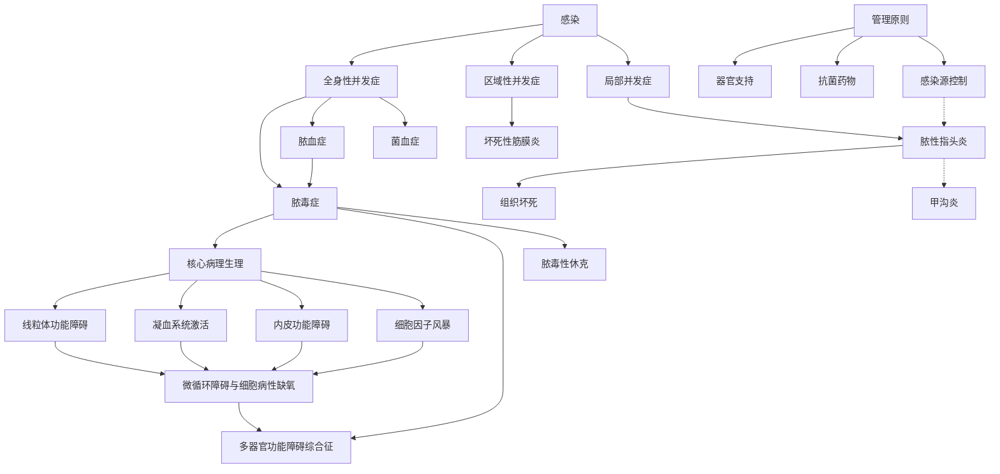

好的，教授。以下是根据您提供的已有笔记和要求，整合并深化编写的博士层级概念笔记。

---
# 感染的并发症与脓毒症 (Complications of Infection and Sepsis)

## 1. 引言：从局部感染到全身性失控 (From Local Infection to Systemic Dysregulation)

感染（Infection）是病原微生物在宿主体内定殖、增殖并引起宿主反应的病理过程。其自然史通常始于一个**局部感染灶 (Focus of Infection)**。然而，感染的进程并非总是局限和自限的。在病原微生物毒力过强、宿主免疫功能低下或局部处理不当时，感染可突破最初的解剖学屏障，引发一系列逐级加剧的**并发症 (Complications)**。这些并发症构成了一个从局部扩散到全身性系统性疾病的风险谱系，其最极端、最致命的表现即为**脓毒症 (Sepsis)** 及其后续阶段。

理解感染并发症的病理生理，关键在于把握两个核心过程的相互作用：**病原体相关的分子模式 (Pathogen-Associated Molecular Patterns, PAMPs)** 与宿主**模式识别受体 (Pattern Recognition Receptors, PRRs)** 的持续相互作用，以及由此触发的、有时会失控的全身性炎症反应。

## 2. 感染并发症的层级谱系 (A Hierarchical Spectrum of Complications)

感染并发症可根据其病理生理机制和波及范围，分为以下层级，逐级加重：

### 2.1 局部并发症 (Local Complications)
指感染局限于原发灶周围组织，但已造成显著的组织破坏和功能障碍。
- **炎症加剧与组织坏死 (Exaggerated Inflammation & Tissue Necrosis)**：强烈的炎症反应导致大量中性粒细胞浸润，释放蛋白酶和活性氧，虽旨在杀灭病原体，却也造成严重的附带组织损伤（Collateral Damage），形成脓肿（Abscess）。例如，**[[脓性指头炎|脓性指头炎（Felon）]]** 即是末节指骨掌侧密闭腔隙内的感染，因局部压力急剧升高、血供障碍而导致剧烈疼痛和组织坏死。
- **窦道与瘘管形成 (Sinus and Fistula Formation)**：慢性感染下，脓液穿破皮肤或脏器表面，形成通向体表的异常通道（窦道，Sinus）或连接两个空腔脏器的异常通道（瘘管，Fistula）。

### 2.2 区域性并发症 (Regional Complications)
感染通过直接蔓延或淋巴/血管途径扩散至邻近的组织层次或器官。
- **直接蔓延 (Direct Spread)**：如蜂窝织炎（Cellulitis）扩散至筋膜下，引发坏死性筋膜炎（Necrotizing Fasciitis）；或颅内感染灶扩散引起脑膜炎（Meningitis）。
- **淋巴管炎与淋巴结炎 (Lymphangitis & Lymphadenitis)**：病原体沿淋巴管扩散，表现为皮肤红线和区域淋巴结肿痛。

### 2.3 全身性并发症 (Systemic Complications)
感染因子或其产物（如内毒素、外毒素）进入血液循环，引发全身性反应。这是感染最危险的阶段。
- **菌血症 (Bacteremia)**：细菌间歇性或一过性进入血液循环，**不一定**引起全身性炎症反应综合征（SIRS）。常见于拔牙、导管置入等操作后。
- ****脓血症 (Pyemia)**：特指化脓性细菌（如金黄色**[[葡萄球菌属|葡萄球菌]]**、化脓性链球菌）侵入血流，并在血液中持续繁殖，**同时**细菌或感染性栓子随血流播散至全身，在远隔器官（如肝、肺、肾、脑、骨）形成多发性转移性脓肿。这是[[脓毒症]]的一种特定且严重的形式，症状极为剧烈。
- **败血症/脓毒症 (Septicemia/Sepsis)**：这是当代临床和研究的核心概念。详见下文第3节。

## 3. 脓毒症：失控的宿主反应 (Sepsis: The Dysregulated Host Response)

### 3.1 定义与演化 (Definition and Evolution)
传统上，“败血症” (Septicemia) 强调血中存在细菌及其毒素。然而，现代医学认识到，驱动脓毒症危象的核心并非单纯的感染本身，而是**宿主对感染产生的、失调且危及生命的全身性炎症反应**。因此，最新的国际共识（如Sepsis-3）将**脓毒症**定义为：
> **因感染引起的宿主反应失调所导致的、危及生命的器官功能障碍 (Life-threatening organ dysfunction caused by a dysregulated host response to infection)。**

这一定义强调了两个关键点：
1.  **感染是触发因素**。
2.  **器官功能障碍是核心表现和诊断依据**，常用**序贯性器官衰竭评估 (Sequential [Sepsis-Related] Organ Failure Assessment, SOFA)** 评分来量化。

### 3.2 病理生理：从级联反应到器官衰竭 (Pathophysiology: From Cascade to Organ Failure)
脓毒症的病理生理极其复杂，涉及多个系统的相互作用，可概括为以下恶性循环：

```
          [感染灶释放 PAMPs/DAMPs]
                   |
                   v
        [免疫细胞激活 (TLRs, NLRs)]
                   |
         ┌─────────┴─────────┐
         v                   v
[促炎细胞因子风暴]    [抗炎反应代偿]
(TNF-α, IL-1β, IL-6)   (IL-10, sTNFR)
         |                   |
         └─────────┬─────────┘
                   |
                   v
         [内皮功能障碍] ──────────┐
         (↑通透性, ↑粘附分子)     |
                   |               |
         ┌─────────┴─────┐        |
         v               v        v
[微循环障碍]      [线粒体功能障碍]  [凝血系统激活]
(血流分布异常)    (细胞病性缺氧)    (DIC前状态)
         |               |        |
         └───────────┬───┘────────┘
                     |
                     v
           [多器官功能障碍综合征]
              (MODS: 肺、肾、肝、
              脑、心血管、血液)
```

**【双向链接说明】**
- `PAMPs`: 如脂多糖(LPS)，细菌DNA等。
- `DAMPs`: 宿主损伤细胞释放的内源性危险信号。
- `DIC`: **弥散性血管内凝血 (Disseminated Intravascular Coagulation)**，是脓毒症严重并发症，表现为广泛微血栓形成与消耗性凝血病并存。

**3.2.1 炎症反应失调 (Dysregulated Inflammatory Response)**
- **细胞因子风暴 (Cytokine Storm)**：巨噬细胞、中性粒细胞等过度释放促炎介质（如TNF-α, IL-1β, IL-6），导致全身性炎症、发热、血管舒张。
- **免疫麻痹 (Immunoparalysis)**：代偿性抗炎反应综合征 (CARS) 可能压倒促炎反应，导致淋巴细胞凋亡、单核细胞HLA-DR表达下调，使患者陷入无法清除原发感染且易继发二次感染的免疫抑制状态。

**3.2.2 血管内皮功能障碍与微循环衰竭 (Endothelial Dysfunction and Microcirculatory Failure)**
- 炎症介质和活化白细胞直接损伤血管内皮，使其通透性增加，导致全身性水肿和有效循环血容量减少。
- 内皮表面抗凝、抗粘附特性丧失，促进血小板和白细胞粘附、聚集，形成微血栓，造成**微循环障碍 (Microcirculatory Dysfunction)**，组织氧输送障碍。

**3.2.3 凝血系统激活与DIC (Coagulation Activation and DIC)**
- 组织因子 (Tissue Factor, TF) 大量表达，激活外源性凝血途径。
- 生理性抗凝系统（抗凝血酶、蛋白C系统）功能受抑。
- 纤溶系统受到抑制。最终可能导致**弥散性血管内凝血 (Disseminated Intravascular Coagulation, DIC)**，微血管内广泛血栓形成消耗凝血因子，同时引发严重出血。

**3.2.4 线粒体功能障碍与细胞病性缺氧 (Mitochondrial Dysfunction and Cytopathic Hypoxia)**
- 这是器官功能障碍的**核心细胞机制**。即使在全身氧输送恢复后，脓毒症细胞仍无法有效利用氧气进行氧化磷酸化产生ATP。这被称为**细胞病性缺氧 (Cytopathic Hypoxia)**，是导致多器官功能衰竭的直接原因。

### 3.3 临床进程：脓毒性休克 (Clinical Progression: Septic Shock)
脓毒症若不能及时纠正，可进展为**脓毒性休克 (Septic Shock)**，其定义为：在充分的液体复苏后，仍需要**血管升压药 (Vasopressors)** 来维持平均动脉压 (MAP) ≥ 65 mmHg，且血清**乳酸 (Lactate)** 水平 > 2 mmol/L。此阶段存在严重的循环、细胞和代谢异常，病死率极高。

## 4. 诊断与管理原则 (Diagnostic and Management Principles)
- **诊断**：基于对感染（临床或微生物学证据）的怀疑，以及对**器官功能障碍**的识别（如SOFA评分急性升高≥2分）。快速筛查工具如**qSOFA**（快速序贯性器官衰竭评估）可用于床旁早期警示。
- **管理核心**：“脓毒症集束化治疗 (Sepsis Bundle)” 强调**时间敏感性**：
    1.  **控制感染源 (Source Control)**：尽早通过外科手术或介入手段清除感染灶、引流脓液。回顾**[[脓性指头炎]]** 的治疗，其“侧面纵切口、通畅引流”正是局部感染源控制的典范。
    2.  **早期、有效的抗菌药物治疗 (Early and Appropriate Antibiotics)**：在识别后1小时内静脉给予广谱抗生素，覆盖可能病原体，并根据培养结果降阶梯治疗。
    3.  **血流动力学支持 (Hemodynamic Support)**：积极的液体复苏，必要时使用血管升压药（如去甲肾上腺素）。
    4.  **器官功能支持 (Organ Support)**：如机械通气（针对ARDS）、肾脏替代治疗（针对AKI）等。
    5.  **辅助治疗**：如小剂量糖皮质激素（用于难治性休克）等。

## 5. 总结 (Conclusion)
感染并发症是一个从局部到全身的连续谱。**脓血症**代表了病原体在血液中播散并形成转移灶的经典模型。而现代**脓毒症**的概念，则超越了单纯的病原体视角，聚焦于宿主对感染的**失调性、破坏性免疫反应**，并以**器官功能障碍**为临床终点。其病理生理核心是**炎症、凝血、内皮和免疫系统**的全面紊乱，最终导致**微循环障碍**和**细胞病性缺氧**。深入理解这一系列相互关联的病理过程，是开发新的诊断标志物和靶向治疗策略的基础，也是改善脓毒症患者预后的关键。

---
**笔记关联图谱 (Knowledge Graph Preview):**

*此图谱展示了概念间的逻辑与层级关系。[[双向链接]]在此文本中以 `[[]]` 形式标注，如 `[[脓性指头炎]]`、`[[葡萄球菌属]]`，在支持双向链接的笔记软件（如 Obsidian, Roam Research）中可实现快速跳转和知识网络的构建。*