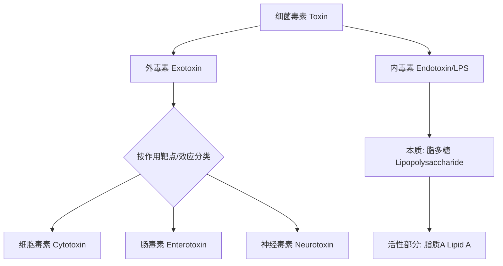

# 细菌毒素的分类、作用机制与致病过程
*Bacterial Toxins: Classification, Mechanisms, and Pathogenic Processes*

## 1. 概述 (Overview)
细菌毒素（[[toxin]]）是细菌合成并释放的关键毒力因子（[[virulence]]），是导致宿主细胞损伤、组织病变和全身性疾病的主要分子。其致病性不仅取决于毒素本身的生化特性，更与其作用于特定靶细胞（target cell）和靶器官（target organ）的精确机制密切相关。在传染病学中，毒素是构成病原菌（[[pathogen]]）**毒力**的核心组成部分。

## 2. 细菌毒素的分类 (Classification of Bacterial Toxins)
根据其**化学本质**、**合成与释放位置**及**理化性质**，细菌毒素主要分为两大类：**外毒素（exotoxin）** 和 **内毒素（endotoxin）**。此分类是理解其致病机制的基础。



### 2.1 外毒素 (Exotoxin)
**外毒素**是细菌在生命活动过程中（主要是对数生长期）主动分泌到菌体外的毒性蛋白质。
*   **来源**：主要由**革兰阳性菌**（如破伤风梭菌、肉毒梭菌、白喉棒状杆菌、金黄色葡萄球菌）产生，部分**革兰阴性菌**（如霍乱弧菌、肠产毒性大肠埃希菌、铜绿假单胞菌）也能产生。
*   **化学本质**：**蛋白质**，因此具有蛋白质的特性。
*   **主要特点**：
    1.  **A-B亚单位结构（A-B Subunit Structure）**：多数外毒素由活性A亚单位（Active subunit，负责毒性）和结合B亚单位（Binding subunit，负责与宿主细胞受体结合）构成。这种“钥匙-锁”模型确保了毒素作用的特异性。
    ```ascii
    结合 (B) 亚单位 + 宿主细胞特异性受体 → 内吞/膜穿透
                           ↓
                活性 (A) 亚单位进入细胞
                           ↓
                发挥酶活性/干扰细胞功能
    ```
    2.  **毒性极强**：极微量即可致死，例如1mg肉毒毒素可杀死2亿只小鼠。
    3.  **免疫原性强**：可刺激机体产生高效价的**抗毒素抗体（antitoxin）**。
    4.  **不耐热（Labile to Heat）**：通常在60-80℃下经30分钟即被破坏（但葡萄球菌肠毒素等例外）。
    5.  **可经甲醛处理脱毒**，制成**类毒素（toxoid）**，用于人工主动免疫。

*   **功能分类**：
    *   **神经毒素（Neurotoxin）**：作用于神经系统。如**肉毒毒素（Botulinum toxin）** 抑制神经肌肉接头乙酰胆碱释放，导致弛缓性麻痹；**破伤风痉挛毒素（Tetanospasmin）** 阻断抑制性神经元信号，导致强直性痉挛。
    *   **细胞毒素（Cytotoxin）**：杀伤或损伤宿主细胞。如**白喉毒素（Diphtheria toxin）** 通过ADP-核糖基化修饰延伸因子-2（EF-2），抑制蛋白质合成，导致细胞死亡。
    *   **肠毒素（Enterotoxin）**：作用于肠上皮细胞，引起呕吐、腹泻等症状。如**霍乱毒素（Cholera toxin）** 通过持续激活腺苷酸环化酶，使细胞内cAMP升高，导致大量水电解质分泌，引起剧烈水样腹泻；**金黄色葡萄球菌肠毒素**是超抗原，可引起食物中毒和中毒性休克综合征。

### 2.2 内毒素 (Endotoxin)
**内毒素**特指革兰阴性菌细胞壁外膜（[[outer membrane]]）中的**脂多糖（Lipopolysaccharide, LPS）**成分，细菌死亡裂解后释放。
*   **来源**：**革兰阴性菌**。
*   **化学本质**：**脂多糖（LPS）**，是外膜的主要结构成分。
*   **结构与活性**：
    ```ascii
    |-------------------------------------------------------|
    |             脂多糖 (LPS) 结构示意图                    |
    |-------------------------------------------------------|
    |   O-特异性侧链 (O-specific polysaccharide)            |  <-- 抗原性（决定血清型）
    |   |   |   |                                           |
    |   核心多糖 (Core polysaccharide)                      |  <-- 较保守
    |   |                                                   |
    |   脂质A (Lipid A)                                     |  <-- **毒性及生物学活性中心**
    |=================== 磷脂双分子层 ======================|
    |                      外膜 (Outer Membrane)            |
    |-------------------------------------------------------|
    ```
    **脂质A（Lipid A）**是LPS的生物活性成分，无种属特异性，是内毒素致病的物质基础。
*   **主要特点**（与外毒素对比）：
    1.  **释放时机**：主要于细菌**死亡裂解**后释放，活菌亦可少量分泌。
    2.  **化学本质**：**脂多糖**，是细胞壁结构成分。
    3.  **稳定性**：**耐热**，需160℃ 2-4小时或强酸、强碱、强氧化剂才能灭活。
    4.  **免疫原性弱**：不能制成类毒素，刺激机体产生的抗体保护作用不强。
    5.  **作用无特异性**：各种革兰阴性菌内毒素的毒性作用基本相同。
    6.  **微量即有生物活性**：极微量（ng/kg级）即可引起广泛的生物学效应。

## 3. 毒素的致病过程与机制 (Pathogenic Processes and Mechanisms)
毒素的致病过程可分为局部作用与全身效应，其核心在于毒素与宿主靶分子的相互作用。

### 3.1 局部作用与进入途径
*   **外毒素**：通常由**在局部定植或繁殖的活菌**产生并释放，直接作用于邻近组织细胞。例如，产气荚膜梭菌产生的卵磷脂酶（α毒素）在创伤局部分解细胞膜，引起气性坏疽。
*   **内毒素**：作为菌体成分，在感染灶细菌被**免疫细胞吞噬、杀灭裂解**后大量释放。若局部释放的内毒素量少，可被单核-巨噬细胞系统清除；若量大或入血，则引发全身反应。

### 3.2 全身性致病效应
毒素进入血液循环引发全身性疾病，是临床危重症的重要原因。

#### 3.2.1 毒血症 (Toxemia)
**毒血症**专指**外毒素**进入血液循环引起的全身中毒症状。
*   **定义**：致病菌在**侵入的局部组织中生长繁殖**，产生的**外毒素**进入血液循环，并运输至**靶细胞和靶器官**，引起特殊毒性症状，而病原菌本身**不侵入血流**。
*   **典型疾病**：
    *   **破伤风**：破伤风梭菌在深部伤口厌氧环境繁殖，产生的痉挛毒素经神经-肌肉接头或血液作用于脊髓前角运动神经元，引起全身骨骼肌强直性痉挛。
    *   **白喉**：白喉棒状杆菌在咽部形成假膜，产生的白喉毒素入血，引起心肌炎、外周神经麻痹等全身中毒症状。

#### 3.2.2 内毒素血症 (Endotoxemia)
**内毒素血症**指**内毒素（LPS）** 进入血液循环所引起的病理生理过程。
*   **定义**：**革兰阴性菌**侵入血液并生长繁殖、死亡裂解释放内毒素；或局部感染灶细菌死亡裂解，释放的内毒素进入血液循环。
*   **核心机制**：LPS中的**脂质A**与血液中的**脂多糖结合蛋白（LBP）** 结合，形成LPS-LBP复合物，再与单核-巨噬细胞表面的**CD14受体**结合，并通过**TLR4（Toll样受体4）** 信号通路，激活这些免疫细胞。
    ```ascii
    LPS (Lipid A) + LBP → (LPS-LBP复合物) → 结合 CD14 → 激活 TLR4 信号通路
                                                        ↓
        免疫细胞（巨噬细胞等）活化，释放大量促炎细胞因子
    （如 TNF-α, IL-1, IL-6）和炎症介质
                                                        ↓
        局部炎症反应 或 全身性炎症反应综合征（SIRS）
                                                        ↓
        严重时导致 感染性休克（Septic Shock）、DIC、多器官功能障碍综合征（MODS）
    ```
*   **临床重要性**：内毒素血症是革兰阴性菌败血症（sepsis）和感染性休克（[[休克/感染性]]）的核心病理环节。临床在输液或医疗操作中若污染LPS，亦可导致热原反应和内毒素血症。

### 3.3 毒素作用机制的分子基础
从分子水平看，毒素通过以下一种或多种机制干扰宿主细胞功能：
1.  **抑制蛋白质合成**：如白喉毒素、志贺毒素。
2.  **激活第二信使系统**：如霍乱毒素、百日咳毒素通过ADP-核糖基化G蛋白，持续激活或抑制腺苷酸环化酶，导致cAMP水平异常。
3.  **破坏细胞膜结构**：如产气荚膜梭菌α毒素（磷脂酶C）水解膜磷脂；金黄色葡萄球菌α毒素（穿孔蛋白）在膜上形成孔道。
4.  **阻断神经冲动传导**：如肉毒毒素抑制乙酰胆碱释放；破伤风毒素阻断抑制性神经递质释放。
5.  **诱导细胞凋亡**：某些毒素作为蛋白酶或可通过激活凋亡途径导致细胞程序性死亡。

## 4. 毒力与毒素的量化 (Virulence and Quantification of Toxins)
细菌的**致病性（Pathogenicity）** 是指其引起疾病的能力，而**毒力（Virulence）** 表示致病性的强弱程度。毒素是构成毒力的重要毒力因子。

**半数致死量（Median Lethal Dose, LD50）**是衡量毒力（包括毒素毒力）的常用**量化指标**。
*   **定义**：在规定时间内，通过指定途径，能使特定体重的一组实验动物半数死亡所需的**最少病原体数量**或**毒素剂量**。
*   **意义**：LD50值越小，表明病原体或毒素的毒力越强。它可用于比较不同菌株或毒素的毒力，以及评价疫苗或抗毒素的保护效果。

## 5. 总结与临床意义 (Summary and Clinical Significance)
理解细菌毒素的分类和机制对于传染病防治至关重要：
1.  **诊断**：特定毒素相关疾病的诊断（如食物中毒中检测肠毒素）。
2.  **治疗**：**抗毒素血清（antitoxin serum）** 是治疗外毒素所致疾病（如破伤风、白喉、肉毒中毒）的关键，能中和游离毒素。针对内毒素血症，研究聚焦于抗LPS抗体、TLR4拮抗剂等。
3.  **预防**：利用**类毒素（toxoid）** 制备的疫苗（如破伤风类毒素、白喉类毒素）是预防相关疾病的有效手段。
4.  **发病学**：解释了许多感染性疾病的特异性临床表现（如破伤风的痉挛、霍乱的腹泻）和全身性危重症（如感染性休克）的病理基础。

---
**[[毒素]]** **[[外毒素]]** **[[脂多糖|内毒素]]** **[[毒血症]]** **[[内毒素血症]]** **[[半数致死量]]** **[[毒力]]** **[[外膜]]** **[[病原菌]]**