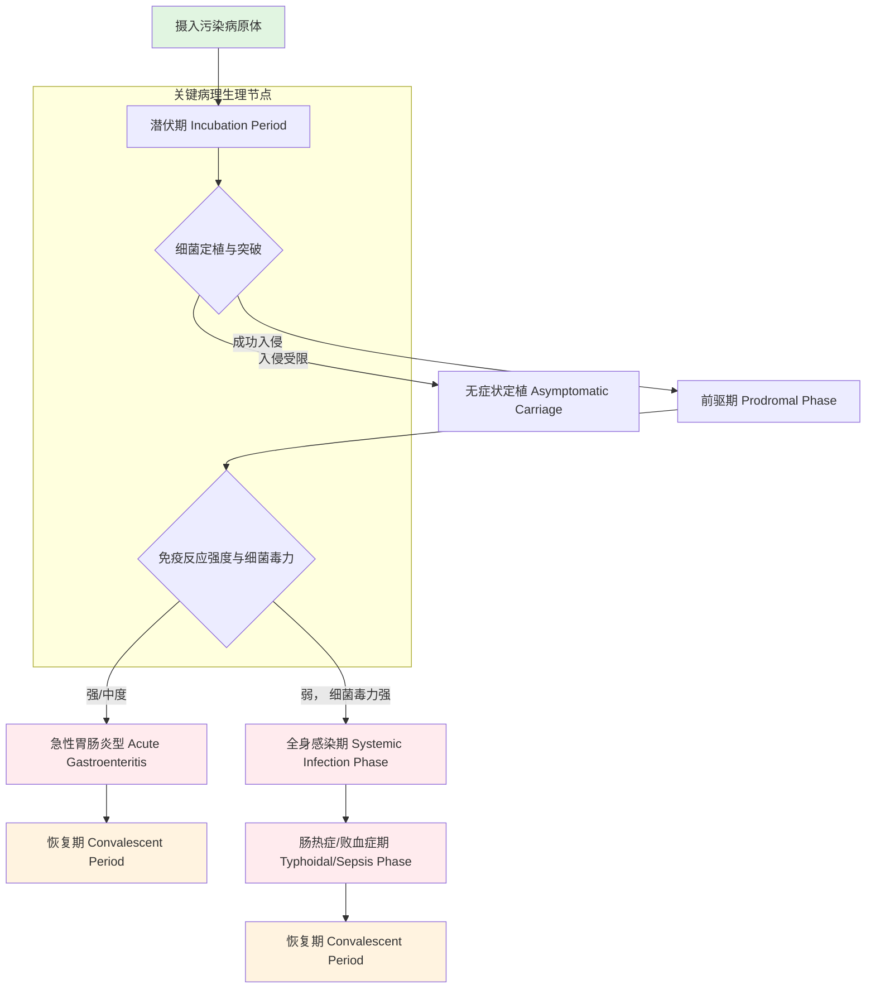

# **沙门氏菌感染的临床过程**
**Clinical Course of *Salmonella* Infection**

**主讲教授**：微生物学
**面向对象**：博士生
**核心术语**：沙门氏菌 (*Salmonella*)， 临床分期 (Clinical Stages)， 肠热症 (Enteric Fever)， 胃肠炎 (Gastroenteritis)， 菌血症 (Bacteremia)， 伤寒杆菌 (*Salmonella* Typhi)， 单核-巨噬细胞系统 (Mononuclear Phagocyte System)

---

## **1. 概述 (Overview)**

沙门氏菌感染是由沙门氏菌属 (*Salmonella*) 细菌引起的一组临床综合征，其临床表现谱系极广，从自限性胃肠炎到危及生命的全身性感染（肠热症）。理解其临床过程对于精准诊断、治疗及公共卫生干预至关重要。本笔记将系统解析沙门氏菌感染的典型临床分期、病理生理基础及宿主-病原体相互作用的动态演变。

## **2. 感染的临床分期 (Clinical Stages of Infection)**

沙门氏菌感染的完整临床过程是一个连续的序贯事件，通常可划分为以下几个关键阶段。下图概括了其核心演进路径：

### **2.1 潜伏期 (Incubation Period)**
*   **持续时间**：通常为6-72小时（胃肠炎型），或7-21天（伤寒型）。
*   **微生物学过程**：病原体随污染食物或水进入胃肠道。细菌需抵抗**胃酸屏障**，其存活能力是决定感染剂量的关键因素。随后，细菌抵达小肠和结肠，通过**Ⅲ型分泌系统 (Type III Secretion System, T3SS)** 向宿主上皮细胞注入效应蛋白，介导细菌侵入肠上皮细胞或M细胞。
*   **宿主反应**：此期通常无症状，但先天免疫系统已被局部激活。

### **2.2 前驱期 (Prodromal Phase) / 定植与入侵期**
*   **持续时间**：短暂，常与潜伏期重叠或紧随其后。
*   **临床表现**：非特异性症状，如低热、乏力、头痛、全身不适。
*   **微生物学过程**：细菌在肠道淋巴组织（**派尔集合淋巴结, Peyer‘s patches**）大量增殖，并开始向**肠系膜淋巴结**扩散。对于伤寒沙门氏菌 (*S.* Typhi) 等，可突破肠道局部防御，进入血液循环，形成初次**菌血症 (Primary Bacteremia)**。

### **2.3 急性期/极期 (Acute Phase/Critical Period)**
此期根据病原体血清型和宿主免疫状态，主要分为两种临床模式：

#### **2.3.1 急性胃肠炎型 (Acute Gastroenteritis - Non-typhoidal Salmonellosis)**
*   **常见病原**：鼠伤寒沙门氏菌 (*S.* Typhimurium)、肠炎沙门氏菌 (*S.* Enteritidis) 等。
*   **持续时间**：通常4-7天。
*   **临床表现**：
    *   **恶心、呕吐**：可能由细菌毒素或肠道神经反射引起。
    *   **腹泻**：**分泌性腹泻**为主，由于细菌侵袭导致炎症、电解质分泌增加。粪便常呈水样，可带粘液，偶尔带血（表明结肠受累）。
    *   **发热**：中至高热，反映全身性炎症反应。
    *   **腹部绞痛**：因肠道蠕动亢进和炎症。
*   **病理生理**：感染**主要局限于肠道及肠系膜淋巴结**。细菌侵袭肠上皮细胞，引发强烈的**中性粒细胞浸润**和促炎细胞因子（如TNF-α, IL-8）释放，导致组织损伤和液体渗出。

#### **2.3.2 肠热症型/全身感染型 (Enteric Fever/Systemic Infection)**
*   **常见病原**：伤寒沙门氏菌 (*S.* Typhi)、副伤寒沙门氏菌 (*S.* Paratyphi)。
*   **持续时间**：可达数周。
*   **临床表现**：具有特征性的阶梯式升温。
    *   **第一周**：体温呈**阶梯状上升**，伴头痛、厌食、全身不适。
    *   **第二周**：持续**稽留热**。相对缓脉 (Faget’s sign)。特征性**玫瑰疹 (Rose spots)**——皮肤上出现的淡红色斑丘疹，压之褪色，系细菌栓塞皮肤毛细血管所致。
    *   **第三周**：若未治疗，可能出现肠出血、肠穿孔等严重并发症。
*   **病理生理**：细菌经肠道进入**单核-巨噬细胞系统**（肝、脾、骨髓的巨噬细胞）内寄生、增殖，并随之播散至全身，造成持续性菌血症。细菌被巨噬细胞吞噬后，可抵抗胞内杀伤，甚至利用其作为“特洛伊木马”进行体内播散。主要病理改变发生在**回肠末端**的淋巴组织（孤立淋巴滤泡和集合淋巴结），发生增生、坏死，形成**“髓样肿胀”、“坏死”、“溃疡”、“脱痂”** 等四期典型病理改变。

### **2.4 恢复期 (Convalescent Period)**
*   **定义**：当机体的免疫功能增长至一定程度，体内病理生理过程基本终止，患者的症状及体征基本消失。
*   **特殊注意事项**：
    *   **可能还有残余病理改变**：如伤寒患者肠道溃疡虽已愈合，但肠壁仍可能较薄。
    *   **病原体尚未被完全清除**：部分患者，尤其是伤寒患者，在症状消失后仍可持续排菌，成为**恢复期携带者 (Convalescent Carrier)**，排菌期可超过3个月，甚至超过1年。
    *   **生理指标恢复**：食欲和体力均逐渐恢复。
    *   **免疫标志物**：血清中的特异性抗体（如抗O抗体、抗Vi抗体）效价亦逐渐上升至最高水平，可用于回顾性诊断。

## **3. 特殊临床过程与并发症 (Special Clinical Courses and Complications)**
*   **无症状携带状态 (Asymptomatic Carriage)**：细菌定植但不引发症状，却可成为传染源。伤寒的**慢性携带者 (Chronic Carriers)** 与胆囊细菌定植有关，是重要的公共卫生问题。
*   **局灶性感染 (Focal Infections)**：在菌血症基础上，细菌可定植于任何器官，导致**骨髓炎、关节炎、脑膜炎、心内膜炎、肺炎**等。这在镰状细胞病患者和血管植入物患者中风险更高。
*   **血管内感染 (Endovascular Infections)**：沙门氏菌易侵入已有动脉粥样硬化的血管内膜，导致感染性动脉瘤或移植物感染，死亡率极高。

## **4. 诊断与治疗的临床病理联系 (Clinicopathological Correlation in Diagnosis and Treatment)**
*   **病原学诊断**：
    *   **粪便/血培养**：胃肠炎型早期粪便培养阳性率高；肠热症型**血培养**在发病第1-2周阳性率最高（可达80%），骨髓培养阳性率更持久。
    *   **分子诊断**：PCR检测*invA*毒力基因等，快速且灵敏。
*   **血清学诊断**：
    *   **肥达试验 (Widal Test)**：检测抗O和抗H抗体。需注意其敏感性、特异性及基线效价问题，动态观察（双份血清效价4倍升高）更有意义。
*   **治疗**：
    *   **胃肠炎型**：以**支持疗法**为主（补液、电解质平衡）。抗生素仅用于重症、高危患者（如老人、免疫缺陷者），因抗生素可能延长排菌时间。
    *   **肠热症型**：**必须使用抗生素**。首选氟喹诺酮类或第三代头孢菌素。早期、足量、足疗程治疗可减少并发症和慢性携带状态的发生。

## **5. 总结与展望 (Summary and Outlook)**
沙门氏菌感染的临床过程是病原体毒力因子与宿主免疫应答之间复杂相互作用的动态体现。从肠道局部的炎症反应到全身性的网状内皮系统增生，每一步都对应着特定的病理改变和临床表现。深入理解这一过程，有助于我们：
1.  **精准诊断**：根据临床表现推断感染类型，选择合适的病原学检查时机与方法。
2.  **合理治疗**：针对不同临床类型和分期制定治疗方案，避免抗生素滥用。
3.  **阻断传播**：识别无症状携带者，特别是慢性携带者，切断传播链。
4.  **疫苗研发**：针对沙门氏菌在宿主细胞内生存的关键环节（如T3SS、荚膜Vi抗原）设计疫苗，是未来的重点方向。

当前，非伤寒沙门氏菌的抗生素耐药性问题日益严重，伤寒沙门氏菌的传播模式也在变化，这些都对临床管理和公共卫生策略提出了新的挑战。作为微生物学研究者，我们的任务是不断深化对宿主-病原相互作用机制的认识，为对抗这一古老而顽固的病原体提供新的理论武器和干预靶点。

---
**参考文献与拓展阅读** (应链接至相关笔记库):
*   [[沙门氏菌的毒力因子]]
*   [[Ⅲ型分泌系统 (T3SS) 的结构与功能]]
*   [[单核-巨噬细胞系统与胞内菌感染]]
*   [[肠道免疫与炎症]]
*   [[细菌性腹泻的鉴别诊断]]