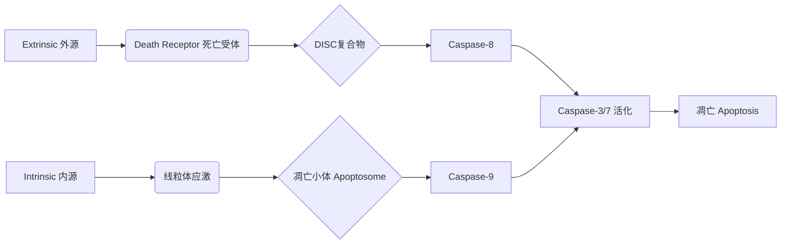

# Cell Death：细胞死亡的核心概念网络

## 1. 总览与定义 (Overview & Definition)
**细胞死亡 (Cell Death)** 是生命过程中不可或缺的组成部分，贯穿发育、组织稳态及疾病。其核心在于**膜完整性 (Membrane Integrity)** 和**细胞命运 (Cell Fate)** 的丧失。根据发生机制与生物学意义，主要分为两大类：

```mermaid
graph TD
    A[Cell Death 细胞死亡] --> B[Non-Programmed 非程序性]
    A --> C[Programmed 程序性/调节性]
    B --> D[[细胞坏死 (Necrosis)]]
    C --> E[Caspase-dependent 依赖]
    C --> F[Caspase-independent 非依赖]
    E --> G[[凋亡 (Apoptosis)]]
    E --> H[[焦亡 (Pyroptosis)]]
    F --> I[[坏死性凋亡 (Necroptosis)]]
    F --> J[[铁死亡 (Ferroptosis)]]
    F --> K[[自噬性细胞死亡 (Autophagic Cell Death)]]
```

- **非程序性细胞死亡 (Non-programmed Cell Death)**：由极端、压倒性的物理、化学或生物因素直接导致，通常不可控且引发炎症。代表为 **[[细胞坏死 (Necrosis)]]**。
- **程序性细胞死亡 (Programmed Cell Death, PCD) / 调节性细胞死亡 (Regulated Cell Death, RCD)**：由细胞内预设的遗传程序或信号通路主动调控的死亡过程，对机体发育、稳态维持和免疫至关重要。其核心特征是**可被特定抑制剂阻断**，且通常**形成独特的分子信号复合物**。

---

## 2. 程序性细胞死亡 (Programmed Cell Death) 的主要形式

### 2.1 凋亡 (Apoptosis)
**定义**：最经典、研究最深入的PCD形式。以细胞皱缩、染色质凝聚、核碎裂、形成凋亡小体并最终被吞噬为主要特征，**过程安静、通常不引起炎症**。

**执行核心**：**胱天蛋白酶 (Caspase) 级联反应**。Caspase以酶原形式存在，被激活后切割特定底物，执行死亡程序。

**主要途径**：
1.  **线粒体途径 (Intrinsic Pathway)**：由细胞内应激（如DNA损伤、代谢压力）触发。促凋亡蛋白（如BAX/BAK）导致线粒体外膜通透化 (MOMP)，释放细胞色素c (cytochrome c)，后者与Apaf-1、Procaspase-9形成**凋亡小体 (Apoptosome)**，激活**启动型Caspase-9**。
2.  **死亡受体途径 (Extrinsic Pathway)**：由细胞膜死亡受体（如Fas, TNFR1）与配体结合触发。招募接头蛋白FADD和Procaspase-8形成**死亡诱导信号复合物 (DISC)**，激活**启动型Caspase-8**。

两条途径最终汇聚于**效应型Caspase-3/-6/-7**的激活，执行分解细胞的“分子切割”任务。



**[[胱天蛋白酶 (Caspase)]]** **的核心作用**：
- **启动型Caspase** (Caspase-8, -9, -10)：在起始复合物中被募集并自激活，负责切割下游效应型Caspase。
- **效应型Caspase** (Caspase-3, -6, -7)：被启动型Caspase激活，广泛切割细胞骨架、DNA修复酶等底物，系统性拆解细胞。
- **炎性Caspase** (Caspase-1, -4, -5, -11)：主要功能是加工促炎细胞因子（如IL-1β）和执行**[[焦亡 (Pyroptosis)]]**，在功能和进化上与凋亡caspase有别。

### 2.2 焦亡 (Pyroptosis)
**定义**：一种**炎性程序性细胞死亡**。由**病原体相关分子模式 (PAMPs)** 或**损伤相关分子模式 (DAMPs)** 触发，依赖于**炎性Caspase**的活化。其特征是细胞快速肿胀、膜破裂，释放大量炎性内容物（如IL-1β, IL-18），**强烈激活炎症反应**。

**核心机制**：
1.  **经典途径**：通过**模式识别受体 (如NLRs, AIM2)** 感知危险信号，组装多蛋白复合物**[[炎症小体 (Inflammasome)]]**。炎症小体招募并激活**Caspase-1**。
2.  **非经典途径**：细胞质中的**Caspase-4/-5 (人) / Caspase-11 (鼠)** 直接识别细菌脂多糖 (LPS) 而被激活。

**执行器**：活化的炎性Caspase切割**Gasdermin D (GSDMD)** 蛋白，其N端片段在细胞膜上寡聚化形成**亲水性孔道**，导致离子失衡、细胞肿胀、膜破裂，并介导成熟IL-1β/IL-18的释放。

**与[[凋亡 (Apoptosis)]]的关键区别**：焦亡是**促炎的**、**依赖膜穿孔的**，而凋亡是**安静的**、**依赖caspase级联分解的**。

### 2.3 坏死性凋亡 (Necroptosis)
**定义**：一种**受调控的、程序性的、形态上类似坏死的死亡方式**。它作为凋亡的**备份通路**，通常在凋亡通路受阻（如Caspase-8被抑制）且存在死亡受体信号时被激活。

**核心信号轴**：
**TNFα → TNFR1 → TRADD → RIPK1 → RIPK3 → MLKL**

当Caspase-8活性缺失时，RIPK1与RIPK3通过RHIM结构域相互作用，形成**坏死小体 (Necrosome)**。RIPK3磷酸化并激活**混合谱系激酶结构域样蛋白 (MLKL)**。活化的MLKL转位至细胞膜，寡聚化并形成膜孔，导致与坏死相似的细胞内容物泄漏和**继发性炎症**。

**生物学意义**：是机体对抗病原体（特别是病毒，其常编码Caspase抑制剂）的重要免疫机制，但也与多种炎症性疾病的组织损伤相关。

### 2.4 铁死亡 (Ferroptosis)
**定义**：一种**铁依赖性的、由脂质过氧化物过度积累驱动的调节性细胞死亡**。其形态特征为线粒体变小、膜密度增高、嵴减少或消失，**细胞膜保持完整性**直到后期。

**核心调控**：
- **驱动因素**：细胞内**游离铁 (Fe²⁺)** 催化活性氧 (ROS) 的产生（通过Fenton反应），攻击多不饱和脂肪酸 (PUFAs)，引发**脂质过氧化**链式反应。
- **防御系统**：核心是**谷胱甘肽过氧化物酶4 (GPX4)**，它利用谷胱甘肽 (GSH) 将脂质过氧化物还原为无毒的醇类。当GPX4功能失活或GSH耗竭（常因System Xc⁻胱氨酸/谷氨酸反向转运体被抑制），脂质过氧化物堆积至致死水平。

**诱导剂**：Erastin (抑制System Xc⁻)， RSL3 (直接抑制GPX4)。
**抑制剂**：铁螯合剂 (去铁胺)， 脂质抗氧化剂 (Ferrostatin-1, Liproxstatin-1)。

### 2.5 自噬性细胞死亡 (Autophagic Cell Death)
**定义**：指**过度或异常的自噬活动本身直接导致的细胞死亡**，而非自噬的促生存功能。其特征是细胞质中出现大量自噬体和自溶酶体。这是一个**存在争议的概念**，因为在许多情况下，观察到的自噬是细胞在死亡过程中的伴随现象或最后的挣扎，而非死亡原因。其明确的、特异的分子执行器尚待完全阐明。

---

## 3. 细胞坏死 (Necrosis) — 非程序性死亡的范式
**定义**：由**强烈的物理（高温、冻融）、化学（强酸强碱）、生物（毒素）或病理性（缺血）因素**导致细胞膜和细胞器膜**急性、不可逆的损伤**，引发细胞内容物（蛋白酶、炎性因子）漏出，引起周围组织**强烈炎症反应**的死亡形式。

**与程序性死亡的本质区别**：
1.  **被动 vs 主动**：坏死是环境压力超过细胞承受极限的被动结果；PCD是细胞主动启动的。
2.  **无特异性调控通路**：虽然近年来发现其也可能涉及特定信号（如RIPK1/RIPK3），但其早期损伤是直接的、无序的。
3.  **结局**：坏死必然导致炎症，而凋亡通常不会。

---

## 4. 整合与调控网络：细胞死亡的“开关”系统
细胞并非简单地选择一种死亡方式，而是整合多种信号，通过复杂的交互网络决定命运。

```mermaid
graph TD
    subgraph “死亡信号整合中心”
        A[TNFα / FasL / TRAIL] --> B[TNFR1/Fas/DR]
        C[DAMPs/PAMPs] --> D[TLRs/NLRs/AIM2]
        E[DNA损伤/ER应激] --> F[Intrinsic Signals]
    end

    B --> G{Caspase-8 活性?}
    G -- 有活性 --> H[凋亡 Apoptosis]
    G -- 无活性 --> I[坏死性凋亡 Necroptosis]

    D --> J{Caspase-1 活性?}
    J -- 有活性 --> K[焦亡 Pyroptosis]

    F --> L{GPX4 System 正常?}
    L -- 是 --> M[存活]
    L -- 否 --> N[铁死亡 Ferroptosis]

    H & K --> O[凋亡小体/膜孔形成]
    I & N --> P[膜破裂/内容物泄漏]
    O & P --> Q[被吞噬/炎症反应]
```

**关键交叉点**：
- **Caspase-8 是核心调控枢纽**：它既是凋亡的启动者，又是**抑制坏死性凋亡**的关键（通过切割RIPK1和RIPK3）。因此，Caspase-8功能丧失将细胞推向坏死性凋亡。
- **炎症反应的十字路口**：焦亡和坏死性凋亡都是**促炎**的，而凋亡是**抗炎或微弱促炎**的。感染时，病原体常抑制凋亡和焦亡，迫使细胞走向坏死性凋亡以引发更强的炎症来清除感染。
- **代谢与氧化应激**：铁死亡将细胞死亡与**铁代谢、脂质代谢和抗氧化防御 (GPX4)** 紧密联系，是代谢相关疾病（如神经退行性疾病、缺血再灌注损伤）中的关键环节。

## 5. 总结与前沿
理解细胞死亡的多样性，已超越了简单的形态学分类，进入了**信号通路网络与代谢状态整合**的时代。核心概念包括：
- **形式多样性**：凋亡、焦亡、坏死性凋亡、铁死亡等是受精密调控的、具有不同生物学功能的PCD亚型。
- **执行器特异性**：Caspase (凋亡/焦亡)、MLKL (坏死性凋亡)、GSDMD (焦亡)、脂质过氧化 (铁死亡) 是不同死亡形式的关键执行分子。
- **功能导向性**：死亡方式的选择服务于生理需求——凋亡维持安静稳态，焦亡/坏死性凋亡驱动免疫防御，铁死亡可能参与肿瘤抑制等。
- **治疗靶向性**：针对特定死亡通路的干预（如激活凋亡治疗癌症，抑制铁死亡治疗神经退行性疾病）已成为新药开发的前沿领域。

**核心考点**：掌握各死亡形式的**定义、形态特征、核心信号通路、关键执行分子及其生物学意义**，并能比较它们之间的异同与联系，是理解细胞命运决定和疾病机制的基础。