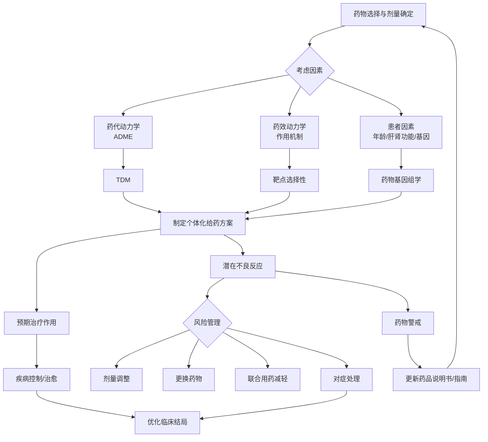

# **临床药理学的核心概念整合笔记**
**Core Concepts in Clinical Pharmacology: An Integrated Framework**

---

## **1. 概述与定义 (Overview and Definition)**
**临床药理学 (Clinical Pharmacology)** 是一门研究药物在人体内作用规律的学科，其核心是连接基础药理学与临床实践，优化**药物治疗 (Drug Therapy)** 的效益风险比。其研究范畴远不止于“药物如何起作用”，更涵盖“如何将药物正确、安全、有效地用于具体患者”。

**核心范式 (Core Paradigm):**
```
药物 (Drug) ———→ [体内过程与受体相互作用] ———→ 效应 (Effect)
    |                                                  |
    |  [[药代动力学]]        [[药效动力学]]             |
    +<——— 机体 (Patient: 基因型、病理状态、合并用药) ———+
```
在此范式下，任何临床效应（包括治疗作用与不良反应）都是药物特性与患者特异性因素相互作用的结果。

---

## **2. 整合框架：治疗作用 vs. 不良反应 (Integrated Framework: Therapeutic Effects vs. Adverse Effects)**
临床药理学的核心实践是管理**治疗指数 (Therapeutic Index, TI)**，即衡量药物安全性的参数。治疗作用与不良反应并非绝对对立，而是同一分子药理作用谱在不同生理/病理背景下的体现。

```ascii
                    [药物分子药理作用谱]
                             |
           /                 |                 \
    [靶器官选择性]       [剂量-效应关系]       [个体差异]
           \                 |                 /
                     [临床效应光谱]
                             |
           /                 |                 \
     [治疗作用]      [治疗作用与不良反应并存]      [不良反应]
     (Therapeutic)   (Therapeutic & Adverse)    (Adverse)
```
- **治疗作用 (Therapeutic Effect)**：针对疾病目标产生的预期有益效应。
- **不良反应 (Adverse Drug Reaction, ADR)**：与用药目的无关，给患者带来痛苦或危害的反应。其发生机制复杂，可基于**剂量-反应关系 (Dose-Response Relationship)** 进行分类，如下文所述。

---

## **3. 不良反应的系统分类与深度解析 (Systematic Classification and In-Depth Analysis of ADRs)**

### **3.1 基于剂量-反应关系的分类框架**
这是理解ADR机制和临床管理的基石。

| 分类 | 定义与机制 | 与剂量关系 | 可预测性 | 可否通过剂量调整避免 | 代表示例 |
| :--- | :--- | :--- | :--- | :--- | :--- |
| **A型 (量变型异常)** | **药物本身固有作用的延伸**。通常由药理作用过强引起，与**药效动力学**和**药代动力学**因素密切相关。 | 明确相关 | 高 | **是** | [[副作用]]，[[毒性反应]]，[[后遗效应]]，[[继发反应]] |
| **B型 (质变型异常)** | **与药物固有药理作用无关的异常免疫或特异质反应**。机制多为免疫介导或遗传缺陷。 | 通常无关 | 低 | **否** | [[I型超敏反应\|变态反应]]，[[特异质反应]] |
| **C型 (长期用药型)** | 与长期用药相关的反应，机制复杂。 | 相关（累积效应） | 中 | 部分可 | [[依赖性]]，[[致癌性]] |
| **D型 (迟发型)** | 潜伏期长（如数月至数年），如致癌、致畸。 | 相关（累积暴露） | 低 | 难 | 孕期服用己烯雌酚致子代阴道癌 |

### **3.2 A型不良反应 (量变型) 的深度剖析**

- **[[副作用]] (Side Effect)**：
    - **定义**：药物在**治疗剂量**下出现的与治疗目的无关的作用。
    - **机制**：源于药物对**多个受体或器官系统的选择性不高**。例如，阿托品治疗胃痛时抑制腺体分泌（治疗作用）和引起口干（副作用）均是其M受体阻断的必然结果。
    - **临床意义**：最常见，通常可预知，但多数轻微且可耐受。可通过选用高选择性药物或联合用药来减轻。

- **[[毒性反应]] (Toxic Reaction)**：
    - **定义**：药物用量过大、用药时间过长或机体对药物**过于敏感**时引起的严重不良反应。
    - **核心**：**剂量依赖性**，是药物**安全窗 (Safety Window)** 或治疗指数的直接体现。
    - **分类**：
        - **[[急性毒性]] (Acute Toxicity)**：单次大剂量给药所致，如对乙酰氨基酚过量致肝坏死。
        - **[[慢性毒性]] (Chronic Toxicity)**：反复长期给药，药物在体内蓄积所致，如氨基糖苷类抗生素长期使用致耳肾毒性。
    - **管理关键**：个体化给药、治疗药物监测 (**TDM**) 和计算**肾清除率 (CrCl)** 调整剂量是预防核心。

- **[[后遗效应]] (After Effect/Residual Effect)**：
    - **定义**：停药后血药浓度已降至阈值以下，但仍残存的生物效应。
    - **示例**：苯巴比妥次晨的宿醉现象；链霉素停药后持续的耳蜗毛细胞损害。

- **[[继发反应]] (Secondary Reaction)**：
    - **定义**：继发于药物**治疗作用**之后的不良反应，是治疗作用间接导致的**新病变**。
    - **经典案例**：长期使用广谱抗生素 → 抑制肠道正常菌群 → **二重感染 (Superinfection)** 或**菌群失调**。这并非药物直接毒性，而是抗菌作用的“代价”。

### **3.3 B型不良反应 (质变型) 的深度剖析**

- **[[I型超敏反应|变态反应]] (Allergic/Hypersensitivity Reaction)**：
    - **定义**：药物作为**半抗原 (Hapten)** 或全抗原，引发免疫系统产生的**病理性免疫反应**。
    - **特点**：**与药理作用无关**；**与剂量无关**（极小量即可诱发）；**首次用药一般不发生**（需有致敏期）；**再暴露时反应迅速且剧烈**。
    - **分类**：可分为I-IV型，其中I型（速发型，如青霉素过敏性休克）在临床最急迫。

- **[[特异质反应]] (Idiosyncratic Reaction)**：
    - **定义**：与遗传因素有关的、**剂量无关**的异常药物反应，常由先天性代谢缺陷引起。
    - **示例**：葡萄糖-6-磷酸脱氢酶 (G6PD) 缺乏者使用氧化性药物（如伯氨喹）诱发的**溶血性贫血**。

### **3.4 其他重要类型**

- **[[停药反应]] (Withdrawal Reaction)**：长期用药后突然停药，原有**病情加剧或出现新的症状群**。机制是机体对药物产生了**反适应 (Counter-adaptation)**。常见于β受体阻滞剂、糖皮质激素、阿片类药物。
- **[[依赖性]] (Dependence)**：分为**躯体依赖 (Physical Dependence)** 和**精神依赖 (Psychological Dependence)**。前者表现为停药后出现特征性的**戒断综合征 (Withdrawal Syndrome)**，后者表现为强烈的渴求行为。

---

## **4. 核心机制：药物-受体相互作用与效应产生 (Core Mechanism: Drug-Receptor Interaction and Effect Generation)**
理解不良反应的根本在于理解药物如何与分子靶点作用。

```
药物 (L) + 受体 (R) ⇌ 药物-受体复合物 (LR) → 生物效应
    |
    +---> 内在活性 (Intrinsic Activity): 决定效能 (Efficacy)
    +---> 亲和力 (Affinity): 决定效价 (Potency)
    +---> 组织特异性分布: 决定效应部位
```
- **选择性 (Selectivity)** 是减少不良反应的关键。一个药物对多种受体亚型或离子通道有亲和力，则可能产生多种药理作用（包括非预期的）。
- **激动剂 (Agonist)**、**拮抗剂 (Antagonist)**、**部分激动剂 (Partial Agonist)**、**反向激动剂 (Inverse Agonist)** 的不同作用模式，决定了其临床效应谱和不良反应特征。

---

## **5. 临床整合：风险最小化与获益最大化 (Clinical Integration: Minimizing Risk, Maximizing Benefit)**
临床药理学的终极目标是为个体患者提供**最佳药物治疗方案 (Optimal Pharmacotherapy)**。

### **5.1 关键原则**
1.  **个体化治疗 (Individualized Therapy)**：基于**治疗药物监测 (TDM)**、**药物基因组学 (Pharmacogenomics)** 和患者**病理生理状态**调整剂量。
2.  **风险-获益评估 (Risk-Benefit Assessment)**：始终权衡治疗疾病所需的获益与药物可能带来的风险。对于恶性肿瘤化疗，可接受较大的A型风险；对于头痛，则要求药物极度安全。
3.  **药物相互作用 (Drug-Drug Interactions, DDI)** 警惕：
    - **药代动力学相互作用**：影响吸收、分布、代谢（如CYP450酶抑制/诱导）、排泄。
    - **药效动力学相互作用**：协同、相加或拮抗效应。
4.  **治疗监测与报告 (Therapeutic Monitoring and Reporting)**：
    - 对高危患者进行**ADR监测**。
    - 鼓励上报**疑似ADR**至国家药物警戒系统，以完善药品安全信息。

### **5.2 概念关联图**

此图展示了从治疗决策到风险管理，再到知识更新的闭环。

---

## **6. 总结 (Summary)**
临床药理学的核心概念构成了一个动态、系统的认知框架。其精髓在于认识到：
- **治疗作用与不良反应同源**，均源于药物与生物靶点的相互作用。
- **药物安全性并非绝对**，而是相对于疾病严重程度、可用替代疗法和患者个体特征而言的**动态平衡**。
- **主动的风险管理**（基于机制分类、剂量调整、治疗监测）是临床药理学区别于简单处方的关键。
- **持续的知识更新**（源自临床实践、药物警戒和基础研究）是优化药物治疗的基石。

掌握这些概念，不仅是为了记忆定义，更是为了培养一种**基于机制的、个体化的、风险意识驱动的**临床药理思维，这是安全有效应用药物治疗所有疾病的必备能力。

---
**笔记属性 (Note Properties)**
*   **创建日期**: 2023-10-27
*   **适用对象**: 药理学博士研究生
*   **关键概念**: [[临床药理学]], [[不良反应]], [[毒性反应]], [[治疗指数]], [[药代动力学]], [[药效动力学]], [[药物相互作用]], [[个体化治疗]], [[药物警戒]]
*   **格式**: 博士层级整合概念笔记，含ASCII/Mermaid图表与双向链接